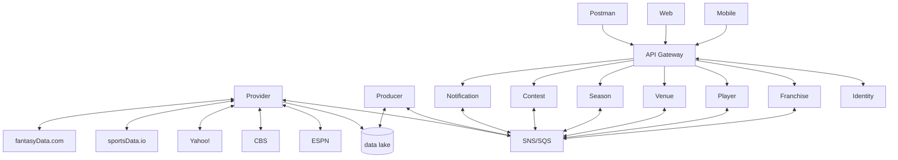

```mermaid
flowchart BT
    subgraph Provider
        PV[svc]
        PVDB[(DB)]
        PV-->PVDB
        PVAPI[API]
        PV-->PVDB
        PVAPI-->PVDB
    end    
    DL[(data lake)]
    PV --> DL
    subgraph Producer
        PD[svc]
        PDDB[(DB)]
        PDAPI[API]
        PD-->PDDB
        PDAPI-->PDDB
    end    
    PD <--> DL
    M[SNS/SQS]
    subgraph Notification
        N[svc]
        NDB[(DB)]
        NAPI[API]
    end
    subgraph Contest
        C[svc]
        CDB[(DB)]
        CAPI[API]
    end
    subgraph Season
        S[svc]
        SDB[(DB)]
        SAPI[API]
    end
    subgraph Venue
        V[svc]
        VDB[(DB)]
        VPI[API]
    end
    subgraph Player
        PL[svc]
        PLDB[(DB)]
        PLAPI[API]
    end
    subgraph Franchise
        FR[svc]
        FRDB[(DB)]
        FRAPI[API]
    end
    subgraph Identity
        ID[Identity]
    end
    API[API Gateway]
    API --> ID
    WCPOST[Postman]
    WCWEB[Web]
    WCMOB[Mobile]
    WCAPP[Code]
    Provider --> ESPN[ESPN]
    Provider --> CBS[CBS]
    Provider --> YAHOO[Yahoo!]
    Provider --> SDIO[sportsData.io]
    Provider --> FD[fantasyData.com]
    PV-->M
    PD-->M
    N-->M
    C-->M
    S-->M
    V-->M
    PL-->M
    FR-->M
    API-->Provider
    API-->Contest
    API-->Season
    API-->Venue
    API-->Player
    API-->Franchise
    API-->Notification
    WCPOST-->API
    WCWEB-->API
    WCMOB-->API
    WCAPP-->API
```

## sports-data-core

Mono repo for Sports Data project. All projects except for sports-data-core are independent services.  Build pipelines exist for all services within the repo.

## **Overview**

Project aims to capture sports data from external sources, convert them into domain objects that all applications will use, and persist said data for future analysis and ML processing.  Initial effort only includes NCAAF, but others will follow (NFL, MLB, PGA, etc).

| Project/Service              | Purpose |
| ---------------------------- | ------- |
| [core](https://github.com/jrandallsexton/sports-data-core/tree/main/src/SportsData.Core) | shared services, components, and middleware to be consumed by the various services that compose the entire application |
| [api](https://github.com/jrandallsexton/sports-data-core/tree/main/src/SportsData.Api) | API Gateway |
| [contest](https://github.com/jrandallsexton/sports-data-core/tree/main/src/SportsData.Contestt) | [more soon] |
| [franchise](https://github.com/jrandallsexton/sports-data-core/tree/main/src/SportsData.Franchise) | [more soon] |
| [notification](https://github.com/jrandallsexton/sports-data-core/tree/main/src/SportsData.Notification) | [more soon] |
| [player](https://github.com/jrandallsexton/sports-data-core/tree/main/src/SportsData.Player) | [more soon] |
| [producer](https://github.com/jrandallsexton/sports-data-core/tree/main/src/SportsData.Producer) | Responsible for converting external JSON files to domain objects and broadcasting eventing information about those domain/integration events. |
| [provider](https://github.com/jrandallsexton/sports-data-core/tree/main/src/SportsData.Provider) | Responsible for gathering data from external data sources (ESPN, CBS, Yahoo!, sportsData.io, etc) and shoving the resulting JSON into a data lake.  Once a resource has been sourced and the JSON stored, it will broadcast an event for others to consume. |
| [season](https://github.com/jrandallsexton/sports-data-season/tree/main/src/SportsData.Season) | [more soon] |
| [venue](https://github.com/jrandallsexton/sports-data-core/tree/main/src/SportsData.Venue) | [more soon]

| Repository      | Purpose |
| --------------- | ------- |
| [sports-data-core](https://github.com/jrandallsexton/sports-data-core) | This repository (source lives here) |
| [sports-data-config](https://github.com/jrandallsexton/sports-data-config) | Kubernetes cluster definition & Gitops |
| [sports-data-provision](https://github.com/jrandallsexton/sports-data-provision) | Cloud-based resource definitions |

**Project Diagram - Level 0**

**Project Diagram - Level 1**

