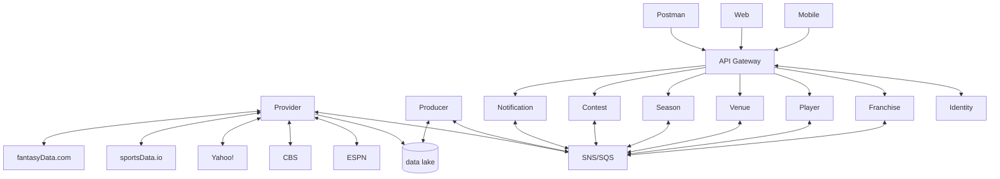

[](https://github.com/jrandallsexton/sports-data-core/actions/workflows/deploy-about.yml)

[](https://github.com/jrandallsexton/sports-data-core/actions/workflows/deploy-ui-dev.yml)

[](https://github.com/jrandallsexton/sports-data-core/actions/workflows/deploy-ui-prod.yml)

[](https://github.com/jrandallsexton/sports-data-core/actions/workflows/deploy-services-prod-auto.yml)

[](https://github.com/jrandallsexton/sports-data-core/actions/workflows/copilot-pull-request-reviewer/copilot-pull-request-reviewer)

[](https://dev.azure.com/jrandallsexton/sport-deets/_apis/build/status%2Fsports-data-api?branchName=main)

# Sports Data Platform

A hybrid cloud sports analytics platform built on a modular monolith architecture, designed for independent service extraction when scaling demands justify the operational complexity.

## **Overview**

Sports data aggregation and analysis platform that ingests data from multiple external sources (ESPN, CBS Sports, Yahoo!, sportsData.io), transforms it into canonical domain models, and exposes it through a unified API. Currently focused on NCAA Football with planned expansion to NFL, MLB, and PGA.

### Key Features

- **Multi-source data aggregation** - Unified interface to ESPN, CBS, Yahoo!, and commercial sports data APIs
- **Event-driven architecture** - Azure Service Bus messaging for decoupled domain communication
- **Hybrid cloud deployment** - Self-hosted Kubernetes on bare metal, leveraging Azure managed services for specific workloads
- **Domain-driven design** - Clear bounded contexts prepared for microservices extraction
- **Modular monolith** - Logical service boundaries without distributed system complexity
- **Cost-optimized architecture** - Pragmatic mix of on-premises compute and cloud-managed services

### Tech Stack

**Backend:** .NET 9, ASP.NET Core, Entity Framework Core  
**Infrastructure:** Kubernetes (on-prem), Docker, Azure (Service Bus, Cosmos DB, App Configuration, Key Vault, Static Web Apps, DevOps)  
**Frontend:** React, TypeScript  
**CI/CD:** Azure Pipelines, GitHub Actions, GitOps  
**Monitoring:** OpenTelemetry, Prometheus  
**Data:** PostgreSQL, Redis, Cosmos DB

## Architecture

### Modular Monolith Pattern

The project follows a **modular monolith** architecture pattern. Domain boundaries are enforced through dedicated HTTP clients ([`ContestClient`](https://github.com/jrandallsexton/sports-data-core/blob/main/src/SportsData.Core/Infrastructure/Clients/Contest/ContestClient.cs), [`FranchiseClient`](https://github.com/jrandallsexton/sports-data-core/blob/main/src/SportsData.Core/Infrastructure/Clients/Franchise/FranchiseClient.cs), [`VenueClient`](https://github.com/jrandallsexton/sports-data-core/blob/main/src/SportsData.Core/Infrastructure/Clients/Venue/VenueClient.cs), etc.) that communicate with their respective service modules.

**Design Principles:**
- **Clear domain boundaries** - Each domain has its own client interface and can be developed independently
- **Service extraction readiness** - Domains can be extracted as microservices with minimal refactoring
- **Development velocity** - Reduced operational complexity while maintaining architectural discipline
- **Pragmatic evolution** - Services scale independently based on actual needs, not speculation

#### Current Implementation

**All domain clients currently point to the Producer API.** While [`ContestClient`](https://github.com/jrandallsexton/sports-data-core/blob/main/src/SportsData.Core/Infrastructure/Clients/Contest/ContestClient.cs), [`FranchiseClient`](https://github.com/jrandallsexton/sports-data-core/blob/main/src/SportsData.Core/Infrastructure/Clients/Franchise/FranchiseClient.cs), and [`VenueClient`](https://github.com/jrandallsexton/sports-data-core/blob/main/src/SportsData.Core/Infrastructure/Clients/Venue/VenueClient.cs) are separate HTTP clients with distinct interfaces, they all resolve to the Producer service's API endpoints via configuration.

**Migration path:**
1. Each client has its own configuration key (e.g., `ContestClientConfig:ApiUrl`, `FranchiseClientConfig:ApiUrl`)
2. Currently all configs point to the same Producer API URL
3. When a domain needs independent scaling:
   - Deploy that domain as a separate service
   - Update the configuration to point to the new service URL
   - **No code changes required** - the abstraction boundary already exists

This approach maintains the architectural seams for future distribution without the operational overhead of managing multiple services prematurely.

### Data Flow

```
External APIs → Provider Service → Data Lake (Azure Blob) 
                                        ↓
                                   Producer Service → Canonical Domain Models → PostgreSQL
                                        ↓
                              Azure Service Bus (Events)
                                        ↓
                         Domain Services (Contest, Franchise, Venue, etc.)
                                        ↓
                                   API Gateway → Clients (Web, Mobile)
```

## Project Structure

| Project/Service              | Purpose |
| ---------------------------- | ------- |
| [core](https://github.com/jrandallsexton/sports-data-core/tree/main/src/SportsData.Core) | Shared services, components, and middleware consumed by all services |
| [api](https://github.com/jrandallsexton/sports-data-core/tree/main/src/SportsData.Api) | API Gateway - unified entry point for all client applications |
| [contest](https://github.com/jrandallsexton/sports-data-core/tree/main/src/SportsData.Contest) | Domain boundary via [`ContestClient`](https://github.com/jrandallsexton/sports-data-core/blob/main/src/SportsData.Core/Infrastructure/Clients/Contest/ContestClient.cs). Manages games, scores, statistics. Planned extraction. |
| [franchise](https://github.com/jrandallsexton/sports-data-core/tree/main/src/SportsData.Franchise) | Domain boundary via [`FranchiseClient`](https://github.com/jrandallsexton/sports-data-core/blob/main/src/SportsData.Core/Infrastructure/Clients/Franchise/FranchiseClient.cs). Teams, rosters, and metadata. Planned extraction. |
| [notification](https://github.com/jrandallsexton/sports-data-core/tree/main/src/SportsData.Notification) | Domain boundary established. User notifications and alerts. Planned extraction. |
| [player](https://github.com/jrandallsexton/sports-data-core/tree/main/src/SportsData.Player) | Domain boundary established. Athlete profiles and statistics. Planned extraction. |
| [producer](https://github.com/jrandallsexton/sports-data-core/tree/main/src/SportsData.Producer) | Transforms external JSON into canonical domain objects. Publishes integration events. |
| [provider](https://github.com/jrandallsexton/sports-data-core/tree/main/src/SportsData.Provider) | Ingests data from external sources (ESPN, CBS, Yahoo!, sportsData.io). Stores raw JSON in data lake. |
| [season](https://github.com/jrandallsexton/sports-data-season/tree/main/src/SportsData.Season) | Domain boundary established. Season schedules and calendars. Planned extraction. |
| [venue](https://github.com/jrandallsexton/sports-data-core/tree/main/src/SportsData.Venue) | Domain boundary via [`VenueClient`](https://github.com/jrandallsexton/sports-data-core/blob/main/src/SportsData.Core/Infrastructure/Clients/Venue/VenueClient.cs). Stadium and location data. Planned extraction. |

### Related Repositories

| Repository      | Purpose |
| --------------- | ------- |
| [sports-data-core](https://github.com/jrandallsexton/sports-data-core) | This repository - application source code |
| [sports-data-config](https://github.com/jrandallsexton/sports-data-config) | Kubernetes cluster definitions & GitOps configuration |
| [sports-data-provision](https://github.com/jrandallsexton/sports-data-provision) | Infrastructure as Code - Azure resource definitions |

## System Diagrams

**High-Level Architecture**


**Detailed Service Architecture**

```mermaid
flowchart BT
    subgraph Provider
        PV[svc]
        PVDB[(DB)]
        PV-->PVDB
        PVAPI[API]
        PV-->PVDB
        PVAPI-->PVDB
    end    
    DL[(data lake)]
    PV --> DL
    subgraph Producer
        PD[svc]
        PDDB[(DB)]
        PDAPI[API]
        PD-->PDDB
        PDAPI-->PDDB
    end    
    PD <--> DL
    M[SNS/SQS]
    subgraph Notification
        N[svc]
        NDB[(DB)]
        NAPI[API]
    end
    subgraph Contest
        C[svc]
        CDB[(DB)]
        CAPI[API]
    end
    subgraph Season
        S[svc]
        SDB[(DB)]
        SAPI[API]
    end
    subgraph Venue
        V[svc]
        VDB[(DB)]
        VPI[API]
    end
    subgraph Player
        PL[svc]
        PLDB[(DB)]
        PLAPI[API]
    end
    subgraph Franchise
        FR[svc]
        FRDB[(DB)]
        FRAPI[API]
    end
    subgraph Identity
        ID[Identity]
    end
    API[API Gateway]
    API --> ID
    WCPOST[Postman]
    WCWEB[Web]
    WCMOB[Mobile]
    WCAPP[Code]
    Provider --> ESPN[ESPN]
    Provider --> CBS[CBS]
    Provider --> YAHOO[Yahoo!]
    Provider --> SDIO[sportsData.io]
    Provider --> FD[fantasyData.com]
    PV-->M
    PD-->M
    N-->M
    C-->M
    S-->M
    V-->M
    PL-->M
    FR-->M
    API-->Provider
    API-->Contest
    API-->Season
    API-->Venue
    API-->Player
    API-->Franchise
    API-->Notification
    WCPOST-->API
    WCWEB-->API
    WCMOB-->API
    WCAPP-->API
```


## Deployment

**Architecture:**
- **Production** - Self-hosted Kubernetes cluster on bare metal
  - 4-node cluster: AMD Ryzen 5 7640HS (6-core/12-thread @ 5.0GHz), ~31.5GB usable RAM (BIOS tuned, iGPU allocation minimized), 1TB NVMe PCIe 4.0 SSD
  - Cluster totals: 24 cores, 48 threads, ~126GB RAM, 4TB NVMe storage
  - Dedicated PostgreSQL node: Same specs, isolated for database workload
  - Dual 2.5GbE networking per node
- **Azure Managed Services** - Service Bus, Cosmos DB, App Configuration, Key Vault, Static Web Apps
- **Hybrid approach** - On-premises compute, Azure for managed services (born from Azure credit constraints, evolved into pragmatic architecture)

**CI/CD Pipeline:**
- GitHub Actions - PR validation, automated testing, code review
- Azure Pipelines - Build, containerization, deployment
- GitOps - Kubernetes manifests managed in [sports-data-config](https://github.com/jrandallsexton/sports-data-config)

**Configuration:**
- Azure App Configuration - centralized configuration management
- Azure Key Vault - secrets and sensitive configuration
- Environment-specific overrides via Azure DevOps pipelines

## License

This project is licensed under the [GNU General Public License v3.0 (GPL-3.0)](LICENSE). 

Any derivative works must also be open source and distributed under the same GPL-3.0 license. This ensures the community benefits from improvements and contributions.

---

**Note:** This is an active development project. Architecture and implementation details are subject to change as requirements evolve.
