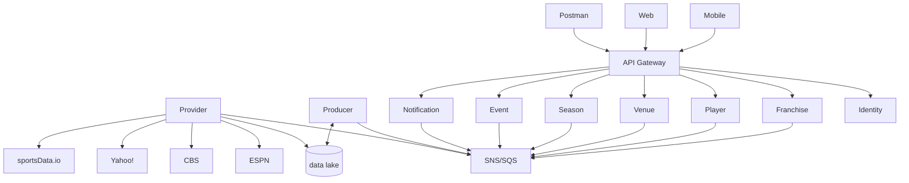

## sports-data-core

Primary repo for Sports Data project. Associated services are in separate repositories.

## **Overview**

Project aims to capture sports data from external sources, convert them into domain objects that all applications will use, and persist said data for future analysis and ML processing.  Initial effort only includes NCAAF, but others will follow (NFL, MLB, PGA, etc).

| Project | Purpose |
| ------- | ------- |
| [sports-data-core](https://github.com/jrandallsexton/sports-data-core) (this repo) | Primary repo for shared services, components, and middleware to be consumed by the various services that compose the entire application |
| [sports-data-provider](https://github.com/jrandallsexton/sports-data-provider) | Responsible for gathering data from external data sources (ESPN, CBS, Yahoo!, sportsData.io, etc) and shoving the resulting JSON into a data lake.  Once a resource has been sourced and the JSON stored, it will broadcast an event for others to consume. |
| [sports-data-producer](https://github.com/jrandallsexton/sports-data-producer) | Responsible for converting external JSON files to domain objects and broadcasting eventing information about those domain/integration events. |
| [sports-data-franchise](https://github.com/jrandallsexton/sports-data-franchise) | [more soon] |
| [sports-data-player](https://github.com/jrandallsexton/sports-data-player) | [more soon] |
| [sports-data-notification](https://github.com/jrandallsexton/sports-data-notification) | [more soon] |
| [sports-data-event](https://github.com/jrandallsexton/sports-data-event) | [more soon] |
| [sports-data-venue](https://github.com/jrandallsexton/sports-data-venue) | [more soon] |
| [sports-data-season](https://github.com/jrandallsexton/sports-data-season) | [more soon] |
| [sports-data-api](https://github.com/jrandallsexton/sports-data-api) | API Gateway |

**Project Diagram**

