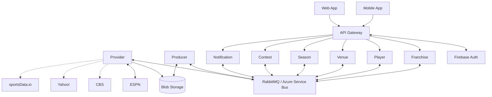
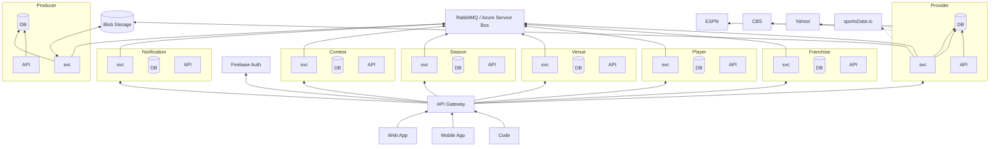

[](https://github.com/jrandallsexton/sports-data-core/actions/workflows/deploy-about.yml)

[](https://github.com/jrandallsexton/sports-data-core/actions/workflows/deploy-services-prod-auto.yml)

[](https://github.com/jrandallsexton/sports-data-core/actions/workflows/ci-mobile.yml)

[](https://dev.azure.com/jrandallsexton/sport-deets/_apis/build/status%2Fsports-data-api?branchName=main)

# Sports Data Platform

A hybrid cloud sports analytics platform built on a microservices architecture, deployed to a self-hosted Kubernetes cluster with Azure managed services.

## **Overview**

Sports data aggregation and analysis platform that ingests data from multiple external sources (ESPN, CBS Sports, Yahoo!, sportsData.io), transforms it into canonical domain models, and exposes it through a unified API. Currently focused on NCAA Football with planned expansion to NFL, MLB, and PGA. ESPN is the active data provider; CBS, Yahoo!, and sportsData.io integrations are planned.

### Key Features

- **Multi-source data aggregation** - Unified interface for ESPN (active), CBS, Yahoo!, and sportsData.io (planned) via a provider/producer pipeline
- **Event-driven architecture** - RabbitMQ (local) / Azure Service Bus (production) messaging for decoupled domain communication
- **Hybrid cloud deployment** - Self-hosted Kubernetes on bare metal, leveraging Azure managed services for specific workloads
- **Domain-driven design** - Clear bounded contexts with dedicated HTTP clients per domain
- **Microservices** - Independent services with per-service databases, Dockerfiles, and deployment manifests
- **Cost-optimized architecture** - Pragmatic mix of on-premises compute and cloud-managed services

### Tech Stack

**Backend:** .NET 10, ASP.NET Core, Entity Framework Core
**Infrastructure:** Kubernetes (on-prem), Docker, Azure (Service Bus, Cosmos DB, App Configuration, Key Vault, Static Web Apps, DevOps)
**Frontend:** React (sd-ui), Expo/React Native (sd-mobile), TypeScript
**Auth:** Firebase Authentication
**CI/CD:** Azure Pipelines, GitHub Actions, GitOps
**Monitoring:** OpenTelemetry, Seq, Prometheus
**Data:** PostgreSQL, Redis, Cosmos DB, Azure Blob Storage

## Architecture

### Microservices with Domain Client Abstraction

Each domain service runs independently with its own database and API. Cross-service communication uses dedicated HTTP clients ([`ContestClient`](https://github.com/jrandallsexton/sports-data-core/blob/main/src/SportsData.Core/Infrastructure/Clients/Contest/ContestClient.cs), [`FranchiseClient`](https://github.com/jrandallsexton/sports-data-core/blob/main/src/SportsData.Core/Infrastructure/Clients/Franchise/FranchiseClient.cs), [`VenueClient`](https://github.com/jrandallsexton/sports-data-core/blob/main/src/SportsData.Core/Infrastructure/Clients/Venue/VenueClient.cs), etc.) defined in the shared Core library.

**Design Principles:**
- **Clear domain boundaries** - Each domain has its own client interface and can be developed independently
- **Configuration-driven routing** - Client base URLs are configurable per environment
- **Development velocity** - Shared Core library reduces boilerplate while maintaining service independence
- **Pragmatic evolution** - Services scale independently based on actual needs, not speculation

#### Current Implementation

**All domain clients currently point to the Producer API.** While [`ContestClient`](https://github.com/jrandallsexton/sports-data-core/blob/main/src/SportsData.Core/Infrastructure/Clients/Contest/ContestClient.cs), [`FranchiseClient`](https://github.com/jrandallsexton/sports-data-core/blob/main/src/SportsData.Core/Infrastructure/Clients/Franchise/FranchiseClient.cs), and [`VenueClient`](https://github.com/jrandallsexton/sports-data-core/blob/main/src/SportsData.Core/Infrastructure/Clients/Venue/VenueClient.cs) are separate HTTP clients with distinct interfaces, they all resolve to the Producer service's API endpoints via configuration.

**Migration path:**
1. Each client has its own configuration key (e.g., `ContestClientConfig:ApiUrl`, `FranchiseClientConfig:ApiUrl`)
2. Currently all configs point to the same Producer API URL
3. When a domain needs independent scaling:
   - Deploy that domain as a separate service
   - Update the configuration to point to the new service URL
   - **No code changes required** - the abstraction boundary already exists

### Data Flow

```
External APIs (ESPN*) → Provider Service → Azure Blob Storage (raw JSON)
                                    ↓
                               Producer Service → Canonical Domain Models → PostgreSQL
                                    ↓
                          Message Bus (RabbitMQ / Azure Service Bus)
                                    ↓
                     Domain Services (Contest, Franchise, Venue, etc.)
                                    ↓
                               API Gateway → Clients (Web, Mobile)
```

## Project Structure

| Project/Service              | Purpose |
| ---------------------------- | ------- |
| [core](https://github.com/jrandallsexton/sports-data-core/tree/main/src/SportsData.Core) | Shared services, components, and middleware consumed by all services |
| [api](https://github.com/jrandallsexton/sports-data-core/tree/main/src/SportsData.Api) | API Gateway - unified entry point for all client applications. Firebase auth middleware. |
| [contest](https://github.com/jrandallsexton/sports-data-core/tree/main/src/SportsData.Contest) | Games, scores, and statistics. Domain boundary via [`ContestClient`](https://github.com/jrandallsexton/sports-data-core/blob/main/src/SportsData.Core/Infrastructure/Clients/Contest/ContestClient.cs). |
| [franchise](https://github.com/jrandallsexton/sports-data-core/tree/main/src/SportsData.Franchise) | Teams, rosters, and metadata. Domain boundary via [`FranchiseClient`](https://github.com/jrandallsexton/sports-data-core/blob/main/src/SportsData.Core/Infrastructure/Clients/Franchise/FranchiseClient.cs). |
| [notification](https://github.com/jrandallsexton/sports-data-core/tree/main/src/SportsData.Notification) | User notifications and alerts. |
| [player](https://github.com/jrandallsexton/sports-data-core/tree/main/src/SportsData.Player) | Athlete profiles and statistics. |
| [producer](https://github.com/jrandallsexton/sports-data-core/tree/main/src/SportsData.Producer) | Transforms external JSON into canonical domain objects. Publishes integration events via MassTransit. |
| [provider](https://github.com/jrandallsexton/sports-data-core/tree/main/src/SportsData.Provider) | Ingests data from external sources (ESPN active; CBS, Yahoo!, sportsData.io planned). Stores raw JSON in Azure Blob Storage. Schedules sourcing runs via Hangfire. |
| [season](https://github.com/jrandallsexton/sports-data-core/tree/main/src/SportsData.Season) | Season schedules and calendars. |
| [venue](https://github.com/jrandallsexton/sports-data-core/tree/main/src/SportsData.Venue) | Stadium and location data. Domain boundary via [`VenueClient`](https://github.com/jrandallsexton/sports-data-core/blob/main/src/SportsData.Core/Infrastructure/Clients/Venue/VenueClient.cs). |
| [jobs-dashboard](https://github.com/jrandallsexton/sports-data-core/tree/main/src/SportsData.JobsDashboard) | Hangfire dashboard for monitoring background job processing. |
| [processor-gen](https://github.com/jrandallsexton/sports-data-core/tree/main/src/SportsData.ProcessorGen) | Source generator for DocumentProcessorBase implementations. |
| [sd-ui](https://github.com/jrandallsexton/sports-data-core/tree/main/src/UI/sd-ui) | React web frontend (TypeScript). |
| [sd-mobile](https://github.com/jrandallsexton/sports-data-core/tree/main/src/UI/sd-mobile) | Expo/React Native mobile app (TypeScript). |

### Related Repositories

| Repository      | Purpose |
| --------------- | ------- |
| [sports-data-core](https://github.com/jrandallsexton/sports-data-core) | This repository - application source code |
| [sports-data-config](https://github.com/jrandallsexton/sports-data-config) | Kubernetes cluster definitions & GitOps configuration |
| [sports-data-provision](https://github.com/jrandallsexton/sports-data-provision) | Infrastructure as Code - Azure resource definitions |

## System Diagrams

**High-Level Architecture**

```mermaid
flowchart TD
    PV[Provider]
    BLOB[(Blob Storage)]
    PV --> BLOB
    PD[Producer]
    PD <--> BLOB
    MSG[RabbitMQ / Azure Service Bus]
    N[Notification]
    C[Contest]
    S[Season]
    V[Venue]
    PL[Player]
    FR[Franchise]
    API[API Gateway]
    AUTH[Firebase Auth]
    API <--> AUTH
    WCWEB[Web App]
    WCMOB[Mobile App]
    PV <--> ESPN[ESPN]
    PV -.-> CBS[CBS]
    PV -.-> YAHOO[Yahoo!]
    PV -.-> SDIO[sportsData.io]
    PV <--> MSG
    PD <--> MSG
    N <--> MSG
    C <--> MSG
    S <--> MSG
    V <--> MSG
    PL <--> MSG
    FR <--> MSG
    API --> C
    API --> S
    API --> V
    API --> PL
    API --> FR
    API --> N
    WCWEB --> API
    WCMOB --> API
```

**Detailed Service Architecture**

```mermaid
flowchart BT
    subgraph Provider
        PV[svc]
        PVDB[(DB)]
        PV-->PVDB
        PVAPI[API]
        PV-->PVDB
        PVAPI-->PVDB
    end
    BLOB[(Blob Storage)]
    PV --> BLOB
    subgraph Producer
        PD[svc]
        PDDB[(DB)]
        PDAPI[API]
        PD-->PDDB
        PDAPI-->PDDB
    end
    PD <--> BLOB
    M[RabbitMQ / Azure Service Bus]
    subgraph Notification
        N[svc]
        NDB[(DB)]
        NAPI[API]
    end
    subgraph Contest
        C[svc]
        CDB[(DB)]
        CAPI[API]
    end
    subgraph Season
        S[svc]
        SDB[(DB)]
        SAPI[API]
    end
    subgraph Venue
        V[svc]
        VDB[(DB)]
        VPI[API]
    end
    subgraph Player
        PL[svc]
        PLDB[(DB)]
        PLAPI[API]
    end
    subgraph Franchise
        FR[svc]
        FRDB[(DB)]
        FRAPI[API]
    end
    API[API Gateway]
    AUTH[Firebase Auth]
    API --> AUTH
    WCWEB[Web App]
    WCMOB[Mobile App]
    WCAPP[Code]
    Provider --> ESPN[ESPN]
    Provider -.-> CBS[CBS]
    Provider -.-> YAHOO[Yahoo!]
    Provider -.-> SDIO[sportsData.io]
    PV-->M
    PD-->M
    N-->M
    C-->M
    S-->M
    V-->M
    PL-->M
    FR-->M
    API-->Provider
    API-->Contest
    API-->Season
    API-->Venue
    API-->Player
    API-->Franchise
    API-->Notification
    WCWEB-->API
    WCMOB-->API
    WCAPP-->API
```

## Deployment

**Architecture:**
- **Production** - Self-hosted Kubernetes cluster on bare metal
  - 4-node cluster: AMD Ryzen 5 7640HS (6-core/12-thread @ 5.0GHz), ~31.5GB usable RAM (BIOS tuned, iGPU allocation minimized), 1TB NVMe PCIe 4.0 SSD
  - Cluster totals: 24 cores, 48 threads, ~126GB RAM, 4TB NVMe storage
  - Dedicated PostgreSQL node: Same specs, isolated for database workload
  - Dual 2.5GbE networking per node
- **Azure Managed Services** - Service Bus, Cosmos DB, App Configuration, Key Vault, Static Web Apps
- **Hybrid approach** - On-premises compute, Azure for managed services (born from Azure credit constraints, evolved into pragmatic architecture)

**CI/CD Pipeline:**
- GitHub Actions - PR validation, automated testing (mobile CI, code review)
- Azure Pipelines - Build, containerization, deployment
- GitOps - Kubernetes manifests managed in [sports-data-config](https://github.com/jrandallsexton/sports-data-config)

**Configuration:**
- Azure App Configuration - centralized configuration management
- Azure Key Vault - secrets and sensitive configuration
- Environment-specific overrides via Azure DevOps pipelines

## License

This project is licensed under the [GNU General Public License v3.0 (GPL-3.0)](LICENSE).

Any derivative works must also be open source and distributed under the same GPL-3.0 license. This ensures the community benefits from improvements and contributions.

---

**Note:** This is an active development project. Architecture and implementation details are subject to change as requirements evolve.
