# Athlete Image Sourcing - Architecture Reference

**Date**: January 2025  
**Scope**: Architecture documentation for athlete headshot/image sourcing flow  
**Status**: Production-Ready

---

## Architecture Overview

### Data Model

**AthleteImage Entity**:
- Belongs to `Athlete` entity (career-level, not season-specific)
- ESPN provides headshot URLs in both `Athlete` and `AthleteSeason` documents, both point to the same image
- Sourcing can occur from either `AthleteDocumentProcessor` or `AthleteSeasonDocumentProcessor`
- `ParentEntityId` is always the `athleteId` (Athlete canonical ID)
- One headshot per athlete across all seasons; updates overwrite the previous image
- Cascade delete configured: when Athlete is deleted, images are deleted

### Processing Flow

```mermaid
sequenceDiagram
    participant ASP as AthleteSeasonDocumentProcessor
    participant AIReq as AthleteImageRequestProcessor
    participant Provider as Provider Service
    participant Blob as Azure Blob Storage
    participant AIResp as AthleteImageResponseProcessor
    participant DB as PostgreSQL

    ASP->>ASP: ProcessHeadshot()
    ASP->>AIReq: Publish ProcessImageRequest
    AIReq->>AIReq: Check if image exists
    AIReq->>Provider: GetExternalImage(url)
    Provider->>Provider: Download from ESPN
    Provider->>Blob: Upload to Azure Storage
    Blob-->>Provider: Return public URL
    Provider-->>AIReq: Return blob URL
    AIReq->>AIResp: Publish ProcessImageResponse
    AIResp->>DB: Persist AthleteImage
```



### Component Responsibilities

| Component | Responsibility |
|-----------|---------------|
| **AthleteSeasonDocumentProcessor** | Processes ESPN athlete season data, initiates headshot sourcing |
| **AthleteImageRequestProcessor** | Receives image requests, checks for existing images, calls Provider |
| **Provider Service** | Downloads image from ESPN, uploads to blob storage, returns URL |
| **AthleteImageResponseProcessor** | Receives sourced image response, persists to database |

---

## Implementation Patterns

### Canonical ID Flow

The canonical ID is generated once from the ESPN URL and flows through the entire pipeline:

1. **AthleteSeasonDocumentProcessor.ProcessHeadshot()**:
   ```csharp
   var imgIdentity = _externalRefIdentityGenerator.Generate(dto.Headshot.Href);
   await _publishEndpoint.Publish(new ProcessImageRequest(
       dto.Headshot.Href,
       imgIdentity.CanonicalId,  // Canonical ID generated here
       athleteId,
       ...
   ));
   ```

2. **ProcessImageRequest** contains `ImageId = imgIdentity.CanonicalId`

3. **Provider** returns `CanonicalId = imgIdentity.CanonicalId`

4. **ProcessImageResponse** contains `ImageId = response.CanonicalId`

5. **AthleteImageResponseProcessor** persists with `Id = Guid.Parse(response.ImageId)`

**Result**: Same ESPN URL always generates same ID (idempotent)

### Response Processor Pattern

```csharp
// Update existing image
if (img is not null)
{
    img.Uri = response.Uri;
    img.Height = response.Height;
    img.Width = response.Width;
    img.Rel = response.Rel;
    img.ModifiedBy = response.CorrelationId;
    img.ModifiedUtc = _dateTimeProvider.UtcNow();
    _dataContext.AthleteImages.Update(img);
    await _dataContext.SaveChangesAsync();
    return;
}

// Create new image with canonical ID
await _dataContext.AthleteImages.AddAsync(new AthleteImage()
{
    Id = Guid.Parse(response.ImageId),  // Canonical ID from request
    AthleteId = response.ParentEntityId,
    CreatedBy = response.CorrelationId,
    CreatedUtc = _dateTimeProvider.UtcNow(),
    Uri = response.Uri,
    Height = response.Height,
    Width = response.Width,
    Rel = response.Rel,
    OriginalUrlHash = response.OriginalUrlHash
});
```

### Request Processor Pattern

```csharp
// Handle existing image - check for blob storage changes
private async Task HandleExisting(AthleteImage img, ...)
{
    var response = await _providerClient.GetExternalImage(query);
    
    if (img.Uri != response.Uri)
    {
        // Blob storage URI changed - publish update
        await _bus.Publish(new ProcessImageResponse(...));
        await _dataContext.SaveChangesAsync();
    }
    else
    {
        // No changes - skip
        _logger.LogInformation("Image unchanged. Skipping.");
    }
}
```

### Document Processor Pattern (ShouldSpawn)

```csharp
// For new entities: always spawn all children (no filtering)
await ProcessHeadshot(command, entity, dto, athleteId);
await ProcessStatistics(command, dto, entity.Id);

// For existing entities: conditional spawning based on command filter
if (ShouldSpawn(DocumentType.AthleteImage, command))
{
    await ProcessHeadshot(command, entity, dto, athleteId);
}

if (ShouldSpawn(DocumentType.AthleteSeasonStatistics, command))
{
    await ProcessStatistics(command, dto, entity.Id);
}
```

---

## Testing Scenarios

### New Athlete Image
**Given**: AthleteSeason with new headshot URL  
**When**: ProcessHeadshot is called  
**Then**:
- ProcessImageRequest is published
- Provider downloads image from ESPN
- Provider uploads to blob storage
- ProcessImageResponse is published
- AthleteImage is created with canonical ID
- `CreatedUtc` is set using `IDateTimeProvider`

### Existing Athlete Image (Blob URI Changed)
**Given**: AthleteSeason with existing headshot URL, but blob storage URI changed  
**When**: ProcessHeadshot is called  
**Then**:
- Existing image is found by `OriginalUrlHash`
- Provider returns new blob storage URI
- ProcessImageResponse is published
- AthleteImage is updated with new URI
- `ModifiedUtc` is updated using `IDateTimeProvider`

### Idempotency
**Given**: Same ESPN URL processed twice  
**When**: ProcessHeadshot called both times  
**Then**:
- Same canonical ID generated both times
- Second processing updates existing image (no duplicate created)

### Selective Update (ShouldSpawn)
**Given**: Command with `IncludeLinkedDocumentTypes = [AthleteSeasonStatistics]` (excludes AthleteImage)  
**When**: ProcessExisting is called for existing AthleteSeason  
**Then**:
- Statistics request is published
- Headshot request is NOT published (filtered by ShouldSpawn)

---

## References

### Related Files
- `src/SportsData.Producer/Application/Documents/Processors/Providers/Espn/Football/AthleteSeasonDocumentProcessor.cs`
- `src/SportsData.Producer/Application/Images/Processors/Requests/AthleteImageRequestProcessor.cs`
- `src/SportsData.Producer/Application/Images/Processors/Responses/AthleteImageResponseProcessor.cs`
- `src/SportsData.Producer/Application/Images/Processors/Responses/FranchiseSeasonLogoResponseProcessor.cs` (reference pattern)
- `src/SportsData.Producer/Infrastructure/Data/Common/AthleteImage.cs`

### Related Documentation
- `.github/copilot-instructions.md` - Architectural principles
- `docs/DOCUMENT_PROCESSOR_BASE_REFACTOR.md` - Base class patterns
