# Document Processing Flow - Complete Hierarchy

**Date:** December 26, 2025  
**Purpose:** Visual map of all DocumentRequested events raised by document processors

---

## Document Processing Tree

This diagram shows the complete hierarchy of document processing, starting from the `Event` document type and tracing all child `DocumentRequested` events published by each processor.

### Legend
- **Bold Text** = Document Processor
- `DocumentType` = Document type being processed
- ? = Publishes DocumentRequested for child document

---

## Complete Flow Diagram

```mermaid
graph TD
    %% Root: Event (Contest)
    Event["`**EventDocumentProcessor**
    _DocumentType.Event_`"]
    
    %% Event Dependencies (Conditional)
    Event -->|Missing Dependency| SeasonType["`**SeasonTypeDocumentProcessor**
    _DocumentType.SeasonType_`"]
    
    Event -->|Missing Dependency| SeasonWeek["`**SeasonTypeWeekDocumentProcessor**
    _DocumentType.SeasonTypeWeek_`"]
    
    Event -->|Missing Dependency| TeamSeason["`**TeamSeasonDocumentProcessor**
    _DocumentType.TeamSeason_`"]
    
    Event -->|Missing Dependency| Venue1["`**VenueDocumentProcessor**
    _DocumentType.Venue_`"]
    
    %% Event always spawns Competition
    Event -->|Always| Competition["`**EventCompetitionDocumentProcessor**
    _DocumentType.EventCompetition_`"]
    
    %% Competition spawns 12 child document types
    Competition -->|Always| Competitor["`**EventCompetitionCompetitorDocumentProcessor**
    _DocumentType.EventCompetitionCompetitor_`"]
    
    Competition -->|If Exists| Odds["`**EventCompetitionOddsDocumentProcessor**
    _DocumentType.EventCompetitionOdds_`"]
    
    Competition -->|If Exists| Status["`**EventCompetitionStatusDocumentProcessor**
    _DocumentType.EventCompetitionStatus_`"]
    
    Competition -->|If Exists| Situation["`**EventCompetitionSituationDocumentProcessor**
    _DocumentType.EventCompetitionSituation_`"]
    
    Competition -->|If Exists| Broadcast["`**EventCompetitionBroadcastDocumentProcessor**
    _DocumentType.EventCompetitionBroadcast_`"]
    
    Competition -->|If Exists| Play["`**EventCompetitionPlayDocumentProcessor**
    _DocumentType.EventCompetitionPlay_`"]
    
    Competition -->|If Exists| Leaders["`**EventCompetitionLeadersDocumentProcessor**
    _DocumentType.EventCompetitionLeaders_`"]
    
    Competition -->|If Exists| Predictor["`**EventCompetitionPredictionDocumentProcessor**
    _DocumentType.EventCompetitionPrediction_`"]
    
    Competition -->|If Exists| Probability["`**EventCompetitionProbabilityDocumentProcessor**
    _DocumentType.EventCompetitionProbability_`"]
    
    Competition -->|If Exists| PowerIndex["`**EventCompetitionPowerIndexDocumentProcessor**
    _DocumentType.EventCompetitionPowerIndex_`"]
    
    Competition -->|If Exists| Drive["`**EventCompetitionDriveDocumentProcessor**
    _DocumentType.EventCompetitionDrive_`"]
    
    Competition -->|Missing Dependency| Venue2["`**VenueDocumentProcessor**
    _DocumentType.Venue_`"]
    
    %% Competitor spawns Score and LineScore
    Competitor -->|If Exists| CompScore["`**EventCompetitionCompetitorScoreDocumentProcessor**
    _DocumentType.EventCompetitionCompetitorScore_`"]
    
    Competitor -->|If Exists| LineScore["`**EventCompetitionCompetitorLineScoreDocumentProcessor**
    _DocumentType.EventCompetitionCompetitorLineScore_`"]
    
    Competitor -->|Missing Dependency| CompetitionDep["`**EventCompetitionDocumentProcessor**
    _DocumentType.EventCompetition_`"]
    
    %% Drive spawns Play
    Drive -->|If Exists| DrivePlay["`**EventCompetitionPlayDocumentProcessor**
    _DocumentType.EventCompetitionPlay_`"]
    
    %% Score can spawn Competitor if missing (dependency)
    CompScore -->|Missing Dependency| CompetitorDep["`**EventCompetitionCompetitorDocumentProcessor**
    _DocumentType.EventCompetitionCompetitor_`"]
    
    %% LineScore can spawn Competitor if missing (dependency)
    LineScore -->|Missing Dependency| CompetitorDep2["`**EventCompetitionCompetitorDocumentProcessor**
    _DocumentType.EventCompetitionCompetitor_`"]
    
    %% Leaf nodes (processors that don't spawn more DocumentRequested)
    Odds -.->|No children| OddsLeaf[" "]
    Status -.->|No children| StatusLeaf[" "]
    Situation -.->|No children| SituationLeaf[" "]
    Broadcast -.->|No children| BroadcastLeaf[" "]
    Play -.->|No children| PlayLeaf[" "]
    Leaders -.->|No children| LeadersLeaf[" "]
    Predictor -.->|No children| PredictorLeaf[" "]
    Probability -.->|No children| ProbabilityLeaf[" "]
    PowerIndex -.->|No children| PowerIndexLeaf[" "]
    DrivePlay -.->|No children| DrivePlayLeaf[" "]
    CompScore -.->|No children| CompScoreLeaf[" "]
    LineScore -.->|No children| LineScoreLeaf[" "]
    Venue1 -.->|No children| Venue1Leaf[" "]
    Venue2 -.->|No children| Venue2Leaf[" "]
    SeasonType -.->|No children| SeasonTypeLeaf[" "]
    SeasonWeek -.->|No children| SeasonWeekLeaf[" "]
    TeamSeason -.->|No children| TeamSeasonLeaf[" "]
    CompetitionDep -.->|Circular| CircularNote[" "]
    CompetitorDep -.->|Circular| CircularNote2[" "]
    CompetitorDep2 -.->|Circular| CircularNote3[" "]
    
    style OddsLeaf fill:none,stroke:none
    style StatusLeaf fill:none,stroke:none
    style SituationLeaf fill:none,stroke:none
    style BroadcastLeaf fill:none,stroke:none
    style PlayLeaf fill:none,stroke:none
    style LeadersLeaf fill:none,stroke:none
    style PredictorLeaf fill:none,stroke:none
    style ProbabilityLeaf fill:none,stroke:none
    style PowerIndexLeaf fill:none,stroke:none
    style DrivePlayLeaf fill:none,stroke:none
    style CompScoreLeaf fill:none,stroke:none
    style LineScoreLeaf fill:none,stroke:none
    style Venue1Leaf fill:none,stroke:none
    style Venue2Leaf fill:none,stroke:none
    style SeasonTypeLeaf fill:none,stroke:none
    style SeasonWeekLeaf fill:none,stroke:none
    style TeamSeasonLeaf fill:none,stroke:none
    style CircularNote fill:none,stroke:none
    style CircularNote2 fill:none,stroke:none
    style CircularNote3 fill:none,stroke:none
```

---

## Processing Summary

### Tier 1: Event (Contest)
**Processor:** `EventDocumentProcessor`  
**Input:** `DocumentType.Event`  
**Always Spawns:**
- `DocumentType.EventCompetition` (1 per competition in event)

**Conditionally Spawns (if dependency missing):**
- `DocumentType.SeasonType`
- `DocumentType.SeasonTypeWeek`
- `DocumentType.TeamSeason` (Home and Away teams)
- `DocumentType.Venue`

---

### Tier 2: Competition
**Processor:** `EventCompetitionDocumentProcessor`  
**Input:** `DocumentType.EventCompetition`  
**Always Spawns:**
- `DocumentType.EventCompetitionCompetitor` (2 per competition - Home and Away)

**Conditionally Spawns (if $ref exists in DTO):**
- `DocumentType.EventCompetitionOdds`
- `DocumentType.EventCompetitionStatus`
- `DocumentType.EventCompetitionSituation`
- `DocumentType.EventCompetitionBroadcast`
- `DocumentType.EventCompetitionPlay`
- `DocumentType.EventCompetitionLeaders`
- `DocumentType.EventCompetitionPrediction`
- `DocumentType.EventCompetitionProbability`
- `DocumentType.EventCompetitionPowerIndex`
- `DocumentType.EventCompetitionDrive`

**Conditionally Spawns (if dependency missing):**
- `DocumentType.Venue`

---

### Tier 3: Competitor
**Processor:** `EventCompetitionCompetitorDocumentProcessor`  
**Input:** `DocumentType.EventCompetitionCompetitor`  
**Conditionally Spawns (if $ref exists in DTO):**
- `DocumentType.EventCompetitionCompetitorScore`
- `DocumentType.EventCompetitionCompetitorLineScore`

**Conditionally Spawns (if dependency missing):**
- `DocumentType.EventCompetition` (if parent Competition not found)

---

### Tier 3: Drive
**Processor:** `EventCompetitionDriveDocumentProcessor`  
**Input:** `DocumentType.EventCompetitionDrive`  
**Conditionally Spawns (for each play in drive):**
- `DocumentType.EventCompetitionPlay`

---

### Tier 4: Leaf Nodes (No Children)
These processors do NOT publish any `DocumentRequested` events:
- `EventCompetitionOddsDocumentProcessor`
- `EventCompetitionStatusDocumentProcessor`
- `EventCompetitionSituationDocumentProcessor`
- `EventCompetitionBroadcastDocumentProcessor`
- `EventCompetitionPlayDocumentProcessor`
- `EventCompetitionLeadersDocumentProcessor`
- `EventCompetitionPredictionDocumentProcessor`
- `EventCompetitionProbabilityDocumentProcessor`
- `EventCompetitionPowerIndexDocumentProcessor`
- `EventCompetitionCompetitorScoreDocumentProcessor`
- `EventCompetitionCompetitorLineScoreDocumentProcessor`
- `VenueDocumentProcessor`
- `SeasonTypeDocumentProcessor`
- `SeasonTypeWeekDocumentProcessor`
- `TeamSeasonDocumentProcessor`

---

## Key Observations

### 1. Cascading Document Sourcing
A single `Event` document can trigger sourcing of:
- **Minimum:** 3 documents (Event ? Competition ? 2 Competitors)
- **Typical:** 20-30 documents (Competition + all child types + Competitor children)
- **Maximum:** 100+ documents (if all optional children exist + all plays in drives)

### 2. Dependency-Driven Requests
Some processors raise `DocumentRequested` for missing dependencies:
- `EventDocumentProcessor` ? `SeasonType`, `SeasonTypeWeek`, `TeamSeason`, `Venue`
- `EventCompetitionDocumentProcessor` ? `Venue`
- `EventCompetitionCompetitorDocumentProcessor` ? `EventCompetition`
- `EventCompetitionCompetitorScoreDocumentProcessor` ? `EventCompetitionCompetitor`
- `EventCompetitionCompetitorLineScoreDocumentProcessor` ? `EventCompetitionCompetitor`

### 3. Circular Dependencies (Handled by Retry Logic)
- `Competitor` ? `Competition` (if missing)
- `CompetitorScore` ? `Competitor` (if missing)
- `CompetitorLineScore` ? `Competitor` (if missing)

These are resolved via the `ExternalDocumentNotSourcedException` retry mechanism.

### 4. Conditional vs Unconditional Spawning

**Unconditional (Always):**
- Event ? EventCompetition
- EventCompetition ? EventCompetitionCompetitor

**Conditional (If $ref exists):**
- All other child document types

---

## Estimated Document Volume Per Event

Based on typical NCAA Football game:

| Document Type | Count | Notes |
|---------------|-------|-------|
| Event | 1 | Root document |
| EventCompetition | 1 | Always 1 competition per event |
| EventCompetitionCompetitor | 2 | Home + Away |
| EventCompetitionStatus | 1 | Usually present |
| EventCompetitionSituation | 1 | Usually present |
| EventCompetitionOdds | 1 | Usually present |
| EventCompetitionProbability | 1 | Usually present |
| EventCompetitionPlay | 100-200 | ~150 plays per game |
| EventCompetitionDrive | 20-30 | ~25 drives per game |
| EventCompetitionCompetitorScore | 2 | Home + Away |
| EventCompetitionCompetitorLineScore | 8-16 | 4-8 per competitor (quarters + halves) |
| EventCompetitionLeaders | 0-1 | Sometimes present |
| EventCompetitionPowerIndex | 0-1 | Sometimes present |
| EventCompetitionBroadcast | 0-1 | Sometimes present |
| EventCompetitionPrediction | 0-1 | Sometimes present |

**Total:** ~150-250 documents per Event

---

## Implications for Historical Season Sourcing

When sourcing a historical season with ~800 Events:

**Total documents sourced:** 120,000 - 200,000 documents

**Cascade timing:**
1. Event sourced ? Competition spawned immediately
2. Competition processed ? 12+ child documents spawned
3. Competitor processed ? 2+ child documents spawned
4. Drive processed ? 150+ Play documents spawned

**This explains why TeamSeason tier delay needs to be 240+ minutes** - the cascade from Events ? Competitions ? detailed stats takes time to process!

---

## Document Status

**Created:** December 26, 2025  
**Scope:** EventDocumentProcessor and all descendants  
**Completeness:** 100% for Event document flow  
**Next:** Expand to cover TeamSeason, AthleteSeason, and other root document types

---

**Purpose:** This diagram serves as the canonical reference for understanding document processing cascades and planning sourcing strategies (e.g., historical season sourcing delays).
