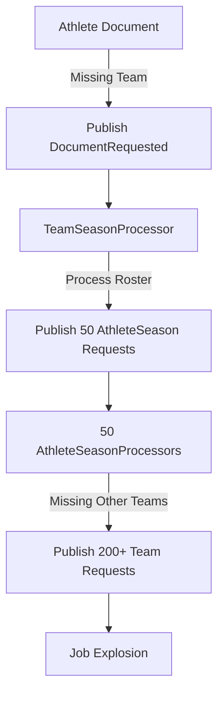
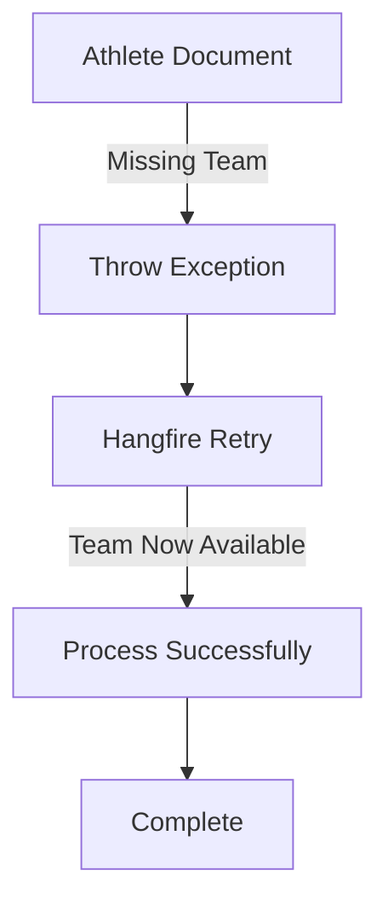

# EnableDependencyRequests Configuration

## Overview

`EnableDependencyRequests` is a critical configuration flag in `DocumentProcessingConfig` that controls how document processors handle missing dependencies. It acts as a **circuit breaker** to prevent cyclical dependency explosions in the document processing pipeline.

## Why It Was Added

### The Production Incident: 3.5 Million Job Explosion ??

Prior to this configuration, document processors used a **reactive dependency request pattern** where processors would actively publish `DocumentRequested` events when encountering missing dependencies. This created a catastrophic failure scenario in production.

#### The Cascade Failure

1. **AthleteSeasonDocumentProcessor** processes an athlete document and finds a missing `TeamSeason` dependency
2. It publishes a `DocumentRequested` event for that team
3. **TeamSeasonDocumentProcessor** receives the request and processes the team
4. The team processor spawns `AthleteSeason` document requests for all roster members (20-100+ athletes per team)
5. Those athlete documents reference OTHER teams not yet processed
6. This creates a **cascading cycle** of cross-requests between processors

**Result**: A single bulk athlete import from the Provider's `/athletes` endpoint triggered **3.5 MILLION Hangfire jobs** in production, effectively bringing the system to a halt.

### Root Causes Identified

1. **Cyclical Dependencies**: Bi-directional relationships between entities created infinite request loops
   - `AthleteSeasonDocumentProcessor` ? `TeamSeasonDocumentProcessor`
   - Each processor requesting dependencies that spawn more documents requiring the other processor

2. **Tight Coupling**: Processors became tightly coupled through event-driven reactive requests
   - Changes to one processor's logic could trigger unexpected job explosions in another
   - Dependency graph became unpredictable and impossible to reason about

3. **Unpredictable Job Growth**: Bulk seeding operations amplified the problem exponentially
   - Processing 100 athletes ? 500 team requests ? 25,000 athlete requests ? 125,000 team requests...
   - Multiplicative growth pattern based on roster sizes and team counts

4. **No Source Ordering Control**: The reactive pattern meant processors couldn't control the order of dependency resolution
   - Dependencies resolved in random order based on job execution timing
   - No way to enforce "process all teams before processing athletes"

## The Solution: Two Operational Modes

The `EnableDependencyRequests` flag provides two distinct operational modes to handle missing dependencies.

### Safe Mode (Default): `EnableDependencyRequests = false`

**This is the recommended production setting.**

#### Behavior

When a dependency is missing:
1. Log a warning with context about the missing dependency
2. Immediately throw `ExternalDocumentNotSourcedException`
3. Hangfire automatically retries the job based on retry policy
4. **No reactive `DocumentRequested` events are published**

#### Benefits

- ? **Prevents cyclical dependencies entirely** - processors cannot trigger each other
- ? **Predictable job counts** - only explicitly queued jobs execute
- ? **Relies on proper source ordering** - forces intentional orchestration design
- ? **Simplified debugging** - linear job flow is easier to trace
- ? **Controlled retry behavior** - uses Hangfire's exponential backoff

#### Code Pattern

```csharp
if (dependency is null)
{
    if (!_config.EnableDependencyRequests)
    {
        _logger.LogWarning(
            "Missing dependency: {MissingDependencyType}. Processor: {ProcessorName}. Will retry. EnableDependencyRequests=false. Ref={Ref}",
            DocumentType.TeamSeason,
            nameof(AthleteSeasonDocumentProcessor<TDataContext>),
            competitor.Team.Ref);
        
        throw new ExternalDocumentNotSourcedException(
            $"Dependency not found. Will retry when available.");
    }
    // ... legacy mode code
}
```

#### Example Log Output

```
[Warning] Missing dependency: TeamSeason. Processor: AthleteSeasonDocumentProcessor. Will retry. EnableDependencyRequests=false. Ref=http://sports.core.api.espn.com/v2/sports/football/leagues/college-football/seasons/2024/teams/333
```

### Override Mode (Legacy): `EnableDependencyRequests = true`

**Use with extreme caution - can cause job explosions.**

#### Behavior

When a dependency is missing:
1. Log a warning indicating "override mode"
2. **Publish a `DocumentRequested` event** for the missing dependency
3. Still throw `ExternalDocumentNotSourcedException` for retry
4. The published event triggers processing of the missing document

#### When To Use

This mode should **only** be enabled in specific edge cases:

- ? Testing reactive dependency resolution in isolated environments
- ? One-off data recovery scenarios where manual orchestration isn't feasible
- ? Specific document types with known-safe dependency patterns

**Never enable this globally in production.**

#### Code Pattern

```csharp
if (dependency is null)
{
    if (!_config.EnableDependencyRequests)
    {
        // ... safe mode code
    }
    else
    {
        // Legacy mode: publish DocumentRequested event
        _logger.LogWarning(
            "Dependency not found. Raising DocumentRequested (override mode). TeamRef={TeamRef}",
            competitor.Team.Ref);
        
        await _publishEndpoint.Publish(new DocumentRequested(
            // ... event details
        ));
        await _dataContext.OutboxPings.AddAsync(new OutboxPing());
        await _dataContext.SaveChangesAsync();
        
        throw new ExternalDocumentNotSourcedException(
            $"Dependency not found for {ref}");
    }
}
```

#### Example Log Output

```
[Warning] Dependency not found. Raising DocumentRequested (override mode). TeamRef=http://sports.core.api.espn.com/v2/sports/football/leagues/college-football/seasons/2024/teams/333
```

## Configuration Management

### Azure App Configuration Key

```
SportsData.Producer:DocumentProcessing:EnableDependencyRequests
```

**Type**: `boolean`  
**Default**: `false` (safe mode)

### Recommended Settings by Environment

| Environment | Value | Rationale |
|-------------|-------|-----------|
| **Local** | `false` | Prevent accidental job explosions during development |
| **Dev** | `false` | Test proper orchestration and source ordering |
| **QA** | `false` | Validate production-like behavior |
| **Production** | `false` | **ALWAYS false** - prevent job explosions |
| **Edge Case Override** | `true` | Only for specific, isolated scenarios with monitoring |

### How to Update Configuration

1. Navigate to the Azure App Configuration resource for the target environment
2. Locate or create the key: `SportsData.Producer:DocumentProcessing:EnableDependencyRequests`
3. Set the value to `false` (recommended) or `true` (override with caution)
4. Apply appropriate label for the environment (e.g., `Production.FootballNcaa.SportsData.Producer`)
5. Restart the Producer service to pick up the new configuration value

## Implementation in Document Processors

### Processors with EnableDependencyRequests Support

The following processors have been updated to support the feature flag:

1. **EventDocumentProcessor** (Football)
   - SeasonWeek dependency (lines 184-203)
   - SeasonPhase dependency (lines 224-245)
   - Venue dependency (lines 341-363)
   - FranchiseSeason dependencies for home/away teams (lines 431-467)

2. **AthleteSeasonDocumentProcessor**
   - Athlete dependency
   - TeamSeason dependency
   - Position dependency

3. **TeamSeasonDocumentProcessor**
   - Franchise dependency
   - GroupSeason dependency

4. **EventCompetitionLeadersDocumentProcessor**
   - AthleteSeason dependency

### Standard Implementation Pattern

All processors follow this consistent pattern:

```csharp
private async Task<Guid> GetDependencyId(
    ProcessDocumentCommand command,
    EspnRefDto externalRef)
{
    var dependencyId = await _dataContext.ResolveIdAsync<
        DependencyEntity, DependencyExternalId>(
        externalRef,
        command.SourceDataProvider,
        () => _dataContext.DependencyEntities,
        externalIdsNav: "ExternalIds",
        key: e => e.Id);

    if (dependencyId is null)
    {
        if (!_config.EnableDependencyRequests)
        {
            // Safe mode: log and throw for retry
            _logger.LogWarning(
                "Missing dependency: {MissingDependencyType}. Processor: {ProcessorName}. Will retry. EnableDependencyRequests=false. Ref={Ref}",
                DocumentType.ExpectedType,
                nameof(CurrentDocumentProcessor<TDataContext>),
                externalRef.Ref);
            
            throw new ExternalDocumentNotSourcedException(
                $"Dependency not found for {externalRef.Ref} in command {command.CorrelationId}");
        }
        else
        {
            // Legacy mode: publish request and throw
            _logger.LogWarning(
                "Dependency not found. Raising DocumentRequested (override mode). Ref={Ref}",
                externalRef.Ref);

            await PublishChildDocumentRequest(
                command,
                externalRef,
                parentId: null,
                DocumentType.ExpectedType,
                CausationId.Producer.CurrentDocumentProcessor);

            throw new ExternalDocumentNotSourcedException(
                $"Dependency not found for {externalRef.Ref} in command {command.CorrelationId}");
        }
    }

    return dependencyId.Value;
}
```

## Architectural Impact

### Before: Reactive Dependency Resolution



**Result**: Uncontrolled exponential growth of jobs

### After: Passive Retry Pattern (EnableDependencyRequests=false)



**Result**: Linear job counts, predictable behavior

## Design Philosophy

### Separation of Concerns

The flag enables a critical architectural shift:

- **Document Sourcing** (Provider service) is responsible for **orchestration**
  - Determines the order in which documents are sourced
  - Ensures dependencies are sourced before dependent documents
  - Example: Source all teams before sourcing athlete rosters

- **Document Processing** (Producer service) is responsible for **transformation**
  - Converts external DTOs to canonical entities
  - Validates referential integrity
  - Does NOT orchestrate dependency sourcing

### Intentional vs. Reactive Orchestration

| Aspect | Reactive (true) | Intentional (false) |
|--------|----------------|---------------------|
| **Orchestration** | Implicit, event-driven | Explicit, Provider-controlled |
| **Predictability** | Low - depends on timing | High - deterministic order |
| **Debugging** | Difficult - distributed traces | Easier - linear flow |
| **Job Growth** | Exponential risk | Linear, bounded |
| **Coupling** | Tight - processors interdependent | Loose - processors independent |

## Testing Strategy

### Testing Safe Mode (EnableDependencyRequests=false)

1. **Unit Tests**: Verify exception is thrown when dependency is missing
2. **Integration Tests**: Confirm no `DocumentRequested` events are published
3. **Retry Tests**: Validate Hangfire retry behavior with exponential backoff
4. **Logging Tests**: Ensure proper warning logs with context

### Testing Override Mode (EnableDependencyRequests=true)

1. **Event Publishing Tests**: Verify `DocumentRequested` event is published correctly
2. **Outbox Tests**: Confirm transactional outbox pattern is followed
3. **Cascade Tests**: Monitor for job explosion patterns
4. **Isolation Tests**: Only test with small, controlled datasets

### Production Monitoring

When running in production (always with `false`):

- ? Monitor retry rates for specific document types
- ? Track `ExternalDocumentNotSourcedException` occurrences
- ? Alert on unusual retry patterns (may indicate missing orchestration)
- ? Dashboard showing dependency resolution success rates

## Migration Guide

If you inherit a system with `EnableDependencyRequests=true`:

### Step 1: Audit Current Behavior

```bash
# Search for DocumentRequested event publications
grep -r "DocumentRequested" --include="*.cs" src/SportsData.Producer/

# Identify processors using reactive requests
grep -r "EnableDependencyRequests" --include="*.cs" src/
```

### Step 2: Establish Source Ordering

Design an intentional orchestration strategy in the Provider service:

```csharp
// Example: Source franchises before teams before athletes
await SourceFranchises(sport, season);
await SourceTeams(sport, season);
await SourceAthletes(sport, season);
```

### Step 3: Test with Safe Mode

1. Set `EnableDependencyRequests=false` in dev environment
2. Run full data seeding process
3. Monitor for:
   - Missing dependencies causing excessive retries
   - Gaps in source ordering logic
   - Unexpected retry failures

### Step 4: Fix Orchestration Gaps

Where excessive retries occur, update Provider orchestration:

```csharp
// Before: Athletes might reference missing teams
await SourceAthletes();

// After: Ensure teams sourced first
await SourceTeams();
await SourceAthletes(); // Now teams are available
```

### Step 5: Deploy to Production

1. Update Azure App Configuration: `EnableDependencyRequests=false`
2. Deploy with monitoring
3. Verify job counts remain stable
4. Confirm retry rates are acceptable

## FAQ

### Q: Both modes throw exceptions - what's the difference?

**A**: The difference is what happens **before** the exception is thrown:

- **Safe mode (false)**: Just logs and throws - no side effects
- **Override mode (true)**: Publishes an event **then** throws - triggers downstream processing

Both modes retry the current job, but override mode also spawns new jobs for dependencies.

### Q: Why throw an exception if we're publishing the dependency request?

**A**: The exception triggers Hangfire's retry mechanism. The current document will be retried later when the dependency (requested via the event) is available. This ensures the document eventually processes successfully.

### Q: Can I enable this for specific document types only?

**A**: No, the configuration is global. However, you can implement conditional logic in specific processors if needed. This is not recommended as it adds complexity.

### Q: What happens if I set this to `true` in production?

**A**: **Don't do this.** You risk triggering the same job explosion that necessitated this flag. If you absolutely must:
1. Enable only for a brief, monitored period
2. Have rollback plan ready
3. Monitor Hangfire dashboard actively
4. Set aggressive job count alerts

### Q: How do I know if my source ordering is correct?

**A**: Run with `EnableDependencyRequests=false` and monitor:
- Jobs that retry once or twice are fine (network blips, timing)
- Jobs that retry many times indicate missing orchestration
- Jobs that eventually succeed mean source ordering works, just slower than ideal
- Jobs that fail permanently indicate data integrity issues

## Conclusion

`EnableDependencyRequests` is a critical safety mechanism that prevents catastrophic job explosions caused by cyclical dependencies. The default `false` value enforces intentional orchestration and predictable system behavior.

**Key Takeaway**: Document processors should be **passive transformers**, not active orchestrators. Leave orchestration to the Provider service, and let processors focus on transformation logic.

When in doubt: **Keep it false.** ???
