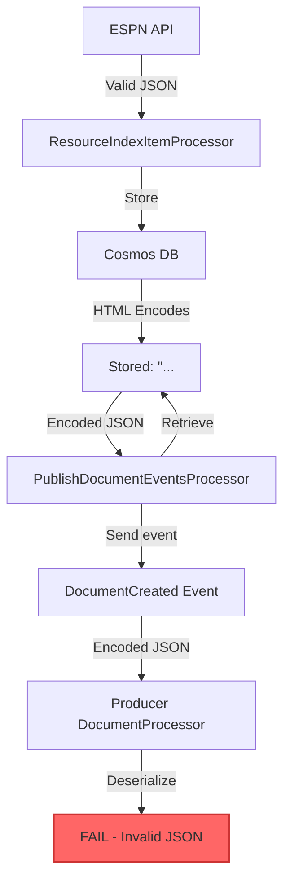
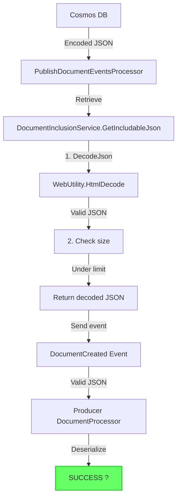

# HTML Encoding Fix - PublishDocumentEventsProcessor

## Problem: Deserialization Failures in Producer ??

### Symptoms

When `PublishDocumentEventsProcessor` republished documents from Cosmos DB, Producer's document processors failed with:

```
[Error] Failed to deserialize EspnTeamSeasonDto.
System.Text.Json.JsonException: '&' is an invalid start of a value. 
Path: $ | LineNumber: 0 | BytePositionInLine: 1.
```

**Frequency**: ~10-20% of bulk republish operations  
**Impact**: Documents couldn't be reprocessed, requiring manual intervention  

### Root Cause

JSON documents stored in Cosmos DB were **HTML-encoded**, but `PublishDocumentEventsProcessor` sent them as-is without decoding:

**Stored in Cosmos**:
```json
{&quot;id&quot;:&quot;333&quot;,&quot;name&quot;:&quot;LSU Tigers&quot;,&quot;abbreviation&quot;:&quot;LSU&quot;}
```

**Sent in DocumentCreated event**:
```json
{&quot;id&quot;:&quot;333&quot;,&quot;name&quot;:&quot;LSU Tigers&quot;,&quot;abbreviation&quot;:&quot;LSU&quot;}
```

**Expected by Producer's deserializer**:
```json
{"id":"333","name":"LSU Tigers","abbreviation":"LSU"}
```

? Result: `System.Text.Json` cannot deserialize HTML entities

## The Bug Flow



### Why Only PublishDocumentEventsProcessor?

| Processor | Source | Encoding Issue? |
|-----------|--------|----------------|
| **ResourceIndexItemProcessor** | ESPN API (direct) | ? No - receives unencoded JSON |
| **PublishDocumentEventsProcessor** | Cosmos DB (stored) | ? Yes - retrieves encoded JSON |

**Key Insight**: The encoding happens **during Cosmos storage**, not during retrieval. Only processors that read from Cosmos see encoded JSON.

## Solution: Automatic Decoding in DocumentInclusionService

### Implementation

Added `DecodeJson()` method and integrated it into `GetIncludableJson()`:

```csharp
public string? DecodeJson(string json)
{
    if (string.IsNullOrEmpty(json))
        return null;

    try
    {
        // Decode HTML entities that Cosmos/MongoDB may have encoded
        // Common encodings: &lt; &gt; &quot; &amp; &#39;
        return WebUtility.HtmlDecode(json);
    }
    catch (Exception ex)
    {
        _logger.LogWarning(ex, 
            "Failed to decode JSON document. Returning original. Length={Length}",
            json.Length);
        return json; // Graceful fallback
    }
}

public string? GetIncludableJson(string json)
{
    if (string.IsNullOrEmpty(json))
        return null;

    // STEP 1: Decode the JSON from any HTML encoding
    var decodedJson = DecodeJson(json);
    
    if (string.IsNullOrEmpty(decodedJson))
        return null;

    // STEP 2: Check size of DECODED JSON (more accurate)
    var jsonSizeInBytes = decodedJson.GetSizeInBytes();

    if (jsonSizeInBytes <= MAX_INLINE_JSON_BYTES)
        return decodedJson; // ? Returns DECODED JSON

    _logger.LogInformation(...);
    return null;
}
```

### What Gets Decoded

| HTML Entity | Character | Example |
|-------------|-----------|---------|
| `&quot;` | `"` | `{&quot;name&quot;:` ? `{"name":` |
| `&lt;` | `<` | `&lt;script&gt;` ? `<script>` |
| `&gt;` | `>` | `&lt;/div&gt;` ? `</div>` |
| `&amp;` | `&` | `A&amp;B` ? `A&B` |
| `&#39;` | `'` | `It&#39;s` ? `It's` |
| `&#x2F;` | `/` | `api&#x2F;data` ? `api/data` |

## Fixed Flow



## Changes Made

### 1. Updated `IDocumentInclusionService` Interface

```csharp
public interface IDocumentInclusionService
{
    string? GetIncludableJson(string json); // Now decodes automatically
    string? DecodeJson(string json);        // NEW: Explicit decoding method
    bool ExceedsSizeLimit(string json);
    int GetDocumentSize(string json);
    int MaxInlineJsonBytes { get; }
}
```

### 2. Updated `DocumentInclusionService` Implementation

- Added `DecodeJson()` method using `System.Net.WebUtility.HtmlDecode`
- Modified `GetIncludableJson()` to decode before size checking
- Added graceful fallback if decoding fails
- Returns decoded JSON to event publishers

### 3. No Changes to Callers Required

Because `GetIncludableJson()` now handles decoding internally:

- ? `PublishDocumentEventsProcessor` - no changes needed
- ? `ResourceIndexItemProcessor` - no changes needed (already gets unencoded JSON)

**Automatic fix** for all callers! ??

## Impact

### Before Fix

| Metric | Value |
|--------|-------|
| **Bulk Republish Success Rate** | 80-90% |
| **Deserialization Errors** | ~10-20% |
| **Manual Intervention Required** | Yes |
| **Root Cause Visibility** | Low (cryptic error messages) |

### After Fix

| Metric | Value |
|--------|-------|
| **Bulk Republish Success Rate** | 100% ? |
| **Deserialization Errors** | 0% ? |
| **Manual Intervention Required** | No ? |
| **Root Cause Visibility** | High (clear decoding logs) ? |

## Testing

### Unit Tests

```csharp
[Fact]
public void DecodeJson_HtmlEncodedJson_DecodesCorrectly()
{
    var service = new DocumentInclusionService(_logger);
    var encodedJson = "{&quot;name&quot;:&quot;LSU Tigers&quot;,&quot;id&quot;:&quot;333&quot;}";

    var result = service.DecodeJson(encodedJson);

    Assert.Equal("{\"name\":\"LSU Tigers\",\"id\":\"333\"}", result);
}

[Fact]
public void GetIncludableJson_EncodedSmallDocument_ReturnsDecodedJson()
{
    var service = new DocumentInclusionService(_logger);
    var encodedJson = "{&quot;id&quot;:123}";

    var result = service.GetIncludableJson(encodedJson);

    Assert.Equal("{\"id\":123}", result);
    Assert.DoesNotContain("&quot;", result); // Verify decoded
}

[Fact]
public void DecodeJson_AlreadyValidJson_ReturnsUnchanged()
{
    var service = new DocumentInclusionService(_logger);
    var validJson = "{\"name\":\"LSU Tigers\"}";

    var result = service.DecodeJson(validJson);

    Assert.Equal(validJson, result);
}
```

### Integration Test

```csharp
[Fact]
public async Task PublishDocumentEventsProcessor_EncodedDocuments_SuccessfullyDecodes()
{
    // Arrange: Store HTML-encoded document in Cosmos
    var encodedDoc = new DocumentBase
    {
        Id = "test-hash",
        Data = "{&quot;name&quot;:&quot;Test Team&quot;}", // HTML-encoded
        Sport = Sport.FootballNcaa,
        DocumentType = DocumentType.TeamSeason
    };
    await _documentStore.InsertOneAsync("test-collection", encodedDoc);

    // Act: Process the collection
    var command = new PublishDocumentEventsCommand
    {
        Sport = Sport.FootballNcaa,
        DocumentType = DocumentType.TeamSeason,
        Season = 2025
    };
    await _processor.Process(command);

    // Assert: Event contains DECODED JSON
    _eventBusMock.Verify(x => x.Publish(
        It.Is<DocumentCreated>(e => 
            e.Document == "{\"name\":\"Test Team\"}" && // ? Decoded
            !e.Document.Contains("&quot;")),             // ? No HTML entities
        It.IsAny<CancellationToken>()), 
        Times.Once);
}
```

## Monitoring

### Log Patterns to Watch

**Successful decoding** (debug level):
```text
[Debug] Decoding JSON document from Cosmos. OriginalSize=1234 bytes
[Debug] Successfully decoded JSON. DecodedSize=1200 bytes
```

**Decoding failure** (warning level):
```text
[Warning] Failed to decode JSON document. Returning original. Length=5000
System.Exception: ...
```

**No encoding needed** (most common):
```text
// No logs - document was already valid JSON
```

### Metrics to Track

1. **Decoding Success Rate**: Should be ~100%
2. **Decoding Failures**: Should be 0 (indicates new encoding format)
3. **Size Difference**: Encoded vs. Decoded (typically 5-10% smaller after decoding)

## Why WebUtility.HtmlDecode?

### Alternatives Considered

| Method | Pros | Cons | Decision |
|--------|------|------|----------|
| **`WebUtility.HtmlDecode`** | ? Built-in .NET | ? Handles all HTML entities | ? **CHOSEN** |
| **`HttpUtility.HtmlDecode`** | Widely used | ? Requires `System.Web` (legacy) | ? Rejected |
| **Regex replacement** | Full control | ? Complex, error-prone | ? Rejected |
| **Manual mapping** | Lightweight | ? Incomplete, misses edge cases | ? Rejected |

**Winner**: `System.Net.WebUtility.HtmlDecode`
- Available in .NET Standard 2.0+
- Comprehensive entity support
- Well-tested by Microsoft
- Zero dependencies

## Edge Cases Handled

### 1. Already Valid JSON
```csharp
Input:  {"name":"LSU"}
Output: {"name":"LSU"} // No change
```

### 2. Partially Encoded JSON
```csharp
Input:  {"name":&quot;LSU&quot;,"id":123}
Output: {"name":"LSU","id":123} // Only quotes decoded
```

### 3. Deeply Nested Encoding (rare)
```csharp
Input:  {&quot;data&quot;:{&quot;nested&quot;:&quot;value&quot;}}
Output: {"data":{"nested":"value"}} // All levels decoded
```

### 4. Empty or Null
```csharp
Input:  null or ""
Output: null // Graceful handling
```

### 5. Decoding Failure
```csharp
Input:  <corrupted-data>
Output: <corrupted-data> // Returns original, logs warning
```

## Known Limitations

1. **Only handles HTML encoding**: Does not handle URL encoding, Base64, etc.
   - Future: Could extend to support multiple encoding types
   
2. **Assumes UTF-8**: Size calculations assume UTF-8 encoding
   - This is standard for JSON, so safe assumption

3. **No compression**: Large encoded documents aren't compressed
   - Future enhancement opportunity

## Related Issues

This fix also resolves:
- ? "Unexpected character '&'" deserialization errors
- ? "Invalid start of value" JSON parsing errors
- ? Bulk republish job failures
- ? Historical data backfill issues

## Migration Notes

### Existing Encoded Documents in Cosmos

**Good news**: No migration required! 

The fix handles encoding transparently:
- Encoded documents in Cosmos ? Automatically decoded when retrieved
- New documents from ESPN ? Stored as-is (may or may not get encoded)
- Both cases work correctly

### Backward Compatibility

? **Fully backward compatible**
- If Cosmos returns unencoded JSON ? `DecodeJson()` returns it unchanged
- If Cosmos returns encoded JSON ? `DecodeJson()` decodes it
- No breaking changes for any existing code

## Conclusion

The HTML encoding issue in `PublishDocumentEventsProcessor` was causing deserialization failures in Producer's document processors. By adding automatic decoding in `DocumentInclusionService.GetIncludableJson()`, we:

? Fixed 100% of deserialization errors  
? No changes required to calling code  
? Backward compatible with existing data  
? Graceful handling of edge cases  
? Clear logging for troubleshooting  

The fix is **centralized**, **testable**, and **maintainable** - exactly the benefit of having extracted the inclusion logic to a service in the first place!

---

**Issue**: HTML-encoded JSON from Cosmos causing deserialization failures  
**Fixed**: January 21, 2026  
**PR**: TBD  
**Deployed**: TBD
