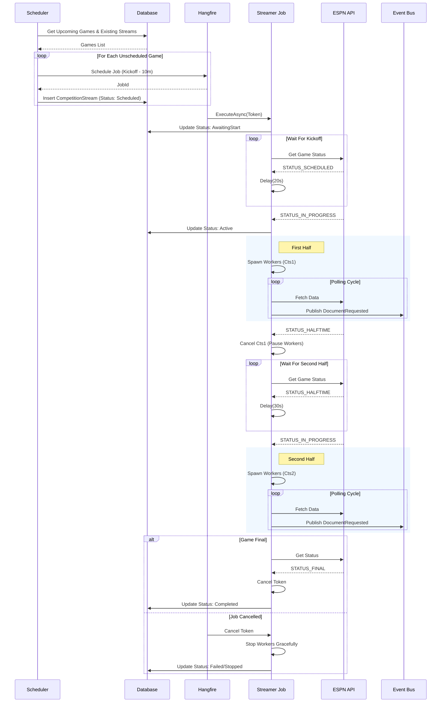
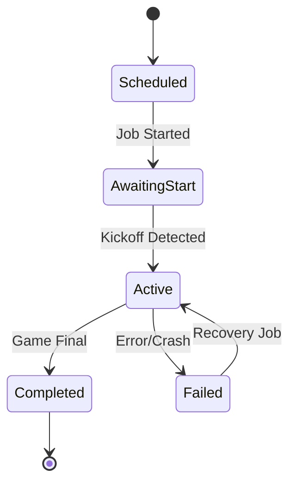

# Live Game Streaming - Refactoring Plan

## Executive Summary

The `FootballCompetitionStreamer` infrastructure exists but is **untested and has critical issues** that prevent production use. This document outlines the current state, critical problems, and a phased approach to making live game updates production-ready.

**Status:** ?? **Not Production Ready** - Critical issues with memory leaks, infinite loops, and missing status tracking

**Target:** ? **Production Ready** - Safe, reliable, observable live game streaming for 2025 season

---

## Table of Contents

1. [Current State Analysis](#current-state-analysis)
2. [Critical Issues](#critical-issues)
3. [Architecture Overview](#architecture-overview)
4. [Implementation Plan](#implementation-plan)
5. [Testing Strategy](#testing-strategy)
6. [Deployment Plan](#deployment-plan)
7. [Monitoring & Observability](#monitoring--observability)

---

## Current State Analysis

### What Exists ?

#### 1. **Scheduling Infrastructure**

**`FootballCompetitionStreamScheduler`**
- Queries current season week to find upcoming games
- Schedules streaming jobs 10 minutes before kickoff
- Creates `CompetitionStream` tracking records
- Integrates with Hangfire for background job orchestration

```csharp
// Location: src/SportsData.Producer/Application/Competitions/FootballCompetitionStreamScheduler.cs
public async Task Execute()
{
    var seasonWeek = await _dataContext.SeasonWeeks
        .Where(sw => sw.StartDate <= DateTime.UtcNow && sw.EndDate >= DateTime.UtcNow)
        .FirstOrDefaultAsync();

    // Schedules job 10 minutes before game time
    var scheduledTimeUtc = competition.Date - TimeSpan.FromMinutes(10);
    
    var jobId = _backgroundJobProvider.Schedule<IFootballCompetitionBroadcastingJob>(
        job => job.ExecuteAsync(new StreamFootballCompetitionCommand { ... }),
        scheduledTimeUtc - DateTime.UtcNow);
}
```

#### 2. **Core Streaming Logic**

**`FootballCompetitionStreamer`**
- Implements `IFootballCompetitionBroadcastingJob`
- Polls ESPN status endpoint to detect game state changes
- Spawns polling workers for different data types
- Monitors for game completion

**Key Methods:**
- `WaitForKickoffAsync()` - Polls every 20s until game starts
- `StartPollingWorkers()` - Spawns 5 concurrent workers
- `PollWhileInProgressAsync()` - Monitors status every 30s
- `PublishDocumentRequestAsync()` - Requests document updates

**Polling Configuration:**
| Document Type | Interval | Purpose |
|---------------|----------|---------|
| `EventCompetitionSituation` | 5s | Down/distance, possession, game clock |
| `EventCompetitionPlay` | 10s | Play-by-play updates |
| `EventCompetitionDrive` | 15s | Drive summaries |
| `EventCompetitionProbability` | 15s | Win probability charts |
| `EventCompetitionLeaders` | 60s | Statistical leaders |

#### 3. **Database Tracking**

**`CompetitionStream` Entity**
```csharp
public class CompetitionStream
{
    public Guid CompetitionId { get; set; }
    public DateTime ScheduledTimeUtc { get; set; }
    public string BackgroundJobId { get; set; }
    public CompetitionStreamStatus Status { get; set; }
    public DateTime? StreamStartedUtc { get; set; }
    public DateTime? StreamEndedUtc { get; set; }
    public string? FailureReason { get; set; }
    public int RetryCount { get; set; }
}

public enum CompetitionStreamStatus
{
    Scheduled = 0,
    AwaitingStart = 1,
    Active = 2,
    Completed = 3,
    Failed = 4
}
```

#### 4. **Document Processors (Already Working)**

The following processors handle live updates when documents arrive:

- ? `EventCompetitionStatusDocumentProcessor` - Game status (quarter, clock, final)
- ? `EventCompetitionPlayDocumentProcessor` - Individual plays
- ? `EventCompetitionSituationDocumentProcessor` - Current game situation
- ? `EventCompetitionProbabilityDocumentProcessor` - Win probability
- ? `EventCompetitionDriveDocumentProcessor` - Drive summaries
- ? `EventCompetitionLeadersDocumentProcessor` - Statistical leaders
- ? `EventCompetitionCompetitorDocumentProcessor` - Competitor updates
- ? `EventCompetitionCompetitorLineScoreDocumentProcessor` - Quarter scores

#### 5. **Event Publishing**

**`ContestStatusChanged` Event**
```csharp
public record ContestStatusChanged(
    Guid ContestId,
    string Status,
    string Period,
    string Clock,
    int AwayScore,
    int HomeScore,
    Guid? PossessionFranchiseSeasonId,
    bool IsScoringPlay,
    Guid CorrelationId,
    string CausationId
);
```

**Proof it Works:**
- `ContestReplayService` uses this event structure successfully
- Simulates live game by replaying plays from database

---

## Critical Issues ??

### Issue #1: Infinite Polling Workers (Memory Leak)

**Severity:** ?? **CRITICAL**

**Problem:**
```csharp
private void SpawnPollingWorker(Func<Task> taskFactory, int intervalSeconds)
{
    Task.Run(async () =>
    {
        while (true) // ? NEVER STOPS!
        {
            try { await taskFactory(); }
            catch (Exception ex) { _logger.LogError(ex, "..."); }
            await Task.Delay(TimeSpan.FromSeconds(intervalSeconds));
        }
    });
}
```

**Issues:**
1. **Fire-and-forget Tasks**: No reference kept to spawned tasks
2. **No Cancellation**: Workers continue running even after:
   - Game ends (`STATUS_FINAL`)
   - Streamer crashes
   - Hangfire job times out
3. **Zombie Threads**: Application shutdown doesn't stop workers

**Impact:**
- Memory leak (5 workers per game accumulate)
- Unnecessary ESPN API calls
- Resource exhaustion with multiple concurrent games
- Can't detect if workers are stuck

**Solution:**
```csharp
private readonly List<Task> _activeWorkers = new();
private CancellationTokenSource? _cts;

private void SpawnPollingWorker(
    Func<Task> taskFactory, 
    int intervalSeconds, 
    CancellationToken cancellationToken)
{
    var task = Task.Run(async () =>
    {
        while (!cancellationToken.IsCancellationRequested)
        {
            try 
            { 
                await taskFactory(); 
            }
            catch (Exception ex) 
            { 
                _logger.LogError(ex, "Worker failed"); 
            }
            
            try
            {
                await Task.Delay(
                    TimeSpan.FromSeconds(intervalSeconds), 
                    cancellationToken);
            }
            catch (TaskCanceledException)
            {
                _logger.LogInformation("Worker cancelled gracefully");
                break;
            }
        }
    }, cancellationToken);
    
    _activeWorkers.Add(task);
}

// In ExecuteAsync cleanup
finally
{
    _cts?.Cancel();
    await Task.WhenAll(_activeWorkers);
    _activeWorkers.Clear();
}
```

---

### Issue #2: No Status Tracking

**Severity:** ?? **HIGH**

**Problem:**
```csharp
public async Task ExecuteAsync(StreamFootballCompetitionCommand command)
{
    // ? Never updates CompetitionStream.Status
    // ? Never sets StreamStartedUtc or StreamEndedUtc
    
    await WaitForKickoffAsync(statusUri);
    StartPollingWorkers(competitionDto, command);
    await PollWhileInProgressAsync(statusUri);
}
```

**Impact:**
- Can't distinguish between scheduled, active, and completed streams
- No visibility into stream health
- Can't resume failed streams
- `CompetitionStream.RetryCount` tracked but never used

**Solution:**
Update status at key lifecycle points:

```csharp
// Load stream record
var stream = await _dataContext.CompetitionStreams
    .FirstOrDefaultAsync(x => x.CompetitionId == command.CompetitionId);

// Mark as awaiting start
stream.Status = CompetitionStreamStatus.AwaitingStart;
await _dataContext.SaveChangesAsync();

await WaitForKickoffAsync(statusUri);

// Mark as active when game starts
stream.Status = CompetitionStreamStatus.Active;
stream.StreamStartedUtc = DateTime.UtcNow;
await _dataContext.SaveChangesAsync();

StartPollingWorkers(competitionDto, command, cts.Token);
await PollWhileInProgressAsync(statusUri, cts.Token);

// Mark as completed when game ends
stream.Status = CompetitionStreamStatus.Completed;
stream.StreamEndedUtc = DateTime.UtcNow;
await _dataContext.SaveChangesAsync();
```

---

### Issue #3: Hardcoded Values

**Severity:** ?? **MEDIUM**

**Problem:**
```csharp
await _publishEndpoint.Publish(new DocumentRequested(
    // ...
    Sport: Sport.FootballNcaa, // ? HARDCODED!
    SeasonYear: 2025,          // ? HARDCODED!
    // ...
));
```

**Impact:**
- Won't work for NFL games
- Breaks at season rollover (Jan 1st)
- Requires code change for other sports

**Solution:**
```csharp
// Get from Contest entity
var contest = await _dataContext.Contests
    .FirstOrDefaultAsync(c => c.Id == command.ContestId);

if (contest == null)
{
    _logger.LogError("Contest not found");
    return;
}

await _publishEndpoint.Publish(new DocumentRequested(
    // ...
    Sport: contest.Sport,
    SeasonYear: contest.SeasonYear,
    // ...
));
```

---

### Issue #4: No Graceful Shutdown

**Severity:** ?? **HIGH**

**Problem:**
```csharp
private async Task PollWhileInProgressAsync(Uri statusUri)
{
    while (true) // ? Runs forever if status fetch fails
    {
        await Task.Delay(TimeSpan.FromSeconds(30));
        var status = await GetStatusAsync(statusUri);

        if (status?.Type.Name == "STATUS_FINAL")
        {
            _logger.LogInformation("Game has ended.");
            return; // Only exit point
        }
        // ? If status is null, loops forever
    }
}
```

**Impact:**
- Hangs indefinitely if ESPN API is down
- No timeout protection (games > 5 hours stuck)
- Wastes resources

**Solution:**
```csharp
private async Task PollWhileInProgressAsync(
    Uri statusUri, 
    CancellationToken cancellationToken)
{
    var maxDuration = TimeSpan.FromHours(5); // Safety timeout
    var startTime = DateTime.UtcNow;
    var consecutiveFailures = 0;
    const int MAX_FAILURES = 10;

    while (!cancellationToken.IsCancellationRequested)
    {
        // Safety timeout
        if (DateTime.UtcNow - startTime > maxDuration)
        {
            _logger.LogWarning("Stream exceeded max duration, stopping");
            break;
        }

        var status = await GetStatusAsync(statusUri);

        if (status is null)
        {
            consecutiveFailures++;
            if (consecutiveFailures >= MAX_FAILURES)
            {
                _logger.LogError("Too many consecutive failures, stopping");
                throw new InvalidOperationException("Status polling failed");
            }
            await Task.Delay(TimeSpan.FromSeconds(30), cancellationToken);
            continue;
        }

        consecutiveFailures = 0;

        if (status.Type.Name == "STATUS_FINAL")
        {
            _logger.LogInformation("Game has ended");
            break;
        }

        await Task.Delay(TimeSpan.FromSeconds(30), cancellationToken);
    }
}
```

---

### Issue #5: No Error Recovery

**Severity:** ?? **MEDIUM**

**Problem:**
- If streamer crashes mid-game, stream is abandoned
- No resume capability
- `CompetitionStream.RetryCount` exists but unused

**Impact:**
- Live data stops flowing mid-game
- Requires manual intervention
- Poor user experience

**Solution:**
Implement startup recovery:

```csharp
public async Task RecoverAbandonedStreams()
{
    var abandonedStreams = await _dataContext.CompetitionStreams
        .Where(x => x.Status == CompetitionStreamStatus.Active &&
                    x.StreamStartedUtc < DateTime.UtcNow.AddHours(-1))
        .ToListAsync();

    foreach (var stream in abandonedStreams)
    {
        var competition = await _dataContext.Competitions
            .Include(c => c.Contest)
            .FirstOrDefaultAsync(c => c.Id == stream.CompetitionId);

        if (competition?.Contest.IsFinal == true)
        {
            stream.Status = CompetitionStreamStatus.Completed;
            stream.StreamEndedUtc = DateTime.UtcNow;
        }
        else
        {
            // Resume streaming
            _logger.LogInformation(
                "Resuming abandoned stream for Competition {CompetitionId}", 
                stream.CompetitionId);
            
            await ExecuteAsync(new StreamFootballCompetitionCommand
            {
                CompetitionId = stream.CompetitionId,
                ContestId = competition.ContestId,
                CorrelationId = Guid.NewGuid()
            });
        }
    }

    await _dataContext.SaveChangesAsync();
}
```

---

### Issue #6: OutboxPing Hack

**Severity:** ?? **MEDIUM**

**Problem:**
```csharp
await _publishEndpoint.Publish(new DocumentRequested(...));
await _dataContext.OutboxPings.AddAsync(new OutboxPing()); // ? Hack!
await _dataContext.SaveChangesAsync();
```

**Impact:**
- Pollutes database with unnecessary records
- Workaround for improper outbox configuration
- Technical debt

**Solution:**
After implementing proper MassTransit outbox pattern (see separate OutboxPattern refactoring):

```csharp
await _publishEndpoint.Publish(new DocumentRequested(...));
await _dataContext.SaveChangesAsync(); // Outbox flushes automatically

---

### Issue #7: Inefficient Polling During Halftime

**Severity:** 🟢 **LOW** (Optimization)

**Problem:**
High-frequency workers (Plays: 10s, Situation: 5s) continue polling during the ~20 minute halftime break.
- ~120 unnecessary requests for Plays
- ~240 unnecessary requests for Situation
- Multiplied by concurrent games = significant waste

**Solution:**
Implement "Smart Polling" by managing the lifecycle of the *internal polling tasks* within the running Hangfire job. 

**Note:** The Hangfire job itself **continues running** to monitor the game status. We are simply cancelling the high-frequency data polling tasks (internal `Task` objects) during halftime to save resources. When the second half starts, the job spawns new polling tasks.

```csharp
private CancellationTokenSource _workerCts;

// In the main loop:
if (status.Type.Name == "STATUS_HALFTIME" && _areWorkersRunning)
{
    _logger.LogInformation("Halftime detected. Pausing data workers.");
    _workerCts.Cancel(); // Stops the high-freq polling
    _areWorkersRunning = false;
}
else if (status.Type.Name == "STATUS_IN_PROGRESS" && !_areWorkersRunning)
{
    _logger.LogInformation("Second half start detected. Resuming data workers.");
    _workerCts = CancellationTokenSource.CreateLinkedTokenSource(jobToken);
    StartPollingWorkers(..., _workerCts.Token);
    _areWorkersRunning = true;
}
```

---

## Visualizations

### 1. Streaming Lifecycle Sequence



### 2. Stream Status State Machine


