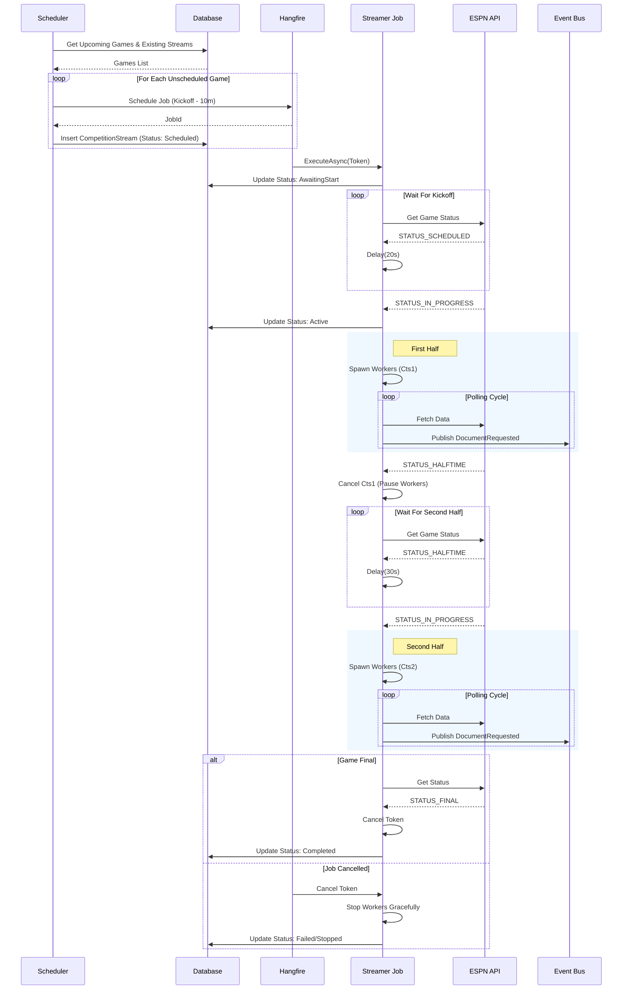
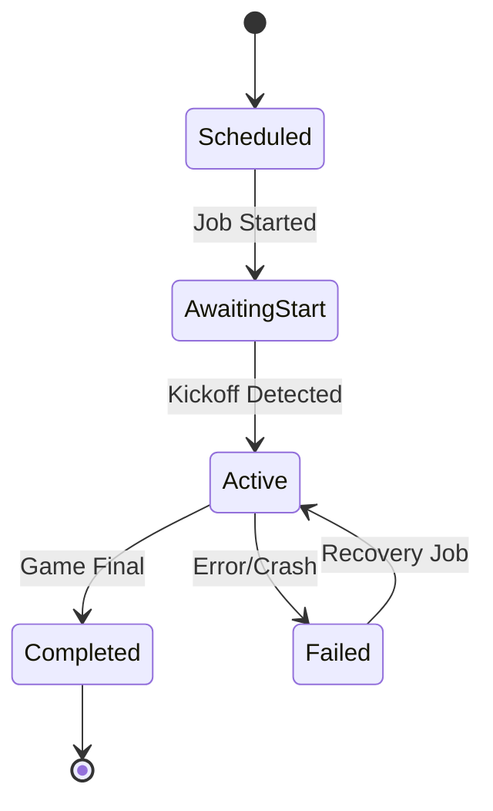

# Live Game Streaming - Refactoring Plan

## Executive Summary

The `FootballCompetitionStreamer` infrastructure exists but is **untested and has critical issues** that prevent production use. This document outlines the current state, critical problems, and a phased approach to making live game updates production-ready.

**Status:** **Phase 1 Complete** - Critical issues #1-4 resolved. Issues #5-7 remain as planned future work.

**Milestone:** Phase 1 shipped targeting the 2025 season. Issues #5-7 are outstanding future work.

---

## Table of Contents

1. [Current State Analysis](#current-state-analysis)
2. [Critical Issues](#critical-issues)
3. [Architecture Overview](#architecture-overview)
4. [Implementation Plan](#implementation-plan)
5. [Testing Strategy](#testing-strategy)
6. [Deployment Plan](#deployment-plan)
7. [Monitoring & Observability](#monitoring--observability)

---

## Current State Analysis

### What Exists ?

#### 1. **Scheduling Infrastructure**

**`FootballCompetitionStreamScheduler`**
- Queries current season week to find upcoming games
- Schedules streaming jobs 10 minutes before kickoff
- Creates `CompetitionStream` tracking records
- Integrates with Hangfire for background job orchestration

```csharp
// Location: src/SportsData.Producer/Application/Competitions/FootballCompetitionStreamScheduler.cs
public async Task Execute()
{
    var seasonWeek = await _dataContext.SeasonWeeks
        .Where(sw => sw.StartDate <= DateTime.UtcNow && sw.EndDate >= DateTime.UtcNow)
        .FirstOrDefaultAsync();

    // Schedules job 10 minutes before game time
    var scheduledTimeUtc = competition.Date - TimeSpan.FromMinutes(10);
    
    var jobId = _backgroundJobProvider.Schedule<IFootballCompetitionBroadcastingJob>(
        job => job.ExecuteAsync(new StreamFootballCompetitionCommand { ... }),
        scheduledTimeUtc - DateTime.UtcNow);
}
```

#### 2. **Core Streaming Logic**

**`FootballCompetitionStreamer`**
- Implements `IFootballCompetitionBroadcastingJob`
- Polls ESPN status endpoint to detect game state changes
- Spawns polling workers for different data types
- Monitors for game completion

**Key Methods:**
- `WaitForKickoffAsync()` - Polls every 20s until game starts
- `StartPollingWorkers()` - Spawns 5 concurrent workers
- `PollWhileInProgressAsync()` - Monitors status every 30s
- `PublishDocumentRequestAsync()` - Requests document updates

**Polling Configuration:**
| Document Type | Interval | Purpose |
|---------------|----------|---------|
| `EventCompetitionSituation` | 5s | Down/distance, possession, game clock |
| `EventCompetitionPlay` | 10s | Play-by-play updates |
| `EventCompetitionDrive` | 15s | Drive summaries |
| `EventCompetitionProbability` | 15s | Win probability charts |
| `EventCompetitionLeaders` | 60s | Statistical leaders |

#### 3. **Database Tracking**

**`CompetitionStream` Entity**
```csharp
public class CompetitionStream
{
    public Guid CompetitionId { get; set; }
    public DateTime ScheduledTimeUtc { get; set; }
    public string BackgroundJobId { get; set; }
    public CompetitionStreamStatus Status { get; set; }
    public DateTime? StreamStartedUtc { get; set; }
    public DateTime? StreamEndedUtc { get; set; }
    public string? FailureReason { get; set; }
    public int RetryCount { get; set; }
}

public enum CompetitionStreamStatus
{
    Scheduled = 0,
    AwaitingStart = 1,
    Active = 2,
    Completed = 3,
    Failed = 4
}
```

#### 4. **Document Processors (Already Working)**

The following processors handle live updates when documents arrive:

- ? `EventCompetitionStatusDocumentProcessor` - Game status (quarter, clock, final)
- ? `EventCompetitionPlayDocumentProcessor` - Individual plays
- ? `EventCompetitionSituationDocumentProcessor` - Current game situation
- ? `EventCompetitionProbabilityDocumentProcessor` - Win probability
- ? `EventCompetitionDriveDocumentProcessor` - Drive summaries
- ? `EventCompetitionLeadersDocumentProcessor` - Statistical leaders
- ? `EventCompetitionCompetitorDocumentProcessor` - Competitor updates
- ? `EventCompetitionCompetitorLineScoreDocumentProcessor` - Quarter scores

#### 5. **Event Publishing**

**Lifecycle vs. scoreboard split (2026-05-03)**

`ContestStatusChanged` was narrowed to a sport-neutral lifecycle event;
the football scoreboard fields it used to carry moved to a sport-
specific tick event. See [INTEGRATION_EVENTS.md](INTEGRATION_EVENTS.md).

```csharp
// Sport-neutral lifecycle (Scheduled → InProgress → Final)
public record ContestStatusChanged(
    Guid ContestId,
    string Status,
    Uri? Ref,
    Sport Sport,
    int? SeasonYear,
    Guid CorrelationId,
    Guid CausationId);

// Football per-play scoreboard tick
public record FootballContestStateChanged(
    Guid ContestId,
    string Period,
    string Clock,
    int AwayScore,
    int HomeScore,
    Guid? PossessionFranchiseSeasonId,
    bool IsScoringPlay,
    Uri? Ref,
    Sport Sport,
    int? SeasonYear,
    Guid CorrelationId,
    Guid CausationId);
```

**Proof it works:**
- `EventCompetitionPlayDocumentProcessor` (FB) emits both
  `ContestPlayCompleted` (log) and `FootballContestStateChanged`
  (scoreboard) when a play lands on a live contest.
- `ContestReplayService` emits the lifecycle once and a state-changed
  event per play; matches the live-flow shape exactly.

---

## Critical Issues

### Issue #1: Infinite Polling Workers (Memory Leak) -- RESOLVED

**Severity:** **CRITICAL** | **Status:** RESOLVED -- Now uses `while (!cancellationToken.IsCancellationRequested)` with worker tracking in `_activeWorkers` list and `CancellationTokenSource` linked to parent token.

**Problem:**
```csharp
private void SpawnPollingWorker(Func<Task> taskFactory, int intervalSeconds)
{
    Task.Run(async () =>
    {
        while (true) // ? NEVER STOPS!
        {
            try { await taskFactory(); }
            catch (Exception ex) { _logger.LogError(ex, "..."); }
            await Task.Delay(TimeSpan.FromSeconds(intervalSeconds));
        }
    });
}
```

**Issues:**
1. **Fire-and-forget Tasks**: No reference kept to spawned tasks
2. **No Cancellation**: Workers continue running even after:
   - Game ends (`STATUS_FINAL`)
   - Streamer crashes
   - Hangfire job times out
3. **Zombie Threads**: Application shutdown doesn't stop workers

**Impact:**
- Memory leak (5 workers per game accumulate)
- Unnecessary ESPN API calls
- Resource exhaustion with multiple concurrent games
- Can't detect if workers are stuck

**Solution:**
```csharp
private readonly List<Task> _activeWorkers = new();
private CancellationTokenSource? _cts;

private void SpawnPollingWorker(
    Func<Task> taskFactory, 
    int intervalSeconds, 
    CancellationToken cancellationToken)
{
    var task = Task.Run(async () =>
    {
        while (!cancellationToken.IsCancellationRequested)
        {
            try 
            { 
                await taskFactory(); 
            }
            catch (Exception ex) 
            { 
                _logger.LogError(ex, "Worker failed"); 
            }
            
            try
            {
                await Task.Delay(
                    TimeSpan.FromSeconds(intervalSeconds), 
                    cancellationToken);
            }
            catch (TaskCanceledException)
            {
                _logger.LogInformation("Worker cancelled gracefully");
                break;
            }
        }
    }, cancellationToken);
    
    _activeWorkers.Add(task);
}

// In ExecuteAsync cleanup
finally
{
    _cts?.Cancel();
    await Task.WhenAll(_activeWorkers);
    _activeWorkers.Clear();
}
```

---

### Issue #2: No Status Tracking -- RESOLVED

**Severity:** **HIGH** | **Status:** RESOLVED -- Status tracking implemented in `FootballCompetitionStreamer` via `UpdateStreamStatusAsync()`. Stream status transitions through AwaitingStart, Active, Completed/Failed with timestamps.

**Problem:**
```csharp
public async Task ExecuteAsync(StreamFootballCompetitionCommand command)
{
    // ? Never updates CompetitionStream.Status
    // ? Never sets StreamStartedUtc or StreamEndedUtc
    
    await WaitForKickoffAsync(statusUri);
    StartPollingWorkers(competitionDto, command);
    await PollWhileInProgressAsync(statusUri);
}
```

**Impact:**
- Can't distinguish between scheduled, active, and completed streams
- No visibility into stream health
- Can't resume failed streams
- `CompetitionStream.RetryCount` tracked but never used

**Solution:**
Update status at key lifecycle points:

```csharp
// Load stream record
var stream = await _dataContext.CompetitionStreams
    .FirstOrDefaultAsync(x => x.CompetitionId == command.CompetitionId);

// Mark as awaiting start
stream.Status = CompetitionStreamStatus.AwaitingStart;
await _dataContext.SaveChangesAsync();

await WaitForKickoffAsync(statusUri);

// Mark as active when game starts
stream.Status = CompetitionStreamStatus.Active;
stream.StreamStartedUtc = DateTime.UtcNow;
await _dataContext.SaveChangesAsync();

StartPollingWorkers(competitionDto, command, cts.Token);
await PollWhileInProgressAsync(statusUri, cts.Token);

// Mark as completed when game ends
stream.Status = CompetitionStreamStatus.Completed;
stream.StreamEndedUtc = DateTime.UtcNow;
await _dataContext.SaveChangesAsync();
```

---

### Issue #3: Hardcoded Values -- RESOLVED

**Severity:** **MEDIUM** | **Status:** RESOLVED -- `PublishDocumentRequestAsync` now uses `command.Sport`, `command.SeasonYear`, and `command.DataProvider` from the `StreamFootballCompetitionCommand` instead of hardcoded values.

**Problem:**
```csharp
await _publishEndpoint.Publish(new DocumentRequested(
    // ...
    Sport: Sport.FootballNcaa, // ? HARDCODED!
    SeasonYear: 2025,          // ? HARDCODED!
    // ...
));
```

**Impact:**
- Won't work for NFL games
- Breaks at season rollover (Jan 1st)
- Requires code change for other sports

**Solution:**
```csharp
// Get from Contest entity
var contest = await _dataContext.Contests
    .FirstOrDefaultAsync(c => c.Id == command.ContestId);

if (contest == null)
{
    _logger.LogError("Contest not found");
    return;
}

await _publishEndpoint.Publish(new DocumentRequested(
    // ...
    Sport: contest.Sport,
    SeasonYear: contest.SeasonYear,
    // ...
));
```

---

### Issue #4: No Graceful Shutdown -- RESOLVED

**Severity:** **HIGH** | **Status:** RESOLVED -- `ExecuteAsync` now wraps work in `try/finally` that calls `StopWorkersAsync()`. Workers are tracked, cancelled via linked `CancellationTokenSource`, and awaited with a 10-second timeout.

**Problem:**
```csharp
private async Task PollWhileInProgressAsync(Uri statusUri)
{
    while (true) // ? Runs forever if status fetch fails
    {
        await Task.Delay(TimeSpan.FromSeconds(30));
        var status = await GetStatusAsync(statusUri);

        if (status?.Type.Name == "STATUS_FINAL")
        {
            _logger.LogInformation("Game has ended.");
            return; // Only exit point
        }
        // ? If status is null, loops forever
    }
}
```

**Impact:**
- Hangs indefinitely if ESPN API is down
- No timeout protection (games > 5 hours stuck)
- Wastes resources

**Solution:**
```csharp
private async Task PollWhileInProgressAsync(
    Uri statusUri, 
    CancellationToken cancellationToken)
{
    var maxDuration = TimeSpan.FromHours(5); // Safety timeout
    var startTime = DateTime.UtcNow;
    var consecutiveFailures = 0;
    const int MAX_FAILURES = 10;

    while (!cancellationToken.IsCancellationRequested)
    {
        // Safety timeout
        if (DateTime.UtcNow - startTime > maxDuration)
        {
            _logger.LogWarning("Stream exceeded max duration, stopping");
            break;
        }

        var status = await GetStatusAsync(statusUri);

        if (status is null)
        {
            consecutiveFailures++;
            if (consecutiveFailures >= MAX_FAILURES)
            {
                _logger.LogError("Too many consecutive failures, stopping");
                throw new InvalidOperationException("Status polling failed");
            }
            await Task.Delay(TimeSpan.FromSeconds(30), cancellationToken);
            continue;
        }

        consecutiveFailures = 0;

        if (status.Type.Name == "STATUS_FINAL")
        {
            _logger.LogInformation("Game has ended");
            break;
        }

        await Task.Delay(TimeSpan.FromSeconds(30), cancellationToken);
    }
}
```

---

### Issue #5: No Error Recovery (Planned)

**Severity:** **MEDIUM**

**Problem:**
- If streamer crashes mid-game, stream is abandoned
- No resume capability
- `CompetitionStream.RetryCount` exists but unused

**Impact:**
- Live data stops flowing mid-game
- Requires manual intervention
- Poor user experience

**Solution:**
Implement startup recovery:

```csharp
public async Task RecoverAbandonedStreams()
{
    var abandonedStreams = await _dataContext.CompetitionStreams
        .Where(x => x.Status == CompetitionStreamStatus.Active &&
                    x.StreamStartedUtc < DateTime.UtcNow.AddHours(-1))
        .ToListAsync();

    foreach (var stream in abandonedStreams)
    {
        var competition = await _dataContext.Competitions
            .Include(c => c.Contest)
            .FirstOrDefaultAsync(c => c.Id == stream.CompetitionId);

        if (competition?.Contest.IsFinal == true)
        {
            stream.Status = CompetitionStreamStatus.Completed;
            stream.StreamEndedUtc = DateTime.UtcNow;
        }
        else
        {
            // Resume streaming
            _logger.LogInformation(
                "Resuming abandoned stream for Competition {CompetitionId}", 
                stream.CompetitionId);
            
            await ExecuteAsync(new StreamFootballCompetitionCommand
            {
                CompetitionId = stream.CompetitionId,
                ContestId = competition.ContestId,
                CorrelationId = Guid.NewGuid()
            });
        }
    }

    await _dataContext.SaveChangesAsync();
}
```

---

### Issue #6: OutboxPing Hack (Planned)

**Severity:** **MEDIUM**

**Problem:**
```csharp
await _publishEndpoint.Publish(new DocumentRequested(...));
await _dataContext.OutboxPings.AddAsync(new OutboxPing()); // ? Hack!
await _dataContext.SaveChangesAsync();
```

**Impact:**
- Pollutes database with unnecessary records
- Workaround for improper outbox configuration
- Technical debt

**Solution:**
After implementing proper MassTransit outbox pattern (see separate OutboxPattern refactoring):

```csharp
await _publishEndpoint.Publish(new DocumentRequested(...));
await _dataContext.SaveChangesAsync(); // Outbox flushes automatically

---

### Issue #7: Inefficient Polling During Halftime

**Severity:** 🟢 **LOW** (Optimization)

**Problem:**
High-frequency workers (Plays: 10s, Situation: 5s) continue polling during the ~20 minute halftime break.
- ~120 unnecessary requests for Plays
- ~240 unnecessary requests for Situation
- Multiplied by concurrent games = significant waste

**Solution:**
Implement "Smart Polling" by managing the lifecycle of the *internal polling tasks* within the running Hangfire job. 

**Note:** The Hangfire job itself **continues running** to monitor the game status. We are simply cancelling the high-frequency data polling tasks (internal `Task` objects) during halftime to save resources. When the second half starts, the job spawns new polling tasks.

```csharp
private CancellationTokenSource _workerCts;

// In the main loop:
if (status.Type.Name == "STATUS_HALFTIME" && _areWorkersRunning)
{
    _logger.LogInformation("Halftime detected. Pausing data workers.");
    _workerCts.Cancel(); // Stops the high-freq polling
    _areWorkersRunning = false;
}
else if (status.Type.Name == "STATUS_IN_PROGRESS" && !_areWorkersRunning)
{
    _logger.LogInformation("Second half start detected. Resuming data workers.");
    _workerCts = CancellationTokenSource.CreateLinkedTokenSource(jobToken);
    StartPollingWorkers(..., _workerCts.Token);
    _areWorkersRunning = true;
}
```

---

### Issue #8: No Metrics on Polling Intervals (Planned — revisit after MLB soak)

**Severity:** 🟢 **LOW** (Optimization)

**Problem:**
Polling intervals were picked by gut feel — football at 5s/10s/15s/60s, baseball at 30s/30s/60s/60s. We have no production data to confirm whether we're polling more often than ESPN actually updates (wasted requests + rate-limit risk) or less often than we should (stale UI).

**Solution sketch:**
Add OpenTelemetry metrics inside `CompetitionStreamerBase` so we can chart actual fetch-vs-change rates per (sport, doc-type) pair. Minimum metric set:

- Counter: `streamer.fetch.total{sport, doc_type}` — every poll attempt
- Counter: `streamer.fetch.changed{sport, doc_type}` — polls where the document hash differed from the prior fetch (requires caching the last hash per worker)
- Histogram: `streamer.fetch.latency{sport, doc_type}` — ESPN response time
- Histogram: `streamer.duration{sport}` — total stream lifetime per game
- Counters: `streamer.worker.spawn` / `streamer.worker.cancel` per (sport, doc_type)

The headline ratio is `changed / total` — if it's <10% we're over-polling and the interval can grow; if it's hitting 90%+ we're probably missing transitions and the interval should shrink. Wiring goes via `IMeterFactory` (we already use OTel + Prometheus exporters; see `docs/OPENTELEMETRY_SETUP.md` and existing meter patterns elsewhere in Producer).

**Open questions for the design pass:**
- Do we instrument the downstream document processors too? Fetch-to-process latency would tell us if we're handling MLB pitches in real time or backing up.
- Do we keep a single shared meter on `CompetitionStreamerBase`, or split by sport for lower cardinality?
- Grafana dashboard layout — one panel per sport, or one panel per doc_type with a sport filter?

**Don't start until** we've watched a few real MLB games run end-to-end (~1 week of MLB soak after the streamer goes live). Tuning intervals against zero data is no better than tuning them against gut feel.

---

### Issue #9: Collapse 4 contest events into 3 (Planned)

**Severity:** **MEDIUM** (architectural cleanup, not a bug)

**Problem:**

The contest pipeline emits four events where three will do. The boundary between "what changed" (state) and "why it changed" (play description) was drawn one event too early — the result is two scoreboard-tick events with no description, and one play event with no scoreboard.

| Event | Carries | Used? |
|---|---|---|
| `ContestStatusChanged` | sport-neutral lifecycle (Scheduled → InProgress → Final) | ✅ keep |
| `ContestPlayCompleted` | `PlayId`, `PlayDescription` — sport-neutral, no state | 📤 emit-only, no consumer |
| `FootballContestStateChanged` | `Period`, `Clock`, scores, possession, `IsScoringPlay` — no description | ✅ wired (SignalR) |
| `BaseballContestStateChanged` | inning/half, scores, count, runners, atBat/pitcher — no description | 🟡 consumer wired, no producer emitter yet |

A play and the resulting state are emitted from the same processor, in the same DB-write turn, with the same `CausationId`. Splitting them buys nothing: the UI needs both halves to render a play card, the backend never publishes one without the other, and the sport-neutral `ContestPlayCompleted` payload has no consumer because every consumer also wants the sport-specific state.

**Impact:**

- UI consumers reassemble the pair from two separate SignalR messages keyed by `CausationId`. The `ContestUpdatesContext` has more wiring than it needs.
- The `*ContestStateChanged` name reads like a generic state delta when each instance is in fact a per-play tick. Future readers (and a future me adding `Soccer*StateChanged`) will guess wrong.
- `BaseballEventCompetitionPlayDocumentProcessor` doesn't emit a sport-specific event today — it inherits the base class which fires `ContestPlayCompleted` (no state), so MLB live updates currently can't render scoreboard ticks. The taxonomy gap is blocking the MLB live-UI work.

**Solution:**

Three events. One per concern. Each sport-specific play processor emits its own merged event:

```csharp
// Sport-neutral lifecycle — unchanged.
public record ContestStatusChanged(
    Guid ContestId, string Status, Uri? Ref, Sport Sport,
    int? SeasonYear, Guid CorrelationId, Guid CausationId);

// Football per-play tick + description.
public record FootballPlayCompleted(
    Guid ContestId, Guid CompetitionId, Guid PlayId, string PlayDescription,
    string Period, string Clock,
    int AwayScore, int HomeScore,
    Guid? PossessionFranchiseSeasonId, bool IsScoringPlay, string? BallOnYardLine,
    Uri? Ref, Sport Sport, int? SeasonYear,
    Guid CorrelationId, Guid CausationId);

// Baseball per-play tick + description.
public record BaseballPlayCompleted(
    Guid ContestId, Guid CompetitionId, Guid PlayId, string PlayDescription,
    int Inning, string HalfInning,
    int AwayScore, int HomeScore,
    int Balls, int Strikes, int Outs,
    Guid? RunnerOnFirstAthleteId, Guid? RunnerOnSecondAthleteId, Guid? RunnerOnThirdAthleteId,
    Guid? AtBatAthleteId, Guid? PitchingAthleteId,
    Uri? Ref, Sport Sport, int? SeasonYear,
    Guid CorrelationId, Guid CausationId);
```

**Migration order:**

1. Add `FootballPlayCompleted` and `BaseballPlayCompleted` records (parallel to existing `*ContestStateChanged` — don't delete yet).
2. `EventCompetitionPlayDocumentProcessor` (FB): switch its existing `FootballContestStateChanged` publish to `FootballPlayCompleted`, populating `PlayId` + `PlayDescription` from the play it just processed. Stop emitting `ContestPlayCompleted` from the base class for the FB sub-tree.
3. `BaseballEventCompetitionPlayDocumentProcessor` (MLB): override the base method, publish `BaseballPlayCompleted` directly. This is the new emitter that closes the wiring gap noted above.
4. Remove `ContestPlayCompleted` emission from `EventCompetitionPlayDocumentProcessorBase` once both sport processors override.
5. API: rename `FootballContestStateChangedHandler` → `FootballPlayCompletedHandler`; rename `BaseballContestStateChangedHandler` → `BaseballPlayCompletedHandler`. SignalR method names follow.
6. UI: update `ContestUpdatesContext` to subscribe to `FootballPlayCompleted` / `BaseballPlayCompleted` and merge play description + state in one handler. Remove the `CausationId`-keyed reassembly.
7. Delete `ContestPlayCompleted`, `FootballContestStateChanged`, `BaseballContestStateChanged` event records.
8. Update `docs/event-surface-overview.md` matrix to reflect the new shape.

**Replay service rename + split:**

`ContestReplayService` (Producer) is football-only despite the sport-neutral name — it emits `ContestStatusChanged` once and `FootballContestStateChanged` per play. As part of this work:

- Rename `ContestReplayService` → `FootballContestReplayService`.
- Create `BaseballContestReplayService` with the same shape, emitting `BaseballPlayCompleted` per play. The MLB admin debug page (`/admin/baseball`) calls into this for synthetic event playback against the matchup card.
- Don't extract a shared `IContestReplayService` interface unless a real second caller appears — admin endpoints can resolve concrete services by sport.

**Open questions:**

- `ContestPlayCompleted` is currently emit-only with no consumer. Confirm nothing outside this repo subscribes before deleting; if yes, this is a coordinated breaking change.
- Should `PlayDescription` always ride the message, or should the UI fetch on demand? Today it fits inline; rich-text/structured plays would force a revisit.
- `BaseballPlayCompleted` carries 5 athlete IDs (runners + atBat + pitcher). At-bat changes inside an inning don't change runners — leave finer-grained `BaseballAtBatChanged` until a UI use case demands it.

---

## Visualizations

### 1. Streaming Lifecycle Sequence


```mermaid
sequenceDiagram
    participant S as Scheduler
    participant DB as Database
    participant H as Hangfire
    participant J as Streamer Job
    participant API as ESPN API
    participant EB as Event Bus

    S->>DB: Get Upcoming Games & Existing Streams
    DB-->>S: Games List
    
    loop For Each Unscheduled Game
        S->>H: Schedule Job (Kickoff - 10m)
        H-->>S: JobId
        S->>DB: Insert CompetitionStream (Status: Scheduled)
    end

    H->>J: ExecuteAsync(Token)
    J->>DB: Update Status: AwaitingStart
    
    loop Wait For Kickoff
        J->>API: Get Game Status
        API-->>J: STATUS_SCHEDULED
        J->>J: Delay(20s)
    end

    API-->>J: STATUS_IN_PROGRESS
    J->>DB: Update Status: Active
    
    rect rgb(240, 248, 255)
    note right of J: First Half
    J->>J: Spawn Workers (Cts1)
    loop Polling Cycle
        J->>API: Fetch Data
        J->>EB: Publish DocumentRequested
    end
    end

    API-->>J: STATUS_HALFTIME
    J->>J: Cancel Cts1 (Pause Workers)
    
    loop Wait For Second Half
        J->>API: Get Game Status
        API-->>J: STATUS_HALFTIME
        J->>J: Delay(30s)
    end

    API-->>J: STATUS_IN_PROGRESS
    
    rect rgb(240, 248, 255)
    note right of J: Second Half
    J->>J: Spawn Workers (Cts2)
    loop Polling Cycle
        J->>API: Fetch Data
        J->>EB: Publish DocumentRequested
    end
    end

    alt Game Final
        J->>API: Get Status
        API-->>J: STATUS_FINAL
        J->>J: Cancel Token
        J->>DB: Update Status: Completed
    else Job Cancelled
        H->>J: Cancel Token
        J->>J: Stop Workers Gracefully
        J->>DB: Update Status: Failed/Stopped
    end
```

### 2. Stream Status State Machine


```mermaid
stateDiagram-v2
    [*] --> Scheduled
    Scheduled --> AwaitingStart: Job Started
    AwaitingStart --> Active: Kickoff Detected
    Active --> Completed: Game Final
    Active --> Failed: Error/Crash
    Failed --> Active: Recovery Job
    Completed --> [*]
```
