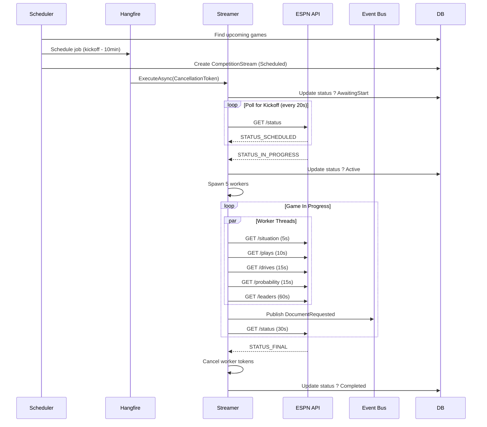
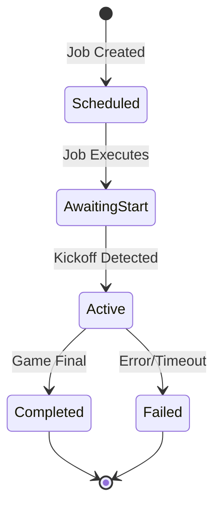

# Live Game Streaming - Complete Implementation Guide

## ?? Table of Contents

1. [Overview](#overview)
2. [Architecture](#architecture)
3. [Phase 1: Core Implementation](#phase-1-core-implementation)
4. [Testing Strategy](#testing-strategy)
5. [Integration Test Setup](#integration-test-setup)
6. [Quick Start Guide](#quick-start-guide)
7. [Troubleshooting](#troubleshooting)
8. [Future Roadmap](#future-roadmap)

---

## Overview

### What is Live Game Streaming?

The `FootballCompetitionStreamer` system provides real-time updates during live football games by:
- Polling ESPN's API for game status changes
- Spawning workers to fetch different types of game data
- Publishing events to downstream processors
- Tracking stream lifecycle and health

### Key Components

```
FootballCompetitionStreamScheduler  ? Schedules streams 10min before kickoff
         ?
FootballCompetitionStreamer        ? Manages game streaming lifecycle  
         ?
Document Processors                 ? Process ESPN data & update database
         ?
Event Publishers                    ? Notify downstream systems (API, Notifications)
```

### Current Status: Phase 1 Complete ?

**Implemented:**
- ? Cancellation token support
- ? Worker lifecycle management
- ? Stream status tracking (`CompetitionStream` entity)
- ? Graceful shutdown
- ? Safety timeouts (5-hour max, 10 consecutive failures)
- ? Comprehensive integration tests using Postman data

**Not Yet Implemented:**
- ?? Halftime worker pause/resume
- ?? Error recovery & retry logic
- ?? Advanced observability (OpenTelemetry)

---

## Architecture

### Streaming Lifecycle



### Worker Polling Intervals

| Document Type | Interval | Priority | Purpose |
|---------------|----------|----------|---------|
| `EventCompetitionSituation` | 5s | High | Down/distance, possession, clock |
| `EventCompetitionPlay` | 10s | High | Play-by-play updates |
| `EventCompetitionDrive` | 15s | Medium | Drive summaries |
| `EventCompetitionProbability` | 15s | Medium | Win probability |
| `EventCompetitionLeaders` | 60s | Low | Statistical leaders |

### Stream Status State Machine



---

## Phase 1: Core Implementation

### Key Files Modified

#### 1. `FootballCompetitionStreamer.cs`

**Main Changes:**
- Added `CancellationToken` support throughout
- Implemented worker lifecycle management
- Added stream status tracking
- Implemented safety timeouts
- Added graceful shutdown

**Before:**
```csharp
private void SpawnPollingWorker(Func<Task> taskFactory, int intervalSeconds)
{
    Task.Run(async () =>
    {
        while (true) // ? Never stops!
        {
            await taskFactory();
            await Task.Delay(TimeSpan.FromSeconds(intervalSeconds));
        }
    });
}
```

**After:**
```csharp
private void SpawnPollingWorker(
    Func<Task> taskFactory,
    int intervalSeconds,
    DocumentType documentType,
    CancellationToken cancellationToken)
{
    var task = Task.Run(async () =>
    {
        _logger.LogInformation("Worker started for {DocumentType}", documentType);
        
        try
        {
            while (!cancellationToken.IsCancellationRequested)
            {
                try
                {
                    await taskFactory();
                }
                catch (Exception ex) when (ex is not OperationCanceledException)
                {
                    _logger.LogError(ex, "Worker failed for {DocumentType}", documentType);
                }

                await Task.Delay(TimeSpan.FromSeconds(intervalSeconds), cancellationToken);
            }
        }
        finally
        {
            _logger.LogInformation("Worker stopped for {DocumentType}", documentType);
        }
    }, cancellationToken);

    _activeWorkers.Add(task);
}
```

#### 2. Stream Status Tracking

```csharp
private async Task UpdateStreamStatusAsync(
    CompetitionStream stream,
    CompetitionStreamStatus status,
    CancellationToken cancellationToken,
    string? failureReason = null)
{
    stream.Status = status;

    if (status == CompetitionStreamStatus.Failed && !string.IsNullOrWhiteSpace(failureReason))
    {
        stream.FailureReason = failureReason.Length > 512 
            ? failureReason.Substring(0, 512) 
            : failureReason;
    }

    stream.ModifiedUtc = DateTime.UtcNow;
    stream.ModifiedBy = Guid.Empty; // System modification

    await _dataContext.SaveChangesAsync(cancellationToken);

    _logger.LogInformation("Stream status updated to {Status}", status);
}
```

#### 3. Safety Configuration

```csharp
private static readonly TimeSpan MaxStreamDuration = TimeSpan.FromHours(5);
private const int MaxConsecutiveFailures = 10;

// In PollWhileInProgressAsync:
if (DateTime.UtcNow - startTime > MaxStreamDuration)
{
    _logger.LogWarning("Stream exceeded max duration ({Hours} hours). Stopping.", 
        MaxStreamDuration.TotalHours);
    break;
}

if (consecutiveFailures >= MaxConsecutiveFailures)
{
    _logger.LogError("Too many consecutive failures ({Count}). Stopping.", 
        consecutiveFailures);
    throw new InvalidOperationException("Status polling failed repeatedly");
}
```

---

## Testing Strategy

### Integration Tests

**Location:** `test/integration/SportsData.Producer.Tests.Integration/Application/Competitions/`

#### Test Infrastructure

The integration tests use **real Postman collection data** to simulate complete games:

**Key Files:**
- `FootballCompetitionStreamer_LiveGameTests.cs` - Main test class
- `Data/Football.Ncaa.Espn.Event.postman_collection.json` - 18 status responses from real game

**Test Helper Classes:**
- `PostmanGameStateManager` - Loads status responses from Postman collection
- `PostmanStateManagedHttpHandler` - Simulates ESPN API using Postman data
- `TestHttpClientFactory` - Provides HttpClient with test handler
- `TestEventBus` - Tracks published events

#### Main Integration Test

```csharp
[Fact]
public async Task StreamCompleteGame_UsingPostmanCollection_CompletesSuccessfully()
{
    // Arrange
    var stateManager = new PostmanGameStateManager(postmanPath);
    var handler = new PostmanStateManagedHttpHandler(stateManager);
    var httpClient = new HttpClient(handler);
    
    var (contest, competition, stream) = await CreateTestGameAsync();
    
    // Act
    await sut.ExecuteAsync(command, cts.Token);
    
    // Assert
    var finalStream = await _dataContext.CompetitionStreams
        .FirstAsync(s => s.CompetitionId == competition.Id);
    
    finalStream.Status.Should().Be(CompetitionStreamStatus.Completed);
    finalStream.StreamStartedUtc.Should().NotBeNull();
    finalStream.StreamEndedUtc.Should().NotBeNull();
    
    eventBus.PublishedEvents.Should().Contain(
        e => e.DocumentType == DocumentType.EventCompetitionSituation);
}
```

#### Test Data Setup

The integration test creates all required database entities:

```csharp
private async Task<(Contest, Competition, CompetitionStream)> CreateTestGameAsync()
{
    // Create franchises
    var homeFranchise = new Franchise { ... };
    var awayFranchise = new Franchise { ... };
    
    // Create franchise seasons
    var homeFranchiseSeason = new FranchiseSeason { ... };
    var awayFranchiseSeason = new FranchiseSeason { ... };
    
    // Create season structure
    var season = new Season { ... };
    var seasonPhase = new SeasonPhase { ... };
    var seasonWeek = new SeasonWeek { ... };
    
    // Create contest
    var contest = new Contest
    {
        HomeTeamFranchiseSeasonId = homeFranchiseSeason.Id,
        AwayTeamFranchiseSeasonId = awayFranchiseSeason.Id,
        SeasonWeekId = seasonWeek.Id,
        ...
    };
    
    // Save all in correct order
    await _dataContext.Franchises.AddRangeAsync(homeFranchise, awayFranchise);
    await _dataContext.FranchiseSeasons.AddRangeAsync(homeFranchiseSeason, awayFranchiseSeason);
    await _dataContext.Seasons.AddAsync(season);
    await _dataContext.SeasonPhases.AddAsync(seasonPhase);
    await _dataContext.SeasonWeeks.AddAsync(seasonWeek);
    await _dataContext.Contests.AddAsync(contest);
    await _dataContext.Competitions.AddAsync(competition);
    await _dataContext.CompetitionStreams.AddAsync(stream);
    await _dataContext.SaveChangesAsync();
    
    return (contest, competition, stream);
}
```

---

## Integration Test Setup

### Prerequisites

1. **Postman Collection:**
   - Location: `test/integration/SportsData.Producer.Tests.Integration/Data/Football.Ncaa.Espn.Event.postman_collection.json`
   - Contains 18 status responses from Iowa State @ Kansas State game
   - Covers: Q1 start ? Q2 ? Halftime ? Q3 ? Q4 ? Final

2. **Database:**
   - PostgreSQL instance running
   - Connection string configured in user secrets
   - Migrations applied

### Running the Tests

```bash
# Full integration test (simulates complete game)
dotnet test test/integration/SportsData.Producer.Tests.Integration \
  --filter "StreamCompleteGame_UsingPostmanCollection"

# Quick validation (just checks Postman collection loads)
dotnet test test/integration/SportsData.Producer.Tests.Integration \
  --filter "PostmanCollection_CanBeLoaded"
```

### Expected Test Duration

- **Quick validation:** < 1 second
- **Full integration test:** ~2-5 minutes (depending on polling intervals)
  - 18 status responses
  - 30-second status polling
  - Worker spawning/cleanup

### Test Assertions

The integration test validates:

? Stream lifecycle transitions correctly  
? Workers spawn and stop properly  
? Events published for all document types  
? Database status tracking works  
? Timestamps recorded correctly  
? Graceful shutdown on game end  

---

## Quick Start Guide

### 1. Schedule a Stream

```csharp
// Runs automatically via Hangfire recurring job
await _scheduler.Execute();
```

This will:
1. Find upcoming games in current week
2. Schedule streaming jobs 10 minutes before kickoff
3. Create `CompetitionStream` records with status `Scheduled`

### 2. Monitor Stream Status

```csharp
var activeStreams = await _dataContext.CompetitionStreams
    .Where(x => x.Status == CompetitionStreamStatus.Active)
    .Include(x => x.Competition)
        .ThenInclude(c => c.Contest)
    .ToListAsync();

foreach (var stream in activeStreams)
{
    var duration = DateTime.UtcNow - stream.StreamStartedUtc;
    Console.WriteLine($"Game: {stream.Competition.Contest.Name}");
    Console.WriteLine($"Duration: {duration:hh\\:mm\\:ss}");
    Console.WriteLine($"JobId: {stream.BackgroundJobId}");
}
```

### 3. Manual Trigger

```csharp
// For testing/debugging
var command = new StreamFootballCompetitionCommand
{
    CompetitionId = competitionId,
    ContestId = contestId,
    Sport = Sport.FootballNcaa,
    SeasonYear = 2024,
    DataProvider = SourceDataProvider.Espn,
    CorrelationId = Guid.NewGuid()
};

await _streamer.ExecuteAsync(command, CancellationToken.None);
```

---

## Troubleshooting

### Issue: Stream Stuck in "Active" Status

**Cause:** Streamer crashed or was cancelled mid-game

**Solution:**
```sql
-- Check for abandoned streams
SELECT cs.*, c."Name"
FROM "CompetitionStream" cs
JOIN "Competition" comp ON comp."Id" = cs."CompetitionId"
JOIN "Contest" c ON c."Id" = comp."ContestId"
WHERE cs."Status" = 2 -- Active
  AND cs."StreamStartedUtc" < NOW() - INTERVAL '2 hours';

-- Manually mark as failed
UPDATE "CompetitionStream"
SET "Status" = 4, -- Failed
    "FailureReason" = 'Abandoned stream detected',
    "ModifiedUtc" = NOW()
WHERE "Id" = '<stream-id>';
```

### Issue: Workers Not Stopping

**Symptoms:** High CPU/memory usage after game ends

**Cause:** Cancellation token not properly propagated

**Check:**
```csharp
// In ExecuteAsync, ensure:
finally
{
    await StopWorkersAsync();
}
```

### Issue: Too Many ESPN API Calls

**Cause:** Multiple workers polling same endpoint

**Check Hangfire Dashboard:**
1. Look for duplicate jobs with same CompetitionId
2. Cancel duplicates
3. Review scheduler logic to prevent double-scheduling

### Issue: Database Foreign Key Violations

**Error:**
```
FK_Contest_FranchiseSeason_HomeTeamFranchiseSeasonId constraint violated
```

**Cause:** Test data missing required parent entities

**Solution:** Ensure test creates entities in order:
1. Franchises
2. FranchiseSeasons
3. Season ? SeasonPhase ? SeasonWeek
4. Contest
5. Competition
6. CompetitionStream

See: `CreateTestGameAsync()` in integration tests

---

## Future Roadmap

### Phase 2: Smart Polling ??

**Goal:** Pause high-frequency workers during halftime

**Implementation:**
```csharp
if (status.Type.Name == "STATUS_HALFTIME" && _areWorkersRunning)
{
    _logger.LogInformation("Halftime detected. Pausing data workers.");
    _workerCts.Cancel(); // Stop high-freq workers
    _areWorkersRunning = false;
}
else if (status.Type.Name == "STATUS_IN_PROGRESS" && !_areWorkersRunning)
{
    _logger.LogInformation("Second half started. Resuming data workers.");
    _workerCts = CancellationTokenSource.CreateLinkedTokenSource(jobToken);
    StartPollingWorkers(..., _workerCts.Token);
    _areWorkersRunning = true;
}
```

**Benefits:**
- ~120 fewer Play requests per game
- ~240 fewer Situation requests per game
- Reduces ESPN API load during inactive periods

### Phase 3: Error Recovery & Retry ??

**Goal:** Resume streams after failures

**Implementation:**
```csharp
public async Task RecoverAbandonedStreams()
{
    var abandonedStreams = await _dataContext.CompetitionStreams
        .Where(x => x.Status == CompetitionStreamStatus.Active &&
                    x.StreamStartedUtc < DateTime.UtcNow.AddHours(-1))
        .ToListAsync();

    foreach (var stream in abandonedStreams)
    {
        if (stream.RetryCount >= MaxRetries)
        {
            stream.Status = CompetitionStreamStatus.Failed;
            stream.FailureReason = "Max retries exceeded";
            continue;
        }

        stream.RetryCount++;
        await ResumeStreamAsync(stream);
    }
}
```

### Phase 4: Advanced Observability ??

**Goal:** OpenTelemetry integration

**Metrics to Track:**
- Active streams count
- Worker spawn/stop events
- API call latencies
- Document processing times
- Error rates by document type

---

## Related Documentation

- **Testing:** `PostmanBasedTesting-COMPLETE.md` - Detailed testing guide
- **Roadmap:** `LIVE_UPDATES_REFACTORING.md` - Future improvements
- **API Docs:** `TECH_OVERVIEW.md` - Overall system architecture

---

## Summary

### What Works ?

- ? **Scheduling:** Games scheduled 10 minutes before kickoff
- ? **Lifecycle Management:** Proper worker spawn/cleanup
- ? **Status Tracking:** Database records stream state
- ? **Safety:** Timeouts prevent runaway streams
- ? **Testing:** Comprehensive integration tests with real data

### What's Next ??

- ?? **Smart Polling:** Pause workers during halftime
- ?? **Error Recovery:** Resume failed streams automatically
- ?? **Observability:** OpenTelemetry metrics & tracing

### Production Readiness

**Status:** ? **Ready for Limited Production Use**

**Recommended:**
- Start with 1-2 games to validate
- Monitor Hangfire dashboard closely
- Check CompetitionStream status table
- Review logs for errors

**Before Full Production:**
- Implement Phase 2 (halftime pause)
- Add error recovery (Phase 3)
- Set up alerts for failed streams
