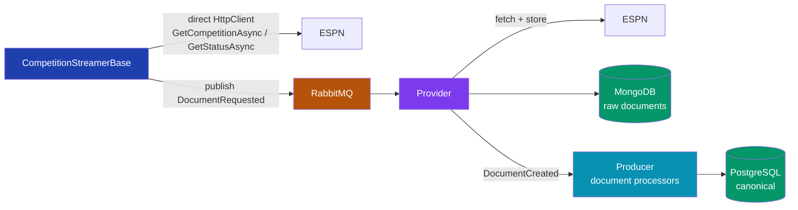
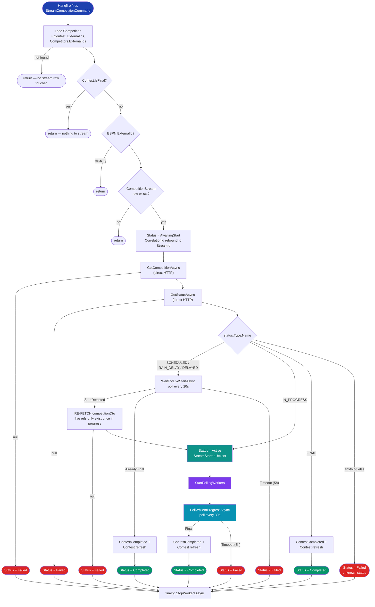
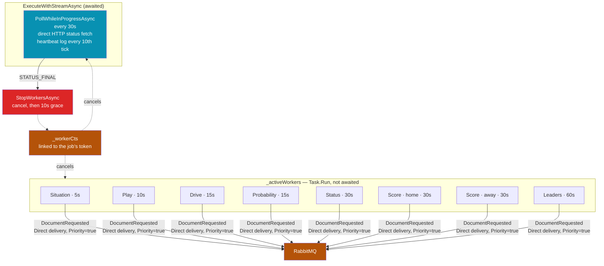
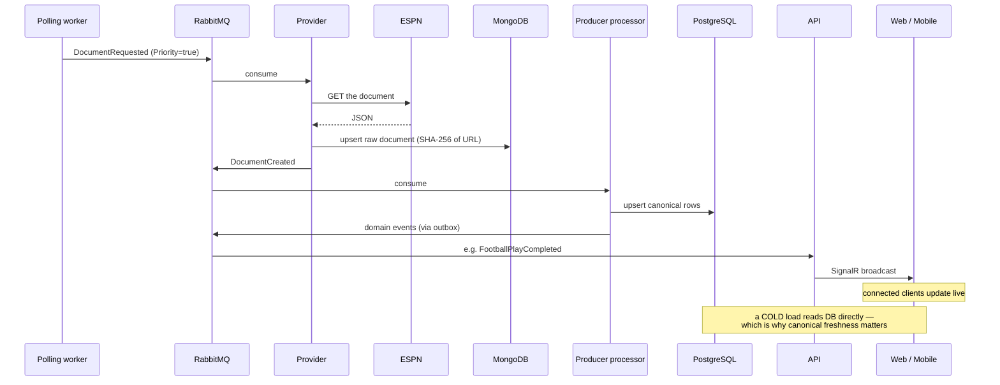

# CompetitionStreamerBase — a code-reading companion

Orientation for `src/SportsData.Producer/Application/Competitions/CompetitionStreamerBase.cs`
and its football subclass. This is the thing that turns "a game is happening
right now" into canonical rows and live UI. It is one Hangfire job per
competition, and it runs for the duration of the game.

Companion to [`docs/features/live-game-streaming.md`](../features/live-game-streaming.md),
which covers the feature's history and roadmap. This document is about the
shape of the code as it stands.

> Reflects the code as of PR #754 (live status + score sourcing). If you are
> reading this against an older checkout, the two scoreboard workers in the
> fan-out diagram will not be there.

---

## The one-paragraph version

A scheduler creates one `CompetitionStream` row and one Hangfire job per
competition, timed for kickoff minus 10 minutes — or five seconds from now if
that moment has already passed, which is how a late-added or rescheduled game
starts streaming almost immediately. When the job fires, the streamer
loads the competition, asks ESPN what the game's status is, and waits until the
game is actually in progress. Then it spawns a handful of independent polling
workers — one per document type — that do nothing but publish
`DocumentRequested` messages on a cadence. Meanwhile the streamer's own loop
keeps asking ESPN for status every 30 seconds, purely to notice when the game
ends. When it does, the workers are cancelled and finalization events go out.

The critical thing to internalise: **the streamer never writes canonical data
itself.** It only asks for documents. Everything you see in Postgres arrives
through the normal document pipeline.

---

## Two paths to ESPN, and why that distinction matters

This trips people up, and it caused a real production bug, so it is worth
stating before anything else. The streamer talks to ESPN in two completely
different ways:

The **direct** path feeds the streamer's own decision-making and is *never*
persisted. The **pipeline** path is the only way anything reaches the database.

A document the streamer reads directly but never requests through the pipeline
is invisible to the rest of the platform. That is exactly what happened with
competition status: `PollWhileInProgressAsync` fetched it every 30 seconds to
detect the end of the game, and threw it away, so `CompetitionStatus` in
Postgres held its pre-kickoff value for the entire game and every matchup card
showed a live game as "scheduled."

---

## Lifecycle

Thirteen exits, every one reached deliberately: four early returns that
never touch the stream row, six that write `Failed`, three that write
`Completed`. Those `CompetitionStreamStatus` values are what you read
afterwards to find out what happened.

### Why the re-fetch exists

ESPN does not populate the live-data refs (`details`, `probabilities`,
`situation`, `leaders`) on the parent `EventCompetition` payload until the game
is actually in progress. The first fetch happens while the game is still
scheduled, so those refs are null. Without the re-fetch after `StartDetected`,
`GetPollingTargets` returns nothing but nulls, the log fills with
`"Skipping worker for X - URI is null"`, `Active workers: 0`, and the monitor
loop runs silently for three hours having sourced nothing.

### Status vocabulary

| ESPN status | Treatment | Why |
|---|---|---|
| `STATUS_SCHEDULED` | wait and poll | normal pre-game |
| `STATUS_RAIN_DELAY` | wait and poll | ESPN flips back to in-progress or final |
| `STATUS_DELAYED` | wait and poll | same |
| `STATUS_IN_PROGRESS` | stream immediately | job fired late, or a restart |
| `STATUS_FINAL` | finalize, don't stream | job fired late |
| `STATUS_POSTPONED` | **abort** | usually reschedules to another day |
| `STATUS_SUSPENDED` | **abort** | may resume on another day |
| anything unknown | **abort** | never spawn workers against unverified state |

The delay statuses share the scheduled branch because of a real incident: a
rain-delayed MLB game hit the `default` branch, aborted at game start, no live
sourcing ever attached, and the contest stuck at "Live" in the UI overnight.
Postponed and suspended are deliberately *not* folded in — waiting the full
five hours on a game that moved to next Tuesday is worse than aborting and
letting the next cron pick it up.

---

## Concurrency model

Once live, there are **N + 1 concurrent loops**: one monitor owned by the
streamer, and one fire-and-forget worker per polling target.

Cadences shown are football (`FootballCompetitionStreamer.GetPollingTargets`
plus the two scoreboard workers added by the base). Baseball is slower across
the board and has no drives.

Things worth knowing about this model:

- **Workers never touch the database.** Each tick is one publish and a delay.
  A worker that throws logs and keeps going; only cancellation stops it.
- **The streamer instance is stateful** — `_activeWorkers` and `_workerCts` are
  instance fields — so it is resolved per job execution, never shared.
- **`StopWorkersAsync` runs in a `finally`**, so workers are cancelled on every
  exit path including exceptions, with a 10-second grace period before the
  streamer gives up waiting and proceeds anyway.
- **Cancellation is rethrown, not swallowed.** When KEDA scales down a pod
  mid-game, the job must fail loudly so Hangfire re-queues it onto a healthy
  worker. Swallowing it caused ten of fourteen MLB streams to silently die on
  2026-06-13. The `Failed` status written on that path is diagnostic only — the
  next run overwrites it.

---

## What one polling tick actually causes

A single worker tick is one small publish, but it fans out across four services
before anything a user sees changes.

That last note is the whole reason the status and score workers exist.
Connected clients get sub-second updates from the SignalR play stream, so a
frozen `CompetitionStatus` is invisible to anyone already watching. It only
shows up on a **cold load**, which reads Postgres — and that is the case the
polling has to carry.

---

## Polling targets — football

| Document | Cadence | `ParentId` sent | Notes |
|---|---|---|---|
| `EventCompetitionSituation` | 5s | competition | down, distance, possession |
| `EventCompetitionPlay` | 10s | competition | drives the SignalR feed |
| `EventCompetitionDrive` | 15s | competition | |
| `EventCompetitionProbability` | 15s | *none* | resolves its parent from its own DTO |
| `EventCompetitionStatus` | 30s | competition | period, clock, status type |
| `EventCompetitionCompetitorScore` | 30s × 2 | **competitor** | one worker per side |
| `EventCompetitionLeaders` | 60s | competition | |

`ParentId` is not decoration — it is how the downstream processor resolves what
the document belongs to. Most processors call `TryGetOrDeriveParentId` and
expect the competition. Score documents are the exception: their parent is the
`CompetitionCompetitor`, which is why the polling targets carry an explicit
parent id rather than a boolean.

Sport-specific targets come from `GetPollingTargets`; status and scores are
added by the base class so no new sport can forget them.

---

## Failure and timing constants

| Constant | Value | Meaning |
|---|---|---|
| `MaxStreamDuration` | 5 hours | applies separately to the wait-for-start loop and the in-progress loop |
| `MaxConsecutiveFailures` | 10 | consecutive *status* fetch failures before the stream throws |
| live-start poll | 20s | `WaitForLiveStartAsync` |
| in-progress poll | 30s | `PollWhileInProgressAsync` |
| worker stop grace | 10s | `StopWorkersAsync` |
| heartbeat | every 10th tick (~5 min) | proof-of-life in Seq during long quiet stretches |

A status fetch failure is *not* immediately fatal — the counter resets on any
success. Ten in a row throws, which surfaces as `Failed` and a Hangfire retry.

---

## `ContestCompleted` is published from three places

Deliberately. All three are `DeliveryMode.Direct` (stateless publish, no
`SaveChangesAsync` for the outbox interceptor to ride) and the consumer is
idempotent:

1. status was already `FINAL` when the job started
2. the game went final while waiting for live start
3. the in-progress loop saw `FINAL`

Plus a fourth, defensive publish from `EventCompetitionStatusProcessorBase`
when it persists a `FINAL` transition — covering the case where the streamer
died before noticing. Downstream, `ContestScoringProcessor` short-circuits when
no unscored picks remain, so duplicates are cheap.

Each of those sites also publishes a **Contest refresh** `DocumentRequested`
for the parent Event, with `IncludeLinkedDocumentTypes` deliberately omitted so
*every* linked child is re-sourced. Provider's ~90-minute re-publish
suppression absorbs the duplicates against documents already polled during the
stream.

---

## Where to look

| You want | Go to |
|---|---|
| the whole lifecycle | `ExecuteAsync` → `ExecuteWithStreamAsync` |
| what gets polled for a sport | `FootballCompetitionStreamer.GetPollingTargets` |
| what gets polled for *every* sport | `StartPollingWorkers` (status + scores) |
| why a stream ended | `CompetitionStream.Status` + `FailureReason` |
| a stream's whole story in Seq | filter on `CorrelationId = <CompetitionStream.Id>` |
| streams for a slate | `sql/pgsql/_debug_competitionStream.sql` |

The CorrelationId rebind is the single most useful debugging affordance here:
from the moment the stream row is loaded, every log line — streamer, workers,
Provider's sourcing, Producer's processors — carries the `CompetitionStream.Id`.
One Seq filter gives you the entire game.
