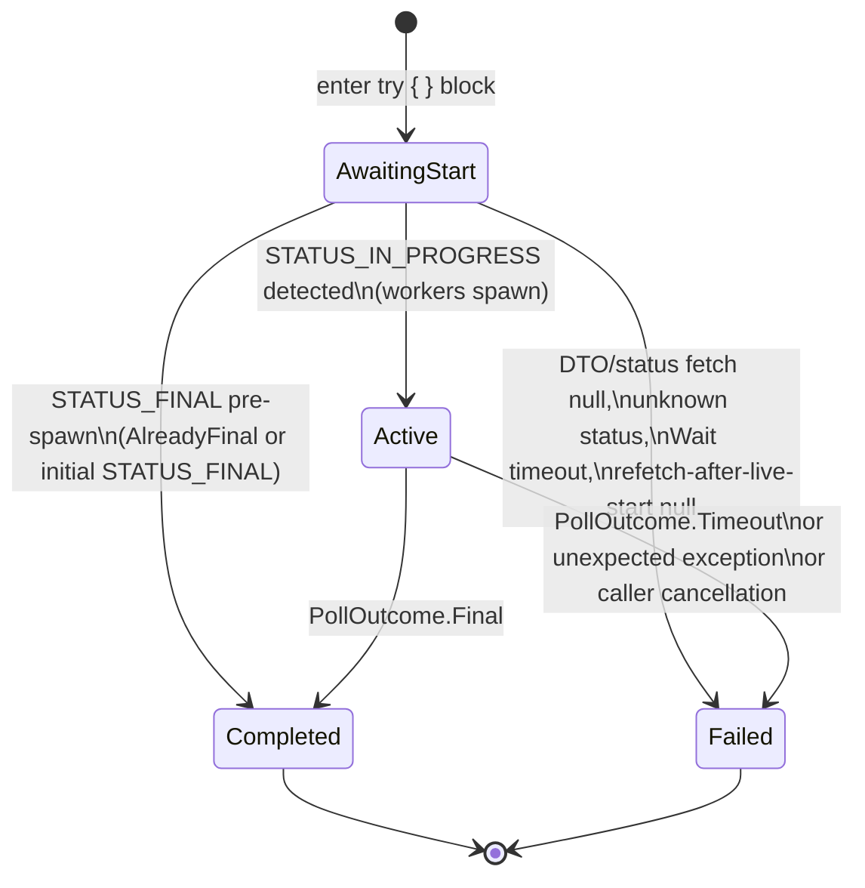
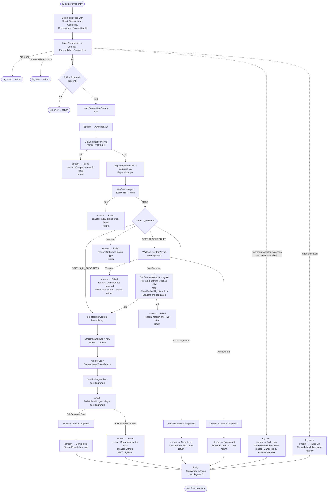
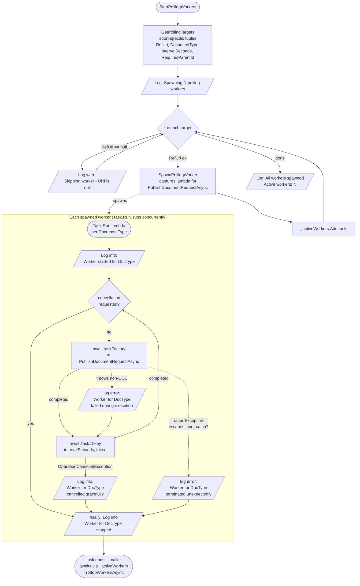
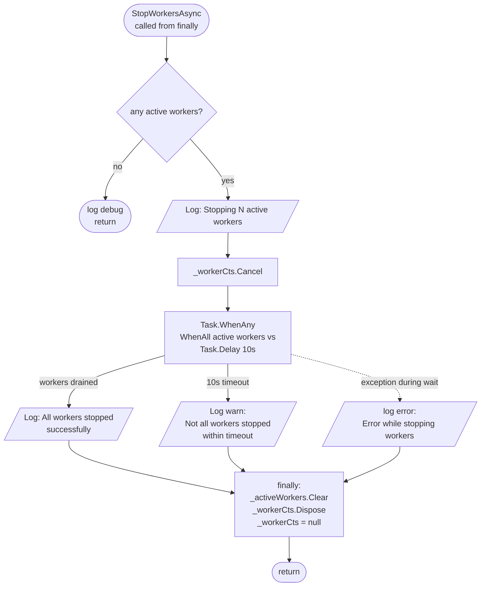
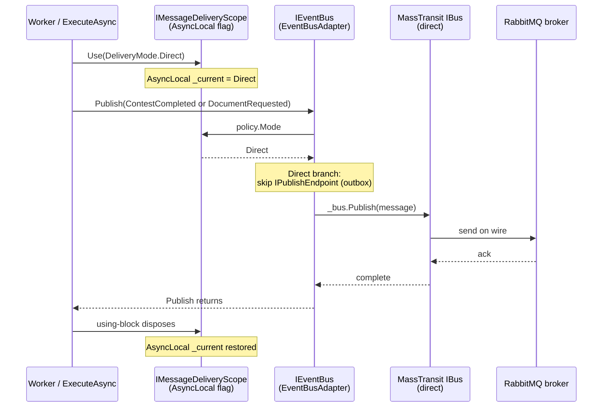

# Competition Streamer — Logic Diagram

Reference for `src/SportsData.Producer/Application/Competitions/CompetitionStreamerBase.cs` (~680 LOC).

`CompetitionStreamerBase<TCompetitionDto>` drives the live ESPN polling lifecycle for a single contest, fans out per-child-doc polling workers, and emits domain events as the contest transitions between states. Sport-specific subclasses (`BaseballCompetitionStreamer`, `FootballCompetitionStreamer`) supply the typed DTO and the polling target list. Runs as a Hangfire job in the Producer Worker role pod.

Key constants:

| Name | Value | Notes |
|---|---|---|
| `MaxStreamDuration` | 5 hours | Hard ceiling on both pre-game wait and in-game polling. |
| `MaxConsecutiveFailures` | 10 | Triggers `InvalidOperationException` from either polling loop. |
| Pre-game status poll | every 20s | `WaitForLiveStartAsync` |
| In-game status poll | every 30s | `PollWhileInProgressAsync` |
| Per-doc worker poll | per-target (see `GetPollingTargets`) | Spawned by `StartPollingWorkers` |
| `StopWorkersAsync` grace | 10s | Wait for workers to drain after cancellation. |

---

## 1. `CompetitionStream.Status` state machine

The persisted `CompetitionStream.Status` row in PostgreSQL is the externally-visible lifecycle. Every state transition is committed by `UpdateStreamStatusAsync`. `Completed` and `Failed` are terminal.

Notes:
- `Failed` is also written by both `catch` blocks in `ExecuteAsync` — `OperationCanceledException` (caller cancel) and the generic `Exception` (anything else).
- The `Failed` write from the `OperationCanceledException` catch uses `CancellationToken.None` so the status update isn't itself cancelled.

---

## 2. `ExecuteAsync` — main flow

The entry point. All paths converge on the `finally { StopWorkersAsync(); }` at the bottom.

**Code-structure note**: `ExecuteAsync` handles pre-stream-load validation (Competition load → externalId → CompetitionStream load), then opens a nested log scope that rebinds `CorrelationId` to `CompetitionStream.Id` and delegates to `ExecuteWithStreamAsync` for everything from the first `GetCompetitionAsync` call onward. The diagram below collapses both methods into one logical flow.

---

## 3. `WaitForLiveStartAsync` and `PollWhileInProgressAsync` — the two status polling loops

Same shape; different cadences, different terminal conditions. Both share the `consecutiveFailures` failure budget.

```mermaid
flowchart TD
    subgraph WLS["WaitForLiveStartAsync — 20s polling, returns LiveStartOutcome"]
        WStart([entry]) --> WLogStart[/Log: Polling for live start<br/>every 20 seconds.../]
        WLogStart --> WLoop{cancellation<br/>requested?}
        WLoop -->|yes| WLoopOutTimeout([return Timeout])
        WLoop -->|no| WAgeCheck{elapsed ><br/>MaxStreamDuration?}
        WAgeCheck -->|yes| WAgeOutTimeout([log warn<br/>return Timeout])
        WAgeCheck -->|no| WDelay[await Task.Delay 20s<br/>token-aware]
        WDelay --> WFetch[GetStatusAsync]
        WFetch -->|null| WInc[consecutiveFailures++]
        WFetch -->|status| WReset[consecutiveFailures = 0]
        WInc --> WCheckBudget{>= MaxConsecutiveFailures?}
        WCheckBudget -->|yes| WThrow([throw InvalidOperationException])
        WCheckBudget -->|no| WLoop
        WReset --> WBranch{status.Type.Name}
        WBranch -->|STATUS_IN_PROGRESS| WStart_([return StartDetected])
        WBranch -->|STATUS_FINAL| WFinal([log warn<br/>return AlreadyFinal])
        WBranch -->|other| WLoop
    end

    subgraph PWP["PollWhileInProgressAsync — 30s polling, returns PollOutcome"]
        PStart([entry]) --> PLogStart[/Log: Monitoring competition status<br/>every 30 seconds.../]
        PLogStart --> PLoop{cancellation<br/>requested?}
        PLoop -->|yes| PLoopOutTimeout([return Timeout])
        PLoop -->|no| PAgeCheck{elapsed ><br/>MaxStreamDuration?}
        PAgeCheck -->|yes| PAgeOutTimeout([log warn<br/>return Timeout])
        PAgeCheck -->|no| PDelay[await Task.Delay 30s<br/>token-aware]
        PDelay --> PFetch[GetStatusAsync]
        PFetch -->|null| PInc[consecutiveFailures++<br/>log warn N/Max]
        PFetch -->|status| PReset[consecutiveFailures = 0]
        PInc --> PCheckBudget{>= MaxConsecutiveFailures?}
        PCheckBudget -->|yes| PThrow([log error<br/>throw InvalidOperationException])
        PCheckBudget -->|no| PLoop
        PReset --> PBranch{status.Type.Name == STATUS_FINAL?}
        PBranch -->|yes| PFinal([log info<br/>return Final])
        PBranch -->|no| PLogDebug[log debug:<br/>still in progress] --> PLoop
    end
```

`PollWhileInProgressAsync` runs on the main `ExecuteAsync` thread while the per-doc workers from diagram 4 run concurrently. Both branches share the `_workerCts.Token` so cancelling `_workerCts` (in `StopWorkersAsync`) collapses both at once.

---

## 4. `StartPollingWorkers` + `SpawnPollingWorker` — concurrent fire-and-forget tasks

`StartPollingWorkers` iterates the per-sport `GetPollingTargets(competitionDto)` list and spins up one `Task.Run` per non-null URI. Each task owns its own poll loop.

Key behavior notes:
- The inner `catch (Exception ex) when (ex is not OperationCanceledException)` swallows publish-time failures so the loop keeps polling.
- `OperationCanceledException` from `Task.Delay` is the *expected* exit path on cancellation — caught and logged as "cancelled gracefully".
- An `OperationCanceledException` raised by `taskFactory()` itself (i.e. by an HTTP call inside the publish path) is NOT caught by the inner handler — it propagates out to the outer `catch` and logs "terminated unexpectedly". This kills that worker but the others keep running.
- `_activeWorkers` is the list `StopWorkersAsync` awaits.

---

## 5. `StopWorkersAsync` — finally-block cleanup

Always runs. Bounded by a 10-second grace timeout so a hung worker doesn't block the job's exit indefinitely.

---

## 6. Publish helpers — direct delivery (bypass outbox)

Both `PublishContestCompletedAsync` and `PublishDocumentRequestAsync` use `IMessageDeliveryScope.Use(DeliveryMode.Direct)` and call `IEventBus.Publish` straight through — no DbContext involvement.

Why direct: these helpers are **stateless publishes**. No entity write happens inside them, so MassTransit's EF-outbox interceptor (which hooks `SaveChangesAsync`) has no `SavingChanges` event to ride. An outbox-mode publish without a backing entity write would sit captured in the in-memory pending list and never reach the broker. Direct delivery sidesteps that gap entirely.

`IEventBus` (`EventBusAdapter`) and `IMessageDeliveryScope` (`MessageDeliveryPolicy`) are thread-safe — the underlying `IBus`/`IPublishEndpoint` are MassTransit's thread-safe primitives, and the policy is an `AsyncLocal`-scoped flag. All polling workers share the same injected instances; no per-call DI scoping is needed.

Why this matters operationally:
- The publish reaches the broker on the same thread as the `await Publish` call — no outbox-flush dependency on a downstream `SaveChangesAsync`.
- `IEventBus.Publish` honours `cancellationToken` but does not impose its own broker-side timeout. A genuinely stuck broker connection would still hang the call until the client library's heartbeat timer fires (typically minutes). Worth a future enhancement: wrap publishes in a per-call `CancelAfter` so a stuck publish surfaces as a `Worker for X failed during execution` Error rather than freezing the worker.
- The precedent for this direct-publish pattern lives in `BaseballContestReplayService` (admin replay tool, same architectural shape — stateless publish of a recorded event sequence).

---

## 7. Exception handling — outer `try`/`catch`/`finally` summary

| Catch | Trigger | Behavior |
|---|---|---|
| `catch (OperationCanceledException) when (cancellationToken.IsCancellationRequested)` | Caller-initiated cancellation (Hangfire job cancel, host shutdown) | Log warn `Streaming cancelled by external request`. Write `stream → Failed` using `CancellationToken.None` so the status update itself isn't cancelled. Do NOT rethrow. |
| `catch (Exception ex)` | Anything else that bubbles out of the try block (incl. `InvalidOperationException` from polling-loop failure budget, EF errors, etc.) | Log error `Unexpected error during streaming`. Write `stream → Failed` using `CancellationToken.None`. Rethrow so Hangfire sees the failure. |
| `finally { StopWorkersAsync(); }` | Always | Cancel `_workerCts`, await active workers up to 10s, dispose. |

Both `catch` blocks dereference `stream` only after a null-check; if the `CompetitionStream` row didn't exist at all (warning logged at startup), the status update is simply skipped.

---

## 8. Quick-reference: where each domain event publish + key log line lives

These are the places this class emits domain events or key proof-of-life log lines, useful when grep-ing Seq.

| Source method | Log level | Log template | Conditions |
|---|---|---|---|
| `PublishContestCompletedAsync` | Info | `Publishing ContestCompleted for ContestId={ContestId}, CompetitionId={CompetitionId}, CorrelationId={CorrelationId}` | Fires from three sites: `LiveStartOutcome.AlreadyFinal`, initial `STATUS_FINAL` switch arm, `PollOutcome.Final`. |
| `PublishDocumentRequestAsync` | Info | `Publishing {Type} document request for {Uri}` | Fires once per polling worker tick. Promoted from Debug → Info so steady-state worker activity is visible at default filtering. |
| `PollWhileInProgressAsync` | Info | `Streaming heartbeat. Tick={Tick}, ElapsedMin={ElapsedMin:F1}, Status={Status}, Clock={Clock}` | Heartbeat every 10th tick (≈ every 5 min at 30s polling). 12/hour at default filtering — proof-of-life during long in-game stretches. |
| `PollWhileInProgressAsync` | Debug | `Competition still in progress. Status: {Status}, Clock: {Clock}` | Every non-heartbeat tick. Verbose-mode only. |
| `ExecuteAsync` (post stream load) | Info | `CompetitionStream loaded. StreamId={StreamId}; CorrelationId rebound from {PriorCorrelationId} to StreamId for the remainder of this run.` | Once per run, immediately after stream load. Pivot point for Seq searches: switch from `command.CorrelationId` to `stream.Id`. |

---

## 9. CorrelationId model + log scope

Two layers of log scope wrap the streaming work:

1. **Outer scope** (whole `ExecuteAsync`): `Sport`, `SeasonYear`, `ContestId`, `CorrelationId = command.CorrelationId`, `CompetitionId`, `RunId = Guid.NewGuid()`. Carries early "Broadcasting job started" logs and the pre-stream-load validation.
2. **Inner scope** (everything after `CompetitionStream` loads, including `ExecuteWithStreamAsync` and all downstream calls): overrides `CorrelationId` to `stream.Id` and adds `StreamId = stream.Id`. Every subsequent log line + every domain-event publish carries `stream.Id` as the correlation.

`RunId` distinguishes execution boundaries (Hangfire refire, admin replay, pod restart) while `CorrelationId = stream.Id` stays stable across runs — so a single Seq query by `stream.Id` returns every log line for that stream's full lifetime including refires, while `RunId` lets you separate which run produced which line.

Downstream propagation (already wired upstream of this class):
- `PublishContestCompletedAsync` and `PublishDocumentRequestAsync` set `CorrelationId = stream.Id` on the emitted events.
- `EventBusAdapter` auto-stamps `X-Correlation-Id` transport header from `EventBase.CorrelationId` (see `EventBus.cs:93-98`) — belt-and-suspenders alongside the body field.
- Provider's `DocumentRequestedHandler` runs a 5-level fallback resolver (body → header → MT context → Activity TraceId → NewGuid+ERROR) and sets its own `BeginScope` from the resolved id. See `src/SportsData.Provider/Application/Documents/DocumentRequestedHandler.cs`.
- Producer's `DocumentProcessorBase.ProcessAsync` opens its scope from `command.ToLogScope()` (carrying `CorrelationId`) and propagates it forward into any child `DocumentRequested` re-publishes.

Net result: querying Seq by `stream.Id` returns the full Producer (streamer) → Provider (handler + ESPN fetch) → Producer (document processors) → API (consumers, e.g., `BaseballPlayCompletedHandler`) chain for the entire lifetime of one CompetitionStream.
