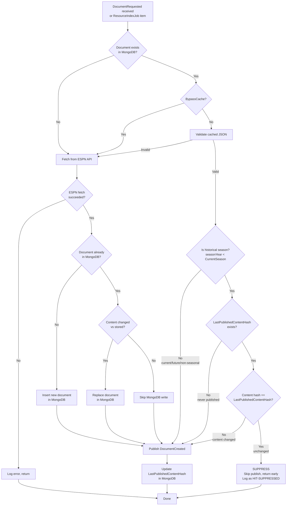

# Document Publish Suppression

## Problem

When Producer processes a document, it discovers `$Ref` links and raises `DocumentRequested` events for each. Provider sources those documents (often from MongoDB cache), raises `DocumentCreated`, and Producer processes them — only to find `$Ref` links back to documents already processed. This circular cascade generates massive queue churn with zero new canonical rows.

Example cycle:
1. Producer processes Event A, finds `$Ref` to Team B → raises `DocumentRequested(B)`
2. Provider sources B (cache hit), raises `DocumentCreated(B)`
3. Producer processes B, finds `$Ref` back to A → raises `DocumentRequested(A)`
4. Provider sources A (cache hit), raises `DocumentCreated(A)`
5. Repeat indefinitely

During historical sourcing runs, this cycle inflates Hangfire queues by orders of magnitude while producing no new data.

## Solution

Add a `LastPublishedContentHash` field to each document in MongoDB. Before publishing `DocumentCreated` from cache, Provider compares the current content hash against the stored hash. If they match — and the document belongs to a historical season — the publish is suppressed.

### Key rules

- **Historical seasons** (`seasonYear < CurrentSeason`): suppress if content hash matches
- **Current/future seasons** (`seasonYear >= CurrentSeason`): always publish (data may change)
- **Non-seasonal resources** (Venues, Franchises, etc.): always publish
- **New documents**: always publish (no previous hash)
- **Updated documents** (content changed): always publish (hash won't match)
- **`CurrentSeason == 0`** (feature disabled): always publish (safe fallback)

## Flow



## Files changed

| File | Change |
|------|--------|
| `DocumentBase.cs` | Added `LastPublishedContentHash` (nullable string) |
| `IDocumentStore` / `MongoDocumentService.cs` | Added `UpdateFieldAsync<T>()` for targeted single-field MongoDB updates |
| `CosmosDocumentService.cs` | Same interface method using Cosmos `PatchItemAsync` |
| `ResourceIndexItemProcessor.cs` | Cache hit suppression logic, hash update after every publish, `IsCurrentSeason()` helper |

## Behavior by scenario

| Scenario | Publishes? | Why |
|----------|-----------|-----|
| First request for historical doc | Yes | `LastPublishedContentHash` is null |
| Second request for same historical doc | No | Hash matches — suppressed |
| Historical doc content changes in MongoDB | Yes | Hash won't match |
| Current-season doc (any request) | Yes | `IsCurrentSeason()` returns true — always publish |
| Non-seasonal resource (Venue, Franchise) | Yes | No `SeasonYear` — always publish |
| New document (not in MongoDB) | Yes | Fetched from ESPN, inserted, published |
| DLQ replay | Yes | Replayed `DocumentCreated` goes directly to Producer — bypasses Provider entirely |

## Failure modes

- **`UpdateLastPublishedHashAsync` fails**: Caught and logged as Warning. Next request will re-publish (harmless duplicate, not data loss).
- **MongoDB missing `LastPublishedContentHash` field on existing docs**: Field is nullable. Null is treated as "never published" — first request publishes and sets the hash. No migration needed.
- **Redis/rate limiter interaction**: None. This operates entirely within Provider's MongoDB layer.

## Relationship to ShouldBypassCache

`IsCurrentSeason()` mirrors the `ShouldBypassCache()` logic in `ResourceIndexJob`:

```
CurrentSeason == 0        → feature disabled → always publish (safe fallback)
SeasonYear == null         → non-seasonal     → always publish
SeasonYear >= CurrentSeason → active/future   → always publish
SeasonYear < CurrentSeason  → historical      → suppress if hash matches
```

The two methods serve complementary purposes:
- `ShouldBypassCache()`: controls whether to skip MongoDB and fetch fresh from ESPN
- `IsCurrentSeason()`: controls whether to suppress redundant `DocumentCreated` publishes
