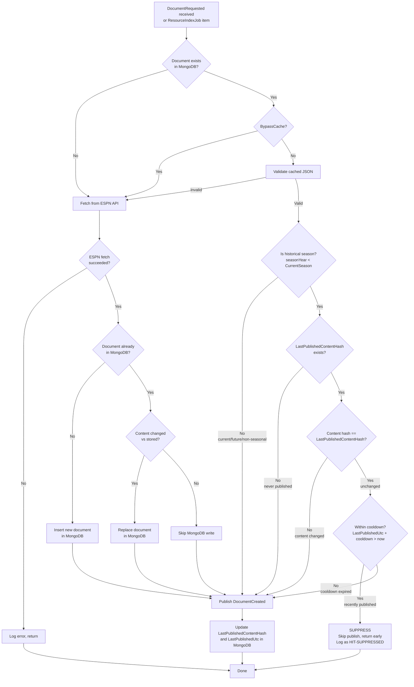

# Document Publish Suppression

## Problem

When Producer processes a document, it discovers `$Ref` links and raises `DocumentRequested` events for each. Provider sources those documents (often from MongoDB cache), raises `DocumentCreated`, and Producer processes them — only to find `$Ref` links back to documents already processed. This circular cascade generates massive queue churn with zero new canonical rows.

Example cycle:
1. Producer processes Event A, finds `$Ref` to Team B → raises `DocumentRequested(B)`
2. Provider sources B (cache hit), raises `DocumentCreated(B)`
3. Producer processes B, finds `$Ref` back to A → raises `DocumentRequested(A)`
4. Provider sources A (cache hit), raises `DocumentCreated(A)`
5. Repeat indefinitely

During historical sourcing runs, this cycle inflates Hangfire queues by orders of magnitude while producing no new data.

## Solution

Track two fields on each document in MongoDB:
- `LastPublishedContentHash` — SHA-256 hash of content at last publish
- `LastPublishedUtc` — timestamp of last publish

Before publishing `DocumentCreated` from cache, Provider checks:
1. Is the content hash unchanged since last publish?
2. Was the last publish within the configurable cooldown window?

If both are true, the publish is suppressed. If the cooldown has expired, the document is re-published even if the content is identical — enabling historical re-sourcing runs.

### Key rules

- **Historical seasons** (`seasonYear < CurrentSeason`): suppress if content hash matches AND within cooldown
- **Historical seasons, cooldown expired**: always publish (enables re-sourcing)
- **Current/future seasons** (`seasonYear >= CurrentSeason`): always publish (data may change)
- **Non-seasonal resources** (Venues, Franchises, etc.): always publish
- **New documents**: always publish (no previous hash)
- **Updated documents** (content changed): always publish (hash won't match)
- **`LastPublishedUtc` is null**: always publish (never been published, or pre-existing document)
- **`CurrentSeason == 0`** (feature disabled): always publish (safe fallback)

### Configuration

| Key | Type | Default | Description |
|-----|------|---------|-------------|
| `CommonConfig:CurrentSeason` | int | 0 (disabled) | Season year threshold for historical vs current |
| `SportsData.Provider:DocumentPublishCooldownMinutes` | int | 1440 (24h) | Minutes to suppress re-publishing unchanged historical documents. 0 = cooldown disabled (always allow). Missing/invalid = suppress indefinitely (safe fallback matching pre-cooldown behavior). |

## Flow



## Files changed

| File | Change |
|------|--------|
| `DocumentBase.cs` | `LastPublishedContentHash` (nullable string), `LastPublishedUtc` (nullable DateTime) |
| `IDocumentStore` / `MongoDocumentService.cs` | `UpdateFieldAsync<T>()` for targeted single-field MongoDB updates |
| `CosmosDocumentService.cs` | Same interface method using Cosmos `PatchItemAsync` |
| `ResourceIndexItemProcessor.cs` | Suppression logic with cooldown check, `IsCurrentSeason()` + `IsWithinPublishCooldown()` helpers, `UpdateLastPublishedStateAsync()` sets both hash and timestamp |

## Behavior by scenario

| Scenario | Publishes? | Why |
|----------|-----------|-----|
| First request for historical doc | Yes | `LastPublishedContentHash` is null |
| Second request within cooldown, same content | No | Hash matches, within cooldown — suppressed |
| Request after cooldown expires, same content | Yes | Hash matches but cooldown expired — re-publish for re-sourcing |
| Historical doc content changes in MongoDB | Yes | Hash won't match |
| Current-season doc (any request) | Yes | `IsCurrentSeason()` returns true — always publish |
| Non-seasonal resource (Venue, Franchise) | Yes | No `SeasonYear` — always publish |
| New document (not in MongoDB) | Yes | Fetched from ESPN, inserted, published |
| DLQ replay | Yes | Replayed `DocumentCreated` goes directly to Producer — bypasses Provider entirely |
| `LastPublishedUtc` is null (pre-existing doc) | Yes | Null timestamp = never published — allow |
| Cooldown config missing | No | Safe default — suppress indefinitely (matches pre-cooldown behavior) |
| Cooldown config = 0 | Yes | Cooldown disabled — always allow re-publish |

## Failure modes

- **`UpdateLastPublishedStateAsync` fails**: Caught and logged as Warning. Next request will re-publish (harmless duplicate, not data loss).
- **MongoDB missing `LastPublishedContentHash`/`LastPublishedUtc` fields on existing docs**: Both are nullable. Null is treated as "never published" — first request publishes and sets both. No migration needed.
- **Redis/rate limiter interaction**: None. This operates entirely within Provider's MongoDB layer.
- **Clock drift across pods**: Using UTC throughout. Cooldown is measured in hours; sub-second drift is irrelevant.

## Relationship to ShouldBypassCache

`IsCurrentSeason()` mirrors the `ShouldBypassCache()` logic in `ResourceIndexJob`:

```
CurrentSeason == 0        → feature disabled → always publish (safe fallback)
SeasonYear == null         → non-seasonal     → always publish
SeasonYear >= CurrentSeason → active/future   → always publish
SeasonYear < CurrentSeason  → historical      → suppress if hash matches AND within cooldown
```

The methods serve complementary purposes:
- `ShouldBypassCache()`: controls whether to skip MongoDB and fetch fresh from ESPN
- `IsCurrentSeason()`: controls whether suppression logic applies at all
- `IsWithinPublishCooldown()`: controls whether an eligible-for-suppression document should actually be suppressed or allowed through due to staleness
