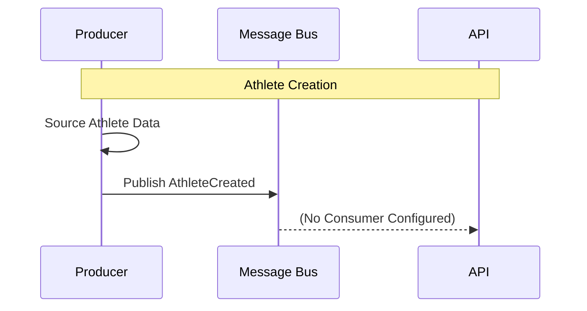

# AthleteCreated

Fired when a new athlete is discovered and created in the system.

## Flow Diagram

```mermaid
sequenceDiagram
    participant P as Producer
    participant B as Message Bus
    participant A as API

    Note over P, A: Athlete Creation
    P->>P: Source Athlete Data
    P->>B: Publish AthleteCreated
    B-->>A: (No Consumer Configured)
```
