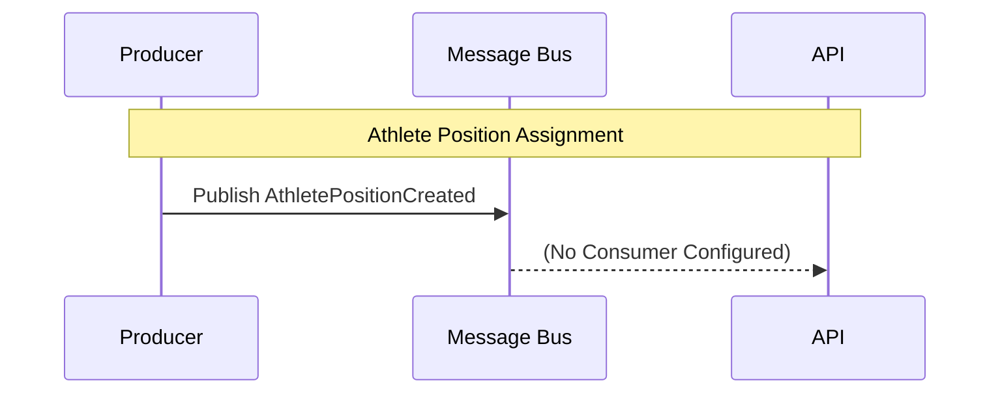

# AthletePositionCreated

Fired when a new position is assigned to an athlete.

## Flow Diagram

```mermaid
sequenceDiagram
    participant P as Producer
    participant B as Message Bus
    participant A as API

    Note over P, A: Athlete Position Assignment
    P->>B: Publish AthletePositionCreated
    B-->>A: (No Consumer Configured)
```
