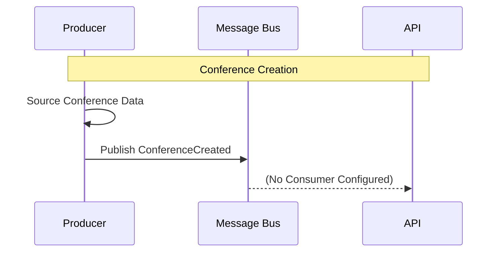

# ConferenceCreated

Fired when a new conference is added to the system.

## Flow Diagram

```mermaid
sequenceDiagram
    participant P as Producer
    participant B as Message Bus
    participant A as API

    Note over P, A: Conference Creation
    P->>P: Source Conference Data
    P->>B: Publish ConferenceCreated
    B-->>A: (No Consumer Configured)
```
