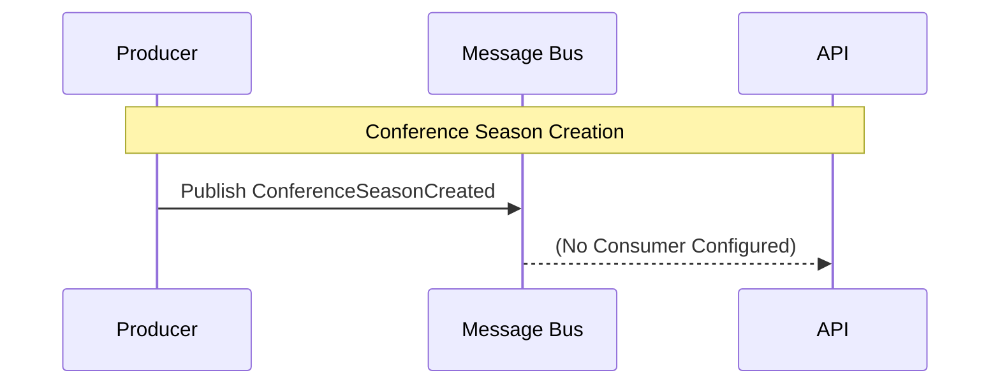

# ConferenceSeasonCreated

Fired when a conference is associated with a specific season.

## Flow Diagram

```mermaid
sequenceDiagram
    participant P as Producer
    participant B as Message Bus
    participant A as API

    Note over P, A: Conference Season Creation
    P->>B: Publish ConferenceSeasonCreated
    B-->>A: (No Consumer Configured)
```
