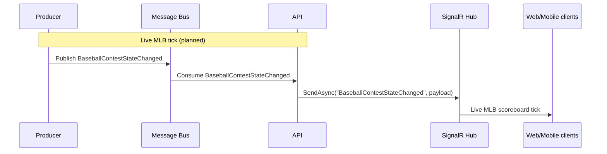

# BaseballContestStateChanged

Baseball per-pitch / per-at-bat scoreboard tick. The API consumer and
SignalR fan-out (`BaseballContestStateChanged`) are wired so the
end-to-end pipeline lights up the moment the MLB live-state Producer
emitter ships. No Producer emitter today.

## Flow Diagram

## Payload

| Field | Type | Notes |
|---|---|---|
| `ContestId` | Guid | |
| `Inning` | int | |
| `HalfInning` | string | `Top` / `Bottom` |
| `AwayScore` | int | |
| `HomeScore` | int | |
| `Balls` | int | |
| `Strikes` | int | |
| `Outs` | int | |
| `RunnerOnFirst` | bool | |
| `RunnerOnSecond` | bool | |
| `RunnerOnThird` | bool | |
| `AtBatAthleteId` | Guid? | |
| `PitchingAthleteId` | Guid? | |
| `Ref` | Uri? | |
| `Sport` | enum | `BaseballMlb` |
| `SeasonYear` | int? | |
| `CorrelationId` | Guid | |
| `CausationId` | Guid | |
| `MessageId` | Guid | Inherited from `EventBase` — auto-generated `Guid.NewGuid()`. |
| `CreatedUtc` | DateTime | Inherited from `EventBase` — UTC timestamp at construction. |
