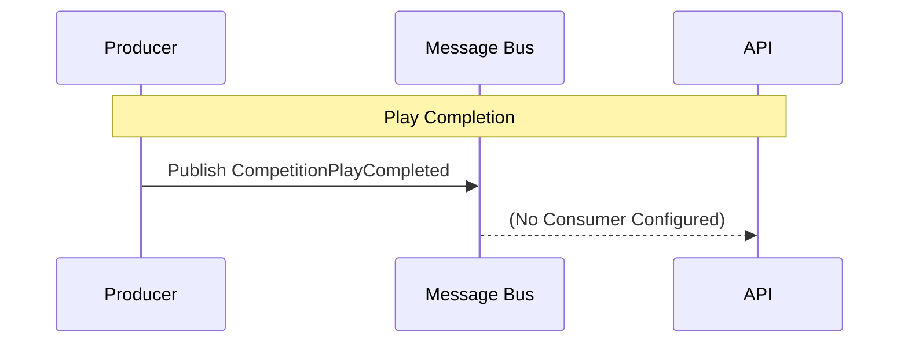

# CompetitionPlayCompleted

Fired when a play within a competition is completed.

## Flow Diagram

```mermaid
sequenceDiagram
    participant P as Producer
    participant B as Message Bus
    participant A as API

    Note over P, A: Play Completion
    P->>B: Publish CompetitionPlayCompleted
    B-->>A: (No Consumer Configured)
```
