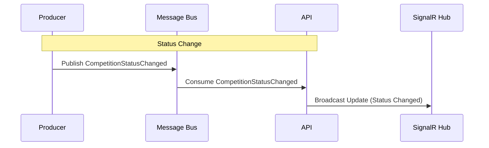

# CompetitionStatusChanged

Fired when a game's status changes (e.g., Scheduled -> InProgress -> Final).

## Flow Diagram

```mermaid
sequenceDiagram
    participant P as Producer
    participant B as Message Bus
    participant A as API
    participant S as SignalR Hub

    Note over P, A: Status Change
    P->>B: Publish CompetitionStatusChanged
    B->>A: Consume CompetitionStatusChanged
    A->>S: Broadcast Update (Status Changed)
```
