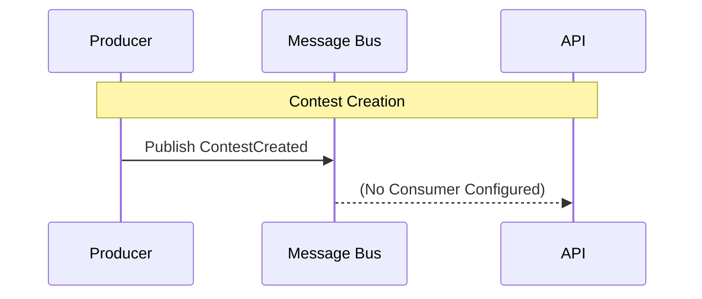

# ContestCreated

Fired when a new contest (game/match) is created.

## Flow Diagram

```mermaid
sequenceDiagram
    participant P as Producer
    participant B as Message Bus
    participant A as API

    Note over P, A: Contest Creation
    P->>B: Publish ContestCreated
    B-->>A: (No Consumer Configured)
```
