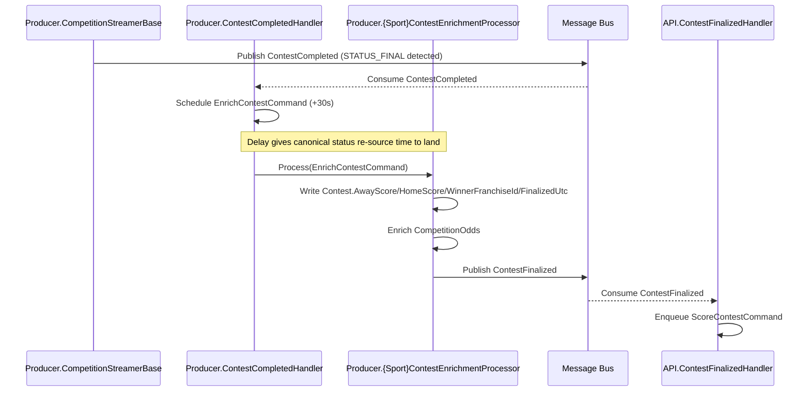

# ContestFinalized

Fired by Producer once the canonical Contest row has been enriched with final scores, winner, odds results, and `FinalizedUtc`. This is the trigger API consumes to kick off picks scoring — distinct from `ContestCompleted`, which fires the moment STATUS_FINAL is detected, before enrichment runs.

Renamed from `ContestEnrichmentCompleted` in the contest-finalization event restructure — see [docs/contest-finalization-event-restructure.md](../../contest-finalization-event-restructure.md).

## Flow Diagram

