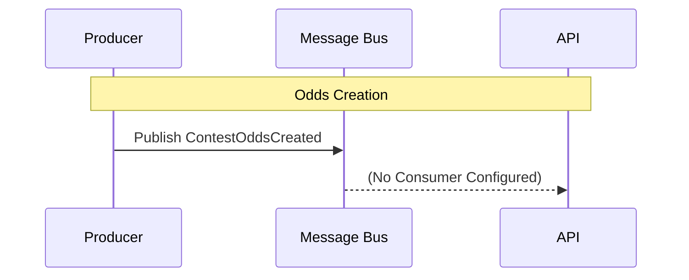

# ContestOddsCreated

Fired when betting odds for a contest are first created.

## Flow Diagram

```mermaid
sequenceDiagram
    participant P as Producer
    participant B as Message Bus
    participant A as API

    Note over P, A: Odds Creation
    P->>B: Publish ContestOddsCreated
    B-->>A: (No Consumer Configured)
```
