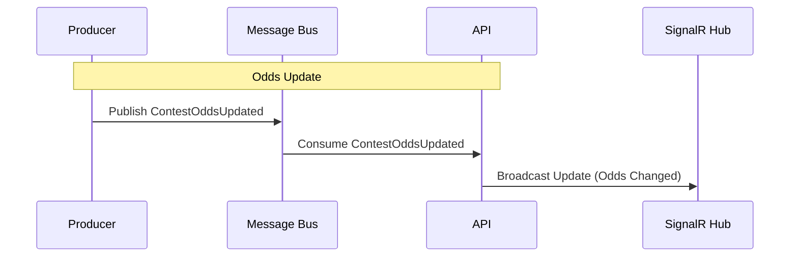

# ContestOddsUpdated

Fired when betting odds for a contest are updated.

## Flow Diagram

```mermaid
sequenceDiagram
    participant P as Producer
    participant B as Message Bus
    participant A as API
    participant S as SignalR Hub

    Note over P, A: Odds Update
    P->>B: Publish ContestOddsUpdated
    B->>A: Consume ContestOddsUpdated
    A->>S: Broadcast Update (Odds Changed)
```
