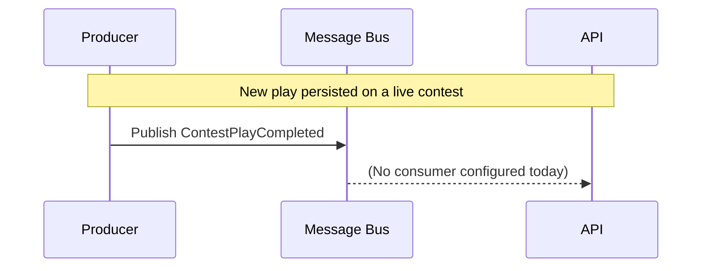

# ContestPlayCompleted

Per-play log event. Producer publishes when a new play row is created
on an in-progress contest. Sport-neutral payload (description only —
sport-specific scoreboard fields go on `FootballContestStateChanged` /
`BaseballContestStateChanged`).

## Flow Diagram

## Payload

| Field | Type | Notes |
|---|---|---|
| `ContestId` | Guid | |
| `CompetitionId` | Guid | Producer-internal — kept on this event for trace/debug; clients should not depend on it. |
| `PlayId` | Guid | |
| `PlayDescription` | string | |
| `Ref` | Uri? | |
| `Sport` | enum | |
| `SeasonYear` | int? | |
| `CorrelationId` | Guid | |
| `CausationId` | Guid | |
