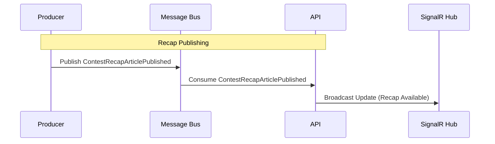

# ContestRecapArticlePublished

Fired when an AI-generated game recap is available.

## Flow Diagram

```mermaid
sequenceDiagram
    participant P as Producer
    participant B as Message Bus
    participant A as API
    participant S as SignalR Hub

    Note over P, A: Recap Publishing
    P->>B: Publish ContestRecapArticlePublished
    B->>A: Consume ContestRecapArticlePublished
    A->>S: Broadcast Update (Recap Available)
```
