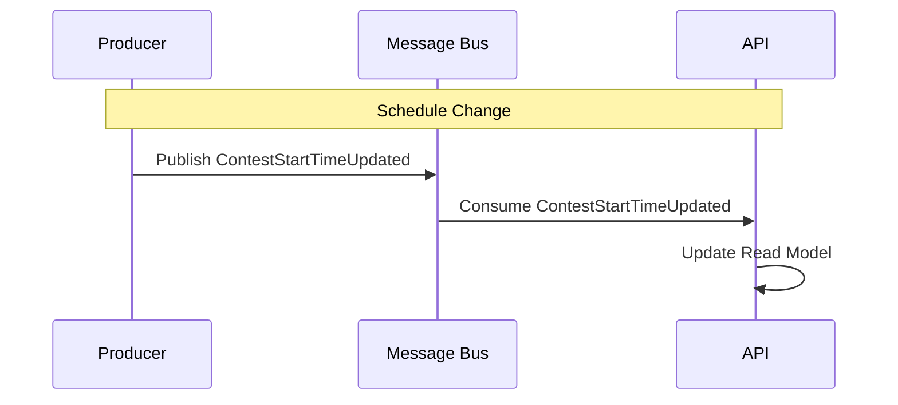

# ContestStartTimeUpdated

Fired when a game's start time changes.

## Flow Diagram

```mermaid
sequenceDiagram
    participant P as Producer
    participant B as Message Bus
    participant A as API

    Note over P, A: Schedule Change
    P->>B: Publish ContestStartTimeUpdated
    B->>A: Consume ContestStartTimeUpdated
    A->>A: Update Read Model
```
