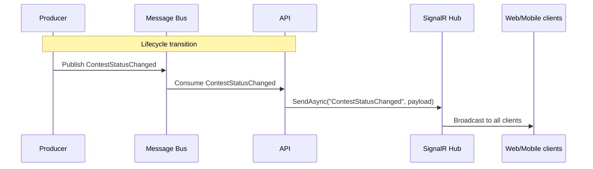

# ContestStatusChanged

Sport-neutral contest lifecycle event. Producer publishes when a contest
transitions Scheduled → InProgress → Final (or related lifecycle states
such as Postponed). Per-play scoreboard ticks are split off to
`FootballContestStateChanged` / `BaseballContestStateChanged`.

## Flow Diagram

## Payload (sport-neutral)

| Field | Type | Notes |
|---|---|---|
| `ContestId` | Guid | Contest aggregate root id |
| `Status` | string | `Scheduled` / `InProgress` / `Final` / etc. |
| `Ref` | Uri? | Producer-canonical resource ref |
| `Sport` | enum | |
| `SeasonYear` | int? | |
| `CorrelationId` | Guid | |
| `CausationId` | Guid | |
