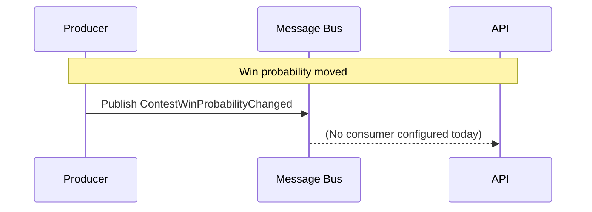

# ContestWinProbabilityChanged

Win-probability tick. Producer publishes when ESPN's per-contest
probability snapshot moves. Sport-neutral — both football and baseball
carry the same home/away/tie percentages.

## Flow Diagram

## Payload

| Field | Type |
|---|---|
| `ContestId` | Guid |
| `PlayId` | Guid? |
| `HomeWinPercentage` | double |
| `AwayWinPercentage` | double |
| `TiePercentage` | double |
| `SecondsLeft` | int |
| `EspnLastModifiedUtc` | DateTime |
| `Source` | string |
| `SourceRef` | string |
| `SequenceNumber` | string |
| `Ref` | Uri? |
| `Sport` | enum |
| `SeasonYear` | int? |
| `CorrelationId` | Guid |
| `CausationId` | Guid |
| `MessageId` | Guid (inherited from `EventBase` — auto `Guid.NewGuid()`) |
| `CreatedUtc` | DateTime (inherited from `EventBase` — UTC timestamp at construction) |
