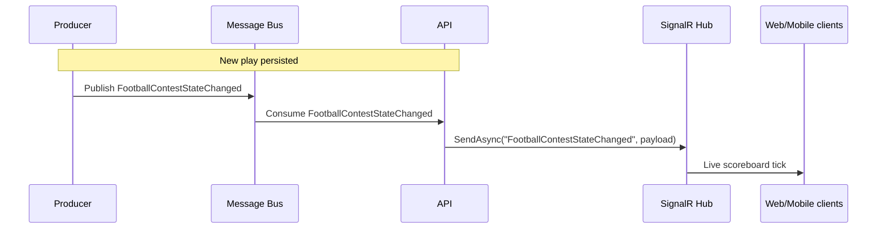

# FootballContestStateChanged

Football per-play scoreboard tick. Producer publishes from
`EventCompetitionPlayDocumentProcessor` (live games) and
`ContestReplayService` (replay tool) once the contest is in progress.

API consumes and fans out to SignalR clients (event name
`FootballContestStateChanged`); web's `useContestUpdates` merges the
payload into the per-contest live-state map that drives the live game UI.

## Flow Diagram

## Payload

| Field | Type | Notes |
|---|---|---|
| `ContestId` | Guid | |
| `Period` | string | `Q1` / `Q2` / `Q3` / `Q4` / `OT` |
| `Clock` | string | Game clock display (e.g. `12:34`) |
| `AwayScore` | int | |
| `HomeScore` | int | |
| `PossessionFranchiseSeasonId` | Guid? | Team with possession at start of play |
| `IsScoringPlay` | bool | |
| `Ref` | Uri? | |
| `Sport` | enum | `FootballNcaa` / `FootballNfl` |
| `SeasonYear` | int? | |
| `CorrelationId` | Guid | |
| `CausationId` | Guid | |
