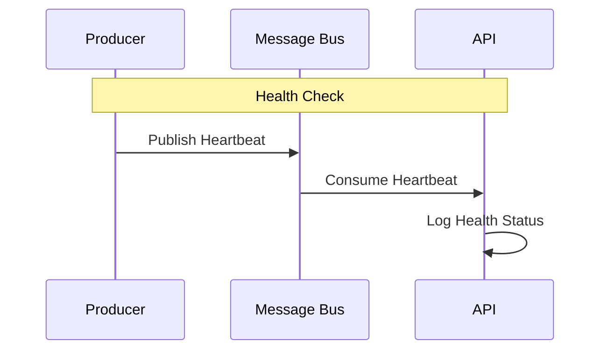

# Heartbeat

System health check event.

## Flow Diagram

```mermaid
sequenceDiagram
    participant P as Producer
    participant B as Message Bus
    participant A as API

    Note over P, A: Health Check
    P->>B: Publish Heartbeat
    B->>A: Consume Heartbeat
    A->>A: Log Health Status
```
