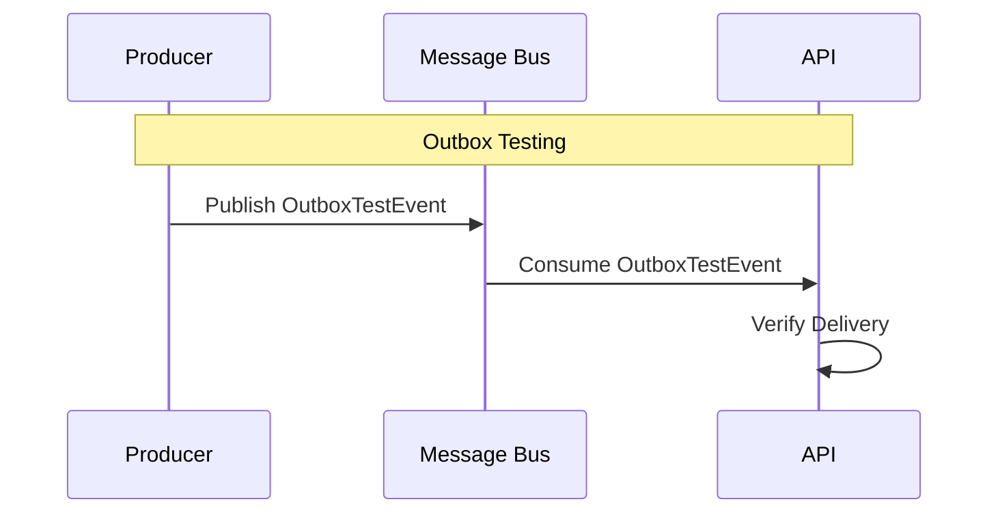

# OutboxTestEvent

Used for testing the transactional outbox pattern.

## Flow Diagram

```mermaid
sequenceDiagram
    participant P as Producer
    participant B as Message Bus
    participant A as API

    Note over P, A: Outbox Testing
    P->>B: Publish OutboxTestEvent
    B->>A: Consume OutboxTestEvent
    A->>A: Verify Delivery
```
