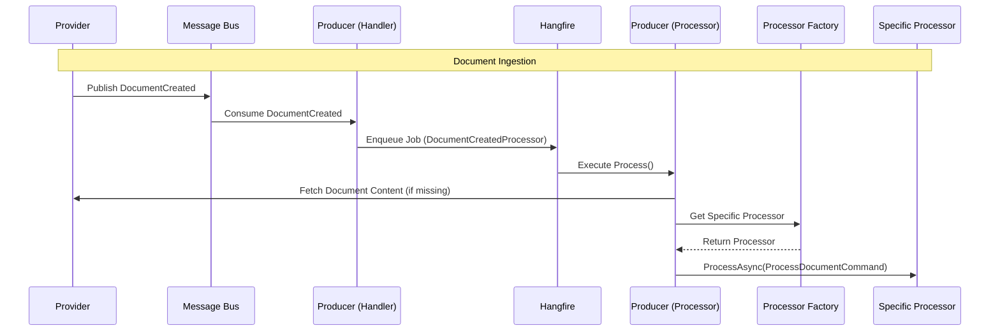

# DocumentCreated

Fired when a new raw document is saved.

## Flow Diagram

## Processing Details

1.  **Provider** publishes `DocumentCreated` event.
2.  **Producer** consumes the event via `DocumentCreatedHandler`.
3.  **Handler** enqueues a background job in **Hangfire** to process the document asynchronously.
4.  **DocumentCreatedProcessor** picks up the job:
    *   Retrieves the full document content from the **Provider** if it wasn't included in the event payload.
    *   Uses `IDocumentProcessorFactory` to resolve the correct processor strategy based on:
        *   Source Data Provider (e.g., ESPN)
        *   Sport (e.g., FootballNcaa)
        *   Document Type (e.g., Team, Athlete, Scoreboard)
    *   Delegates execution to the specific processor using `ProcessDocumentCommand`.
