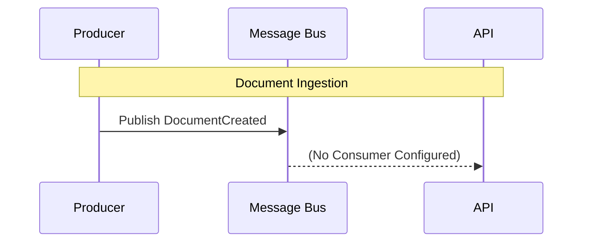

# DocumentCreated

Fired when a new raw document is saved.

## Flow Diagram

```mermaid
sequenceDiagram
    participant P as Producer
    participant B as Message Bus
    participant A as API

    Note over P, A: Document Ingestion
    P->>B: Publish DocumentCreated
    B-->>A: (No Consumer Configured)
```
