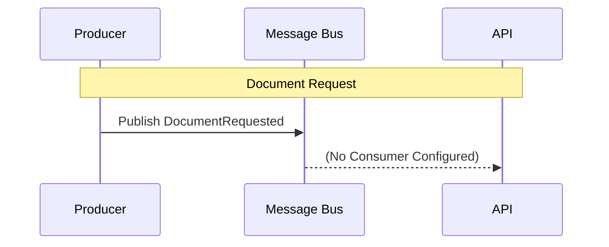

# DocumentRequested

Fired when a document needs to be sourced.

## Flow Diagram

```mermaid
sequenceDiagram
    participant P as Producer
    participant B as Message Bus
    participant A as API

    Note over P, A: Document Request
    P->>B: Publish DocumentRequested
    B-->>A: (No Consumer Configured)
```
