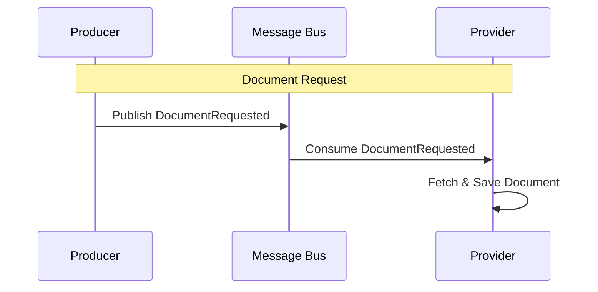

# DocumentRequested

Fired when the system determines a specific document needs to be fetched from the source.

## Flow Diagram

## Processing Details

1.  **Producer** identifies a missing or stale document (e.g., during competition crawling or enrichment).
2.  **Producer** publishes `DocumentRequested`.
3.  **Provider** consumes the event via `DocumentRequestedHandler`.
4.  **Provider** executes the sourcing logic:
    *   Fetches the data from the external source (e.g., ESPN API).
    *   Saves the raw document to the database.
    *   (Typically) Publishes `DocumentCreated` or `DocumentUpdated` upon success.
