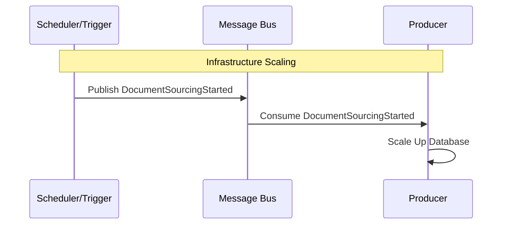

# DocumentSourcingStarted

Fired when a large-scale sourcing operation begins, signaling the infrastructure to prepare for high load.

## Flow Diagram

## Processing Details

1.  **Trigger** (e.g., a scheduled job or manual command) publishes `DocumentSourcingStarted`.
    *   *Note: Explicit publisher is currently pending implementation.*
2.  **Producer** consumes the event via `DocumentSourcingStartedHandler`.
3.  **Producer** interacts with the infrastructure (via `IDatabaseScaler`) to scale up the database resources to handle the incoming write load.
