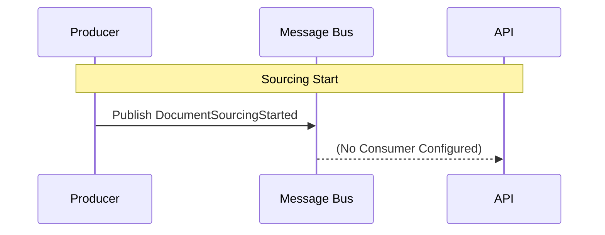

# DocumentSourcingStarted

Fired when the sourcing process for a document begins.

## Flow Diagram

```mermaid
sequenceDiagram
    participant P as Producer
    participant B as Message Bus
    participant A as API

    Note over P, A: Sourcing Start
    P->>B: Publish DocumentSourcingStarted
    B-->>A: (No Consumer Configured)
```
