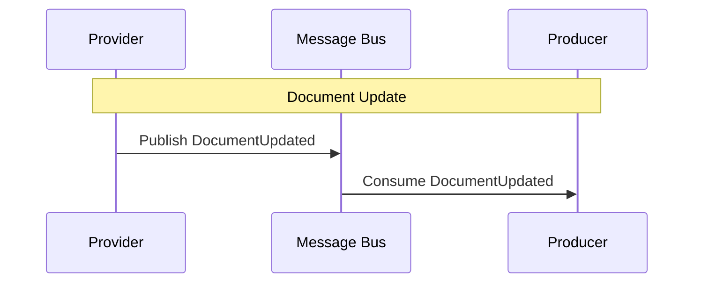

# DocumentUpdated

Fired when an existing document is re-fetched and its content has changed.

## Flow Diagram

## Processing Details

1.  **Provider** detects a change in a document during sourcing.
2.  **Provider** publishes `DocumentUpdated`.
    *   *Note: Currently, the Provider may publish `DocumentCreated` for updates as well, pending refactoring.*
3.  **Producer** consumes the event via `DocumentUpdatedHandler`.
    *   *Note: Handler implementation is currently empty/pending.*
4.  **Producer** (Future State) will re-process the document to update downstream models (e.g., recalculate stats, update game status).
