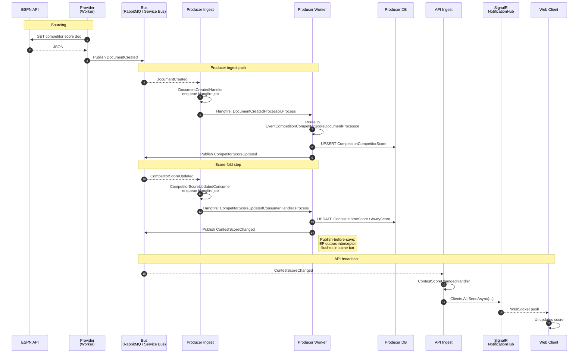

# Flow: Competitor Score Update → Live UI Push

End-to-end trace of how a single competitor score change propagates from ESPN through the platform and lands on a web client's screen via SignalR.

> **Touches three services and two pod roles.** Provider sources the document; Producer transforms it into two domain events on Worker pods (with thin Ingest shims in between); API broadcasts the final state to connected web clients.

---

## Sequence diagram

---

## Step-by-step narrative

| # | Where | Class / file | What happens |
|---|---|---|---|
| 1–3 | Provider (Worker) | sourcing pipeline → `PublishDocumentEventsProcessor.cs:121` (and similar) | ESPN doc fetched, normalized, persisted to Provider's document store. `DocumentCreated` event published. |
| 4 | Bus → Producer Ingest | — | MassTransit delivers the event to the Producer pod registered as Ingest. |
| 5 | Producer Ingest | `DocumentCreatedHandler.cs:30` | Thin shim: enqueues `DocumentCreatedProcessor` Hangfire job (with retry/backoff logic for redeliveries). Returns immediately. |
| 6 | Producer Worker | `DocumentCreatedProcessor.cs:29` | Hangfire job executes. Looks up the registered concrete `IProcessDocuments` implementation for the document's `DocumentType` via `IDocumentProcessorFactory`. |
| 7 | Producer Worker | `EventCompetitionCompetitorScoreDocumentProcessor.cs` | Sport-specific processor (one per sport). Persists or updates the canonical `CompetitionCompetitorScore` row. |
| 8 | Producer Worker | same file, line 133 (new score) or 168 (update) | Publishes `CompetitorScoreUpdated` event with `(ContestId, FranchiseSeasonId, Score, Sport, SeasonYear, CorrelationId, CausationId)`. |
| 9 | Bus → Producer Ingest | — | Same Producer pod (Ingest role) receives its own published event back via the bus. |
| 10 | Producer Ingest | `CompetitorScoreUpdatedConsumer.cs` | Thin shim: enqueues `CompetitorScoreUpdatedConsumerHandler` Hangfire job, logs Hangfire job id + correlation id. Returns. |
| 11 | Producer Worker | `CompetitorScoreUpdatedConsumerHandler.cs` | Loads `Contest` by id; if `FranchiseSeasonId` matches the home team, updates `Contest.HomeScore`; if away, updates `Contest.AwayScore`. Stamps `ModifiedBy`/`ModifiedUtc`. |
| 12 | Producer Worker | same file | Publishes `ContestScoreChanged` event. **Critical:** the publish happens *before* `SaveChangesAsync` so the EF Core MassTransit outbox interceptor flushes the publish in the same DB transaction as the score update. If the transaction rolls back, the publish is rolled back too — no ghost notifications. |
| 13 | Bus → API Ingest | — | API pod (Ingest role) receives the event. |
| 14 | API Ingest | `ContestScoreChangedHandler.cs:13` | SignalR fan-out — calls `_hubContext.Clients.All.SendAsync(...)` on `NotificationHub`. This is the narrow exception to the "Ingest does no work" rule (pure transport translation, no DB write, no further fan-out). |
| 15 | SignalR → Web | `NotificationHub` | WebSocket push to all connected clients. UI updates the displayed score. |

---

## Status of this chain

| Step | Status |
|---|---|
| 1–8 | ✅ Working in production. |
| 9–12 | ✅ Wired as of the `CompetitorScoreUpdatedConsumer` refactor (consumer registered on the Ingest role; handler runs on Worker). Previously the consumer was defined but **not registered**, so the chain broke at step 9. |
| 13–15 | ✅ Wired — `ContestScoreChangedHandler` is now registered in the API's `Program.cs` consumer list. SignalR push to web clients fires end-to-end. |

---

## Design choices worth knowing

- **Two-event chain (`CompetitorScoreUpdated` then `ContestScoreChanged`) is intentional.** The first event is a per-team fact ("Competitor X now has score Y"); the second is a contest-level fact ("Contest's score state is now {home, away}"). They're different domain facts at different aggregation levels. `ContestScoreChanged` is what other future consumers (leaderboard re-scoring, mobile push, statistical projections) would naturally subscribe to.
- **Why does the chain hop between Ingest and Worker so many times?** Each `IConsumer<T>` runs on Ingest (its only job is to enqueue); each Hangfire job runs on Worker. Per the [Ingest-thin-shim rule](../../../../../Users/Randall/.claude/projects/C--Projects-sports-data/memory/feedback_ingest_consumer_thin_shim.md), this separation buys: crash-safe retry, KEDA scale-out on Hangfire queue depth, and observable backpressure. The latency cost is sub-second on warm Workers.
- **Why does Producer self-consume `CompetitorScoreUpdated`?** It's the fold step: per-team scores arrive independently from the document feed, but the contest-level summary requires fetching the `Contest` row to know which team is home vs away. That logic lives in a consumer (not the original document processor) so the score persist and the contest-level fold can be retried independently.
- **`CausationId` chains across the hops** (`EventCompetitionCompetitorScoreDocumentProcessor` → `CompetitorScoreUpdatedConsumerHandler` → API). Each step records which upstream class caused this event, enabling end-to-end traceability in Seq via `CorrelationId` filter + causation walk. See `docs/MESSAGE_TRACING_IDENTIFIERS.md`.

---

## Related

- [Event Surface Overview](../../event-surface-overview.md) — canonical map of every event with publisher/consumer status.
- [`ContestScoreChanged` per-event doc](../contests/) (TODO — currently no per-event doc for this event; the overview is canonical).
- [`CompetitorScoreUpdated` per-event doc](../contests/) (TODO).
