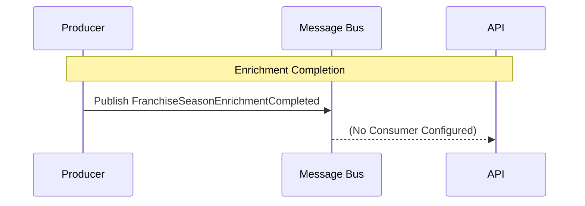

# FranchiseSeasonEnrichmentCompleted

Fired when a franchise season has been fully enriched with stats/records.

## Flow Diagram

```mermaid
sequenceDiagram
    participant P as Producer
    participant B as Message Bus
    participant A as API

    Note over P, A: Enrichment Completion
    P->>B: Publish FranchiseSeasonEnrichmentCompleted
    B-->>A: (No Consumer Configured)
```
