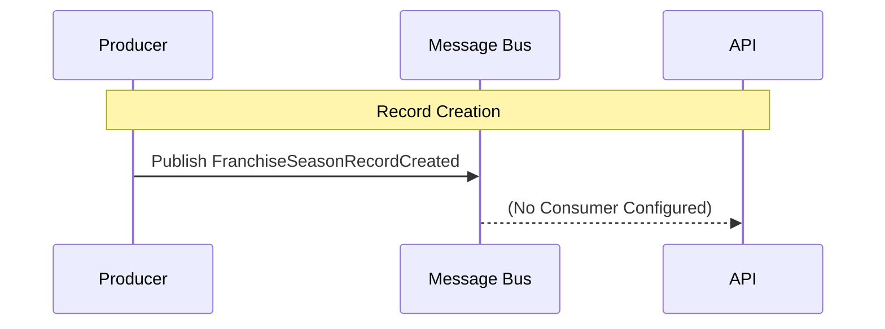

# FranchiseSeasonRecordCreated

Fired when a win/loss record is created for a franchise season.

## Flow Diagram

```mermaid
sequenceDiagram
    participant P as Producer
    participant B as Message Bus
    participant A as API

    Note over P, A: Record Creation
    P->>B: Publish FranchiseSeasonRecordCreated
    B-->>A: (No Consumer Configured)
```
