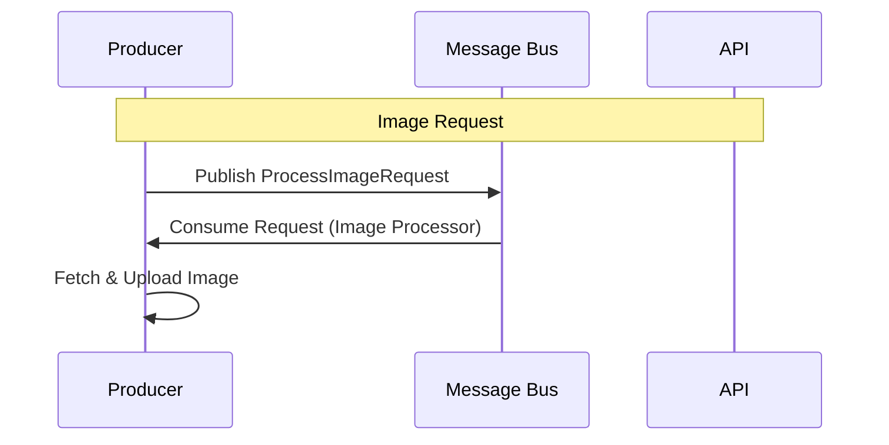

# ProcessImageRequest

Command-like event used to request image processing for an entity (Athlete, Team, Venue).

## Flow Diagram

```mermaid
sequenceDiagram
    participant P as Producer
    participant B as Message Bus
    participant A as API

    Note over P, A: Image Request
    P->>B: Publish ProcessImageRequest
    B->>P: Consume Request (Image Processor)
    P->>P: Fetch & Upload Image
```
