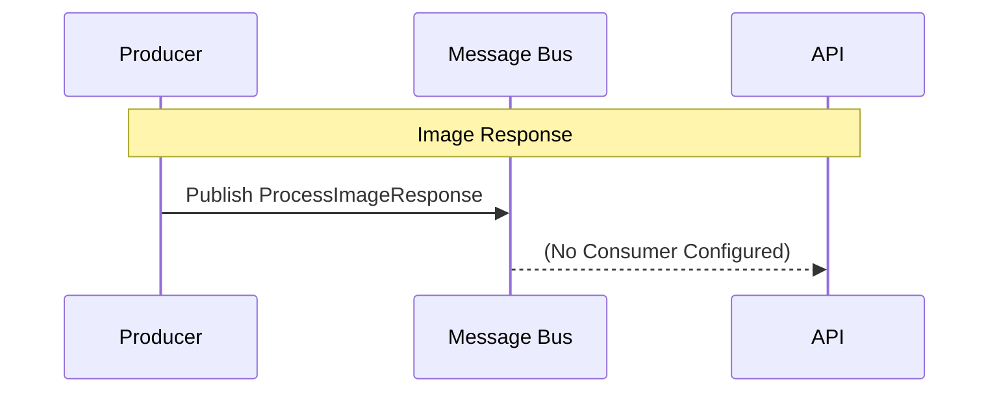

# ProcessImageResponse

Fired when an image has been successfully processed and uploaded to blob storage.

## Flow Diagram

```mermaid
sequenceDiagram
    participant P as Producer
    participant B as Message Bus
    participant A as API

    Note over P, A: Image Response
    P->>B: Publish ProcessImageResponse
    B-->>A: (No Consumer Configured)
```
