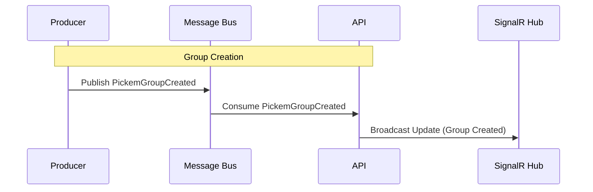

# PickemGroupCreated

Fired when a new Pick'em group is created.

## Flow Diagram

```mermaid
sequenceDiagram
    participant P as Producer
    participant B as Message Bus
    participant A as API
    participant S as SignalR Hub

    Note over P, A: Group Creation
    P->>B: Publish PickemGroupCreated
    B->>A: Consume PickemGroupCreated
    A->>S: Broadcast Update (Group Created)
```
