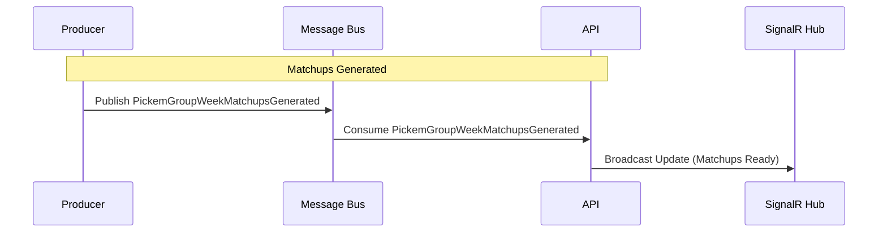

# PickemGroupWeekMatchupsGenerated

Fired when the weekly matchups for a Pick'em group have been generated.

## Flow Diagram

```mermaid
sequenceDiagram
    participant P as Producer
    participant B as Message Bus
    participant A as API
    participant S as SignalR Hub

    Note over P, A: Matchups Generated
    P->>B: Publish PickemGroupWeekMatchupsGenerated
    B->>A: Consume PickemGroupWeekMatchupsGenerated
    A->>S: Broadcast Update (Matchups Ready)
```
