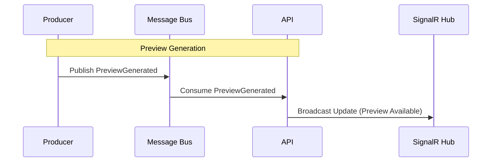

# PreviewGenerated

Fired when a matchup preview (text content) has been successfully generated.

## Flow Diagram

```mermaid
sequenceDiagram
    participant P as Producer
    participant B as Message Bus
    participant A as API
    participant S as SignalR Hub

    Note over P, A: Preview Generation
    P->>B: Publish PreviewGenerated
    B->>A: Consume PreviewGenerated
    A->>S: Broadcast Update (Preview Available)
```
