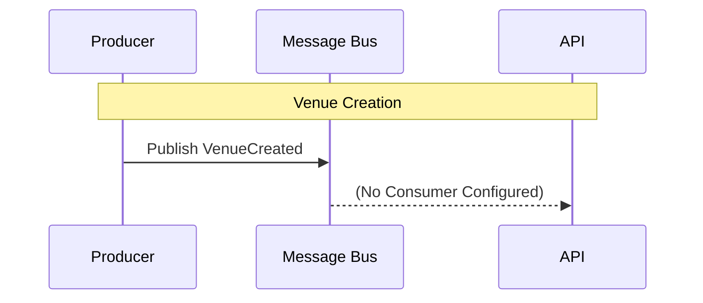

# VenueCreated

Fired when a new venue is created.

## Flow Diagram

```mermaid
sequenceDiagram
    participant P as Producer
    participant B as Message Bus
    participant A as API

    Note over P, A: Venue Creation
    P->>B: Publish VenueCreated
    B-->>A: (No Consumer Configured)
```
